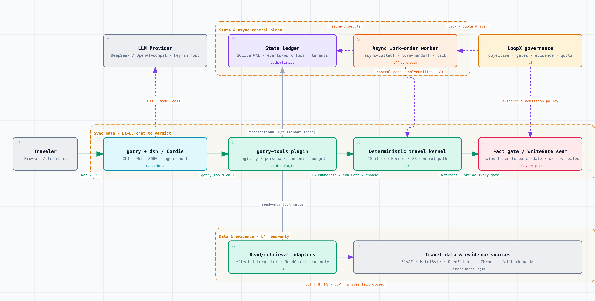
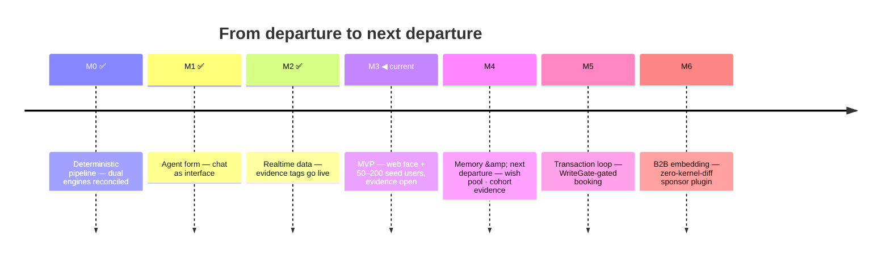

[English](README.md) | [简体中文](README.zh-CN.md)

# GoTry

> **Body and soul — more travel, less tourism.**
> *身体和灵魂,更多旅行,更少旅游。*

GoTry is an AI travel agent for **"departure to next departure."** You say where and why; it interviews you about your working window, then hands you a deterministic verdict — ordinary choices are enumerated and evaluated by a TypeScript kernel, explicit flight chains by Z3. No model guesses.

[](https://github.com/Danceiny/gotry/stargazers)
[](https://github.com/Danceiny/gotry/actions/workflows/ci.yml)
[](https://www.npmjs.com/package/@danceiny/gotry)
[](LICENSE)
[](https://www.npmjs.com/package/@danceiny/gotry)
[](docs/architecture.md)

**[What it does](#what-gotry-does)** · **[How it works](#how-it-works)** · **[Demo](#demo)** · **[Benchmark](#how-mainstream-ai-answers-the-same-trip)** · **[Quick start](#quick-start)** · **[Privacy](#consent-and-privacy)** · **[Status](#project-status)** · **[Roadmap](#roadmap)** · **[Docs](#documentation)**

## What GoTry Does

Turns "I want to go somewhere" into "can I — how, at what true cost?" If the answer is "not this weekend," the destination waits in a wish pool with explicit recall conditions instead of being dropped.

- **For travelers** — a planner that asks what actually matters (working window, departure city, budget), then answers per destination: feasible or not, why, and the **smallest change that makes it feasible**.
- **For agent builders** — the LLM only listens, translates, and explains; the kernel enumerates, evaluates, chooses. Every delivered number carries a provenance tag; writes are gated by design.

## How It Works

The model owns the language ends; deterministic code owns the numbers:


Architecture — the sync path from chat through the kernel to the fact gate, plus the state/async control plane and the read-only data layer:

<a href="docs/assets/gotry-system-architecture.en.html">
  <picture>
    <source media="(prefers-color-scheme: dark)" srcset="docs/assets/gotry-system-architecture.en.dark.png" />
    <source media="(prefers-color-scheme: light)" srcset="docs/assets/gotry-system-architecture.en.light.png" />
    
  </picture>
</a>

> Interactive version: [`docs/assets/gotry-system-architecture.en.html`](docs/assets/gotry-system-architecture.en.html) (archify, showcase-validated). Layers: L2 dsh plugin · L3 `ts/src/unified.ts` kernel · L4 effect interpreter + realtime bridges · L5 loopx governance. ADRs: [`docs/architecture.md`](docs/architecture.md) (Chinese).

## Tools

23 registered tools in groups: realtime retrieval (Fliggy official channel + your own Chrome session, read-only) · catalog · decision engine · memory · artifacts · fact gate · external search · `gotry_doctor` self-check. No hidden dispatch — a channel registry returns an ordered suggestion list; the model or user chooses. Per-tool contracts: [`docs/tools.md`](docs/tools.md) (Chinese-first).

## Demo

https://github.com/user-attachments/assets/6628c254-eba1-4017-a883-c70d22616939

*Illustrative animation-harness capture of a condensed transcript — not a real `gotry web` product UI E2E (sources: [SVG](docs/assets/demo.en.svg) · [webm](docs/assets/demo.en.webm)):*

```
> Two or three days staring at Erhai Lake, leaving from Shanghai, budget 3000, annual leave — no work.

GoTry: constraints captured —
  • window: 2 days   • departure: Shanghai   • budget: ¥3000 all-in
  • motivation: recovery [escape_rest: 0.7]   • no bookings yet

Engine verdict:
  **Erhai, Dali: not feasible now** — a 2-day window can't hold "at least 5 days of Erhai recovery".
    Relax: extend to 5 days, ~¥4950. ★ saved to your "next departure" wish pool.
  **Qiandao Lake: feasible** (G7315 06:35, ¥996, arrival energy 84%, effective rest 4.4h)
  **Taihu Lake: feasible** (G101 09:00, ¥716, effective rest 4.6h)
  Suggestion: Qiandao Lake (imagery match 80%).

[skeleton:openflights] ✓ SZX↔PVG verified [realtime:hbcli] Shanghai airports live
[static-pack:estimate] G7315/G7316 priced on Jul–Aug off-season rates
```

> Tags: `[skeleton:openflights]` route verified against the public route DB · `[realtime:...]` pulled live seconds ago · `[static-pack:estimate]` estimate — **verify before booking**. Attached by the render layer, never the model.

## How Mainstream AI Answers the Same Trip

The same real multi-country workation prompt — with planted traps (no year given, a vague "Wan-xx", an already-resolved ambiguity) — goes verbatim to mainstream assistants; answers are archived word-for-word and scored against a ground-truth rubric ([`docs/evaluation/persona-bench/`](docs/evaluation/persona-bench/)).

| Dimension | Generic chat assistant (Kimi, 13 real turns) | OTA agent (Fliggy open platform, single turn) | GoTry contract |
|---|---|---|---|
| Calendar grounding | ✗ 2025 calendar; three user corrections, three apology-refits | ✗ derived weekdays land on the 2025 calendar — contradicting its own answer on the same page | (2)(8)(9) + time-anchor card |
| Constraint interview | ✗ zero questions; both load-bearing constraints surfaced by the user at turn 6 | △ asks sales qualifiers (budget / star level / sea view); zero must-asks | (1)(10) |
| Feasibility & time accounting | ✗ density illusion, caught by the user | ✗ HK errands + same-day flight with no time budget; an "8h" flight contradicting its own arrival time | (4) + door-to-door true cost |
| Fact provenance | △ destination research holds up | ✗ sells a defunct airline (retired 2020); every price unsourced | (3)(7)(13)(20) |
| Structure completeness | △ decent comparison table only at turn 13 | ✓✓ full skeleton in one turn — completeness is table stakes | verified completeness (fact gate) |
| Persona in one line | erudite but stateless chatter — the user ends up doing four jobs | a flawless-brochure OTA clerk — every section ends in a price table | trusted travel engineer: interview first, the solver decides, infeasible says infeasible |

> **Evidence boundary:** a qualitative comparison, not a scorecard. The Kimi/Fliggy columns summarize archived transcripts (13 turns vs one); the GoTry column summarizes repository behavior contracts. No ranking or uplift is asserted.

Single best finding: two unrelated products derived their weekdays from the 2025 calendar — calendar grounding must be a mechanism, not model luck ([postmortem](docs/research/kimi-postmortem.md)).

## Quick Start

```bash
npx @danceiny/gotry web        # → http://127.0.0.1:3080
npx @danceiny/gotry doctor     # optional-channel health check (--fix to repair)
npx @danceiny/gotry "Two recovery days from Shenzhen, budget 3000"   # headless one-shot
```

Node ≥ 22.15. LLM keys live in the dsh host UI (OpenAI-compatible endpoints included) — gotry never asks for or echoes them. Any npm-compatible registry works; pin an exact version if a mirror's `latest` lags. Inside this repo use the source entry `./gotry web` (bare-name npx fails there). Eligible launches may offer a one-time capability check; CI / non-TTY never prompts, never installs. Onboarding details + operator scripts: [`docs/tools.md`](docs/tools.md). Source install: `npm ci && npm --prefix ts ci && node scripts/build-dist.mjs` — the same pinned DSH `0.1.5-alpha.1` closure as the npm package.

## Consent and Privacy

The account-session channel reads realtime data from **your own logged-in Chrome**, under four hard rules:

1. **Login happens on the external website** — no passwords, SMS codes, or cookie values; cookie *names* only.
2. **Consent card, once per session** — refusal revokes it; master switch `sessionAccess: ask|allow|off`.
3. **Physically read-only** — a ReadGuard aborts writes at the network layer; a captcha stops the agent.
4. **Never hijacks your browser** — dedicated tabs only; tests never open windows.

One-time prerequisite: the [GoTry Session Bridge](https://chromewebstore.google.com/detail/gotry-session-bridge/oeajpiccmonococjcegddlooeeohlbgd) extension (one-click, auto-updates) — until installed, tools return `needs-extension` with the store link and spend nothing.

## Trustworthy by Construction

1. **The model translates; code decides** — no LLM feasibility verdicts or arithmetic.
2. **Every number carries a source tag** — attached by the render layer, switched honestly on degradation.
3. **No write path exists** — booking/payment tools must pass WriteGate before they ship.
4. **Unverifiable means blocked** — the fact gate never lets an untraceable claim ship as "verified"; anchors are fingerprinted.
5. **Prices fail closed** — unknown model, no guessed price; the price table changes only by PR.
6. **Your data is yours** — state under `gotry-state/`; tests run on isolated roots.

## Project Status

**v0.0.1-rc.22** (npm `latest`; registry pull-verified 2026-09-09). Evaluation is at Phase 0 — deterministic contracts and validators; no external scores, no uplift claims.

**Working today**: deterministic choice kernel + explicit Z3 flight-chain path · realtime + account-session retrieval (typed, invocation-bound facts) · dependency doctor with scoped, approved repair · memory (motivation / wish pool / companions / timeline) on the tenant-scoped ledger · routed turn budgets with deep-planning handoff tickets · M4 opt-in evidence collector. Recent fail-closed slices: #279/#352 malformed responses, #359/#363 anchor fingerprints, #341 ground transfer, #343 IANA timezones, #338 home-city default, #254/#265/#282/#327/#329/#194 — full trail in [CHANGELOG.md](CHANGELOG.md).

**Open limitations**: M3 Exit open (no real 50–200 cohort yet) · M4→M6 evidence-bound (#136/#137 gates; fixture proof never opens them) · Ctrip-hotel/Meituan session adapters pending · #272 live evidence open · English covers the solve-output layer only · external runs diagnostic-only · nothing bookable today (M5 via WriteGate only).

<details>
<summary>Deeper engineering state (ledger contracts / evidence contracts / milestone stance)</summary>

The authoritative state lives in the docs, not this README: transactional state ledger (ADR-15) + dual-form freeze (ADR-16: one ledger semantics for local+web; append/read/fold/rebuild are tenant-scoped, and legacy local rows are not re-attributed without external evidence); the M3 real-cohort evidence contract stands (fixtures don't count toward Exit; 50–200 real samples open the gate); the M4 paired-cohort value evidence contract is hardened (synthetic data is never Exit evidence; observed-private data also needs a manual source-review attestation contract bound to the current summary digest and cannot rely on `evidence_kind` self-reporting); the #228 collector is only an explicit-consent, isolated-stateRoot path to produce those scorer inputs; the async work-order terminal contract (`gotry_async_terminal.v1`: 4/4 → succeeded / ledger settled / exit 0). Details: [`docs/roadmap.md`](docs/roadmap.md) / [`docs/architecture.md`](docs/architecture.md) §1 and issues #19–#22, #223, #224, and #228.

</details>

## Roadmap



Authoritative timeline with entry/exit gates: [`docs/roadmap.md`](docs/roadmap.md).

## Verify

```bash
./scripts/run-all-tests.sh    # full-stack suite (pure TS)
```

Packaged web retry/cancel proof (#289): `GOTRY_SESSION_LIVE=0 npx --no-install tsx scripts/issue-289-web-retry-e2e.ts` from `ts/`. The live session benchmark is opt-in and never runs in CI. PRs require local final-SHA evidence; CI is additional signal.

## Contributing

Branch off latest `main` (`feat/ · fix/ · docs/ · chore/`), keep typecheck + full regression green, open a PR. **Red tests never merge.** Guide: [CONTRIBUTING.md](CONTRIBUTING.md).

## For AI Agents

[`AGENTS.md`](AGENTS.md) is the binding contract: sweep async work orders on entry · arithmetic only in the evaluate layer, solving only in `unified.*` · never write shared state (`ts/dsh-runtime/gotry-state/`) · sync the six state faces of `architecture.md` §11 in the same commit · stage named files only, no `git add -A`.

## Documentation

| Document | Purpose |
|---|---|
| [`docs/architecture.md`](docs/architecture.md) | System, ADRs, evolution, debt (Chinese, authoritative) |
| [`docs/roadmap.md`](docs/roadmap.md) | M0–M6 timeline & current position |
| [`docs/user-guide.md`](docs/user-guide.md) | End-user guide |
| [`docs/tools.md`](docs/tools.md) | Tool reference: contracts, routing, onboarding (Chinese-first) |
| [`docs/data-sources.md`](docs/data-sources.md) | Data sources & evidence-chain policy |
| [`docs/release-notes.md`](docs/release-notes.md) | Release decisions per version (the "why") |
| [`CHANGELOG.md`](CHANGELOG.md) | Machine-derived changelog |
| [`docs/README.md`](docs/README.md) | Docs conventions & full index |

## License

**MIT** — same as upstream dsh. See [LICENSE](LICENSE).

## Star History

<a href="https://www.star-history.com/?repos=danceiny%2Fgotry&type=date&legend=top-left">
 <picture>
   <source media="(prefers-color-scheme: dark)" srcset="https://api.star-history.com/chart?repos=danceiny/gotry&type=date&theme=dark&legend=top-left" />
   <source media="(prefers-color-scheme: light)" srcset="https://api.star-history.com/chart?repos=danceiny/gotry&type=date&legend=top-left" />
   
 </picture>
</a>

---

**Built with**: DeepSeek Harness 0.1.5-alpha.1 (root-pinned) · Cordis · Z3 (WASM) · loopx (pipx) · hotelbyte-cli · Agent-Reach v1.5.0 · OpenFlights · TypeScript

**Version baseline: `v0.0.1-rc.22` (npm `latest`).** Verification gates: `scripts/run-all-tests.sh`; release flow: `scripts/publish-npm.sh`.
