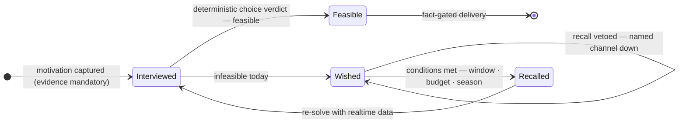
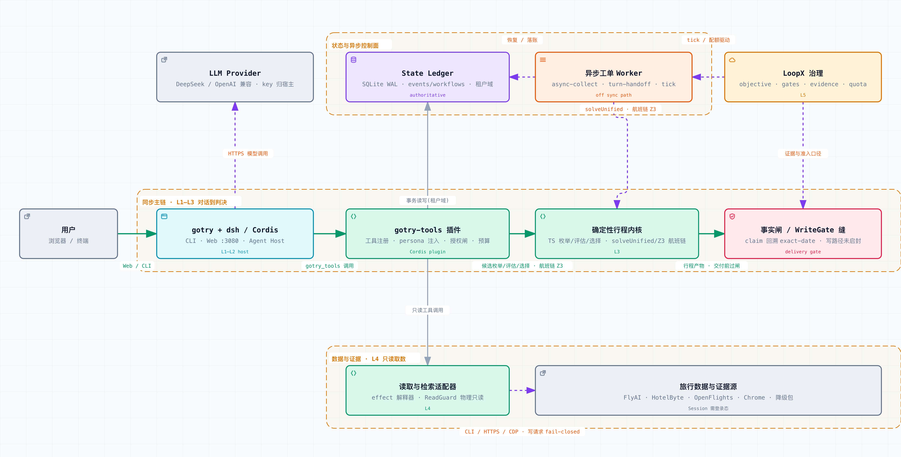
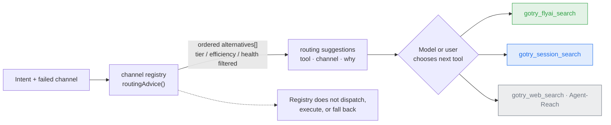
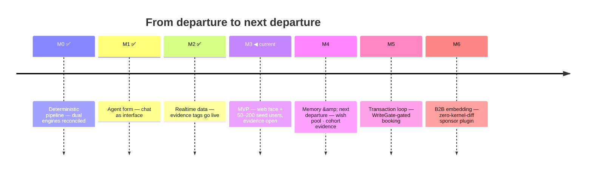

[English](README.md) | [简体中文](README.zh-CN.md)

# GoTry

> **Body and soul — more travel, less tourism.**
> *身体和灵魂,更多旅行,更少旅游。*

GoTry is an AI travel agent for **"departure to next departure."** You tell it where you want to go and why; it interviews you about your working hours and existing bookings, then hands you a deterministic itinerary verdict — ordinary candidate choices are enumerated and evaluated by the TypeScript kernel, while explicit flight-chain cases use the Z3 solver, not model guesses.

[](https://github.com/Danceiny/gotry/stargazers)
[](https://github.com/Danceiny/gotry/actions/workflows/ci.yml)
[](https://www.npmjs.com/package/@danceiny/gotry)
[](LICENSE)
[](https://www.npmjs.com/package/@danceiny/gotry)
[](docs/architecture.md)

**[What GoTry Does](#what-gotry-does)** · **[How It Works](#how-it-works)** · **[Tools](#tools)** · **[Demo](#demo)** · **[Benchmark](#how-mainstream-ai-answers-the-same-trip)** · **[Quick Start](#quick-start)** · **[Consent and Privacy](#consent-and-privacy)** · **[Trustworthy by Construction](#trustworthy-by-construction)** · **[Project Status](#project-status)** · **[Roadmap](#roadmap)** · **[For AI Agents](#for-ai-agents)** · **[Documentation](#documentation)** · **[License](#license)** · **[Star History](#star-history)**

> **Tip for newcomers:** one command is enough to feel the difference — `npx @danceiny/gotry web`, open `http://127.0.0.1:3080`, and say *"I want three relaxing days in Dali."* The agent interviews you first; then the solver, not the model, decides what is feasible. Full walkthrough: [`docs/user-guide.md`](docs/user-guide.md).

## What GoTry Does

GoTry turns "I want to go somewhere" into "can I — and how, at what true cost?" When the answer is "not this weekend," the destination is caught in a wish pool with its conditions instead of being dropped.

- **For travelers** — a conversational planner that asks the questions that actually matter (working window, booked resources, departure city, budget), then returns a verdict per destination: feasible or not, why, and the **smallest change that makes it feasible**.
- **For agent builders** — a working example of an agent where the LLM only listens, translates, and explains. Ordinary candidate decisions follow deterministic TypeScript enumeration, evaluation, and choice; the separate explicit flight-chain path uses Z3. Every deliverable number carries a provenance tag; write operations are gated by design.
- **Evidence built in** — an estimate never poses as realtime. Tags are attached by the render layer, never by the model, and switch honestly on degradation. Bookable claims that cannot trace to an exact-date tool result are blocked before delivery.

## How It Works

One planning pass is a pipeline. The model owns the two language-heavy ends; the ordinary choice path is deterministic TypeScript, while the explicit flight-chain path uses Z3:

```mermaid
flowchart LR
  U(["Traveler: 'I want three relaxing days in Dali'"]) --> A
  subgraph LANG["LLM owns — language"]
    A["Motivation interview<br/>working window · bookings · departure city"] --> B["Fact extraction<br/>working-hours &amp; leave semantics"]
  end
  subgraph NUM["Deterministic TypeScript kernel — ordinary choice path"]
    C["Candidate enumeration<br/>solveChoiceSegment"] --> D["Evaluate each choice<br/>evaluateChoice · true-cost checks"] --> V["Choice verdict<br/>feasible / infeasible · recommendation"]
  end
  subgraph Z3PATH["Separate script/control-plane entry"]
    Z["solveUnified<br/>script/control-plane flight-chain · Z3"]
  end
  subgraph GATE["Gates &amp; memory"]
    E["Evidence chain<br/>every number carries a source tag"] --> F{"Fact gate"}
    F -->|"all claims trace to exact-date tools"| G["Verified itinerary delivered"]
    F -->|"unverifiable"| H["Blocked — never posed as verified"]
    I[("Wish pool<br/>saved with recall conditions")]
  end
  B --> C
  V --> E
  B -.->|"separate script/control-plane entry"| Z
  Z --> E
  V -.->|"infeasible today"| I
  I -.->|"conditions met — enumerate again"| C
  classDef llm fill:#1f6feb22,stroke:#1f6feb,color:#1f6feb;
  classDef solver fill:#2ea04322,stroke:#2ea043,color:#2ea043;
  classDef gate fill:#d2992222,stroke:#d29922,color:#9e6a03;
  class A,B llm;
  class C,D solver;
  class E,F,G,H,I gate;
```



| Stage | Who | Output |
|---|---|---|
| Motivation interview | LLM | Mandatory questions: working window / booked resources / departure city |
| Fact extraction | LLM | Working-hours semantics, leave semantics |
| Candidate choice verdict | **TypeScript choice kernel** | Ordinary path: enumerate candidates, evaluate each choice, then emit per-candidate feasible/infeasible verdicts and a recommendation |
| Explicit flight-chain solve | **Z3 solver** | A separate `solveUnified` path for multi-leg flight-chain constraints; candidate mode bypasses it |
| Door-to-door true cost | TypeScript `evaluateChoice` / explicit Z3 path | Ordinary choices compute true cost in the TypeScript evaluation path; the explicit flight-chain path reports its Z3 result |
| Evidence chain | Render layer | Every number carries a source tag |
| Delivery gate | Fact gate | Bookable claims must trace to exact-date tool results, or the artifact is blocked |
| Memory | Domain layer | Infeasible today → wish pool, with explicit recall conditions |

Vocabulary you will meet in a GoTry answer:

- **Evidence tag** — `[skeleton:openflights]` route existence verified against the public route database; `[realtime:...]` pulled live from an API seconds ago; `[static-pack:estimate]` a researched estimate — not realtime, verify before booking. On degradation the tag switches honestly.
- **Door-to-door true cost** — the ticket price plus what the trip actually takes from you: real duration across time zones, the early-wake penalty, transfers, and the energy you land with.
- **Wish pool** — "next departure" storage. An infeasible dream is saved with explicit conditions (e.g. "5+ days, off-season") and recalled when they can be met.
- **Fact gate** — pre-delivery check on itinerary artifacts: every bookable claim (flight no. / train code / time / airport / price / policy) must trace to an exact-date tool result; unverifiable means blocked — never presented as a verified plan. Flight and rail claims are classified separately: complete Chinese G/D/C/Z + 3–4 digit train tokens go to the rail claim set, while legitimate two-letter airline codes such as `CZ8582` and `9C8781` remain flights; missing rail evidence is the rail-specific `rail_claim_unverified`. Render primitives attach a typed anchor to each fact row so the gate verifies a deterministic fact_id (and for policies, that the rendered `as_of` agrees with the registry) — hand-edited or unknown anchors fail closed. For flight/train rows, only the canonical fare field or an explicit fare-labelled field is compared against the source fact; other separated money fields with a non-fare label are ignored, while bare/unaccounted or malformed fare money is `unverified_price_claim` and blocked. A comparable hard CNY mismatch is `price_contradicted` and blocked; missing source price, unsupported hard currency, or an unanchored price outside the heuristic extraction window is also `unverified_price_claim` and blocked. Fuzzy/start prices and non-numeric values remain un-compared; no FX guess, and hotel `priceRaw` is excluded ([#300](https://github.com/Danceiny/gotry/issues/300), parent [#273](https://github.com/Danceiny/gotry/issues/273)). The hand-written read-side path additionally catches a finite non-keyword hotel set and a finite policy-vocabulary set (see issues [#301](https://github.com/Danceiny/gotry/issues/301) / [#302](https://github.com/Danceiny/gotry/issues/302)); unanchored claims against these sets fail closed. This deterministic read-side coverage now includes 12306 session typed parser/outcome, invocation-bound freshness, and seat-availability gating; malformed/transport/unknown-seat responses produce no facts, genuine empty produces only a negative fact, and the list API contributes no price. No live supplier availability, price, or M5/M6 admission is claimed.

The wish pool lifecycle:



Architecture, five layers:

<a href="docs/assets/gotry-system-architecture.html">
  <picture>
    <source media="(prefers-color-scheme: dark)" srcset="docs/assets/gotry-system-architecture.dark.png" />
    <source media="(prefers-color-scheme: light)" srcset="docs/assets/gotry-system-architecture.light.png" />
    
  </picture>
</a>

> Generated from [`docs/assets/gotry-system-architecture.archify.json`](docs/assets/gotry-system-architecture.archify.json) with [archify](https://github.com/tt-a1i/archify) (showcase-validated: 9/9 artifact checks + browser evidence). Open [`docs/assets/gotry-system-architecture.html`](docs/assets/gotry-system-architecture.html) locally for the interactive version — guided views, pan/zoom, relationship tracing. The sync path distinguishes ordinary TypeScript candidate enumeration/evaluation/choice from the separate explicit flight-chain `solveUnified` Z3 path. Labels are Chinese-first, matching the authoritative [`docs/architecture.md`](docs/architecture.md).

| Layer | Module | Role |
|---|---|---|
| L2 | `ts/src/index.ts` (dsh plugin) + `bin/gotry-inner.js` | Tool registry, time-anchor & memory-brief variables; execute isolation + consent gate + per-turn tool budget + process guards; launcher-owned dsh child process-group cleanup |
| L3 | `ts/src/unified.ts` | ordinary candidate enumeration/evaluation/choice; `solveUnified` is the separate flight-chain Z3 path. `py/gotry_feasibility/` is a historical comparison oracle only, with zero product/runtime/toolchain dependency |
| L4 | `ts/capabilities/effect.ts` · `hbcli.ts` · `skeleton-check.ts` | effect interpreter (backoff retry / circuit breaker / mock interpreter) + realtime inventory bridge + OpenFlights skeleton (three-valued semantics) |
| L5 | loopx governance | objective / gates / evidence / quota |

> Full ADRs / evolution / debt ledger: [`docs/architecture.md`](docs/architecture.md) (Chinese — English versions planned for v0.1.0).

## Tools

The GoTry plugin exposes its tools in groups:

| Group | Tool | What it does |
|---|---|---|
| **Realtime retrieval (OTA/official, read-only)** | `gotry_flyai_search` | Live flight/train/hotel quotes via the Fliggy official channel (masked hotel prices upstream; real prices on the jumpUrl page; exhausted anonymous trial quota degrades as `needs-setup` with key guidance, never silent retries) |
| | `gotry_session_search` | Ctrip flights **and hotels** + 12306 trains + Dida supplier-portal realtime hotel rates on the **user's own Chrome session** (all kinds consent-gated, physically read-only; omitted `kind` defaults to `flight`, query-wrapped args use query-first selection, unknown/malformed kinds fail closed; hotels = `kind:"hotel"` + optional `cityId`, real logged-in prices; trains = `kind:"train"`, public query face — codes/times/seat availability, no prices in the list API) |
| | `gotry_session_login` | Login bootstrap: auto-detects existing login first; otherwise opens the login entry in the user's Chrome (**zero terminal**) |
| | `gotry_weather_check` | Open-Meteo forecast ≤16 d + historical climate baseline |
| | `gotry_flight_verify` | OpenSky ADS-B live flight observation (three-valued) |
| | `gotry_skeleton_check` | OpenFlights 168-hub-pair connectivity (three-valued) |
| **Inventory & catalog** | `gotry_hotel_search` | hotel-byte realtime bridge (requires valid check-in/check-out dates and asks for missing dates), with clearly labeled static results when the supplier is unavailable |
| | `gotry_anything_search` | mixed city/hotel/POI catalog (hotel-be Anything) |
| **Decision engine** | `gotry_feasibility_check` | Registered path: deterministic TypeScript candidate enumeration/evaluation and per-candidate verdicts |
| **Memory & reachability** | `gotry_motivation_save` | Persist motivation profile (evidence mandatory, anti-fabrication) |
| | `gotry_wish_pool_add` / `gotry_wish_pool_list` | "next departure" wish pool + 0..1 conditional recall |
| | `gotry_companion_save` · `gotry_trip_log` | companion profile / travel timeline |
| **Artifacts** | `gotry_artifacts_list` / `gotry_artifacts_read` | Discover & read generated artifacts (async deliverables + working-dir markdown) as a read-only, line-numbered view. The public `./client` adapter keys both custom wire names to DSH Web cards from the runtime `block`; paths are clickable and read cards show source identity plus a content version. The workspace/sidebar remains an additional file-preview surface. Scope: `stateRoot` + the session working dir (excludes `node_modules`/`.git`); text extensions only (`md/txt/json/jsonl/csv/log/yaml/yml`); >2 MB / out-of-root / symlink-escape / unsupported extension → `ok: false` + `hint`. See [user guide](docs/user-guide.md). |
| **Factuality gate** | `gotry_fact_gate` | Pre-delivery gate for itinerary artifacts — see [fact gate](#how-it-works) above |
| **General external** | `gotry_web_search` · `gotry_video_subtitle` · `gotry_github_search` · `gotry_agent_reach` | web / subtitles / GitHub / all-channel external info (via Agent-Reach) |
| **Self-check** | `gotry_doctor` | Read-only health check by default. With explicit `action: "repair"`, it shows the selected auto-repairable gaps, requests approval for that scope, reuses the same idempotent installers as `doctor --fix` / web onboarding, and rechecks health before reporting success. Browser-store installs, credentials/API keys, profile changes, package reinstalls, and Node upgrades stay as user actions; rejection, cancellation, or no approval channel executes nothing. Report lands in `gotry-state/doctor-report.md` (sidebar-workbench previewable) |

> **Channel routing**: retrieval tools stay flat (no hidden dispatch); the persona routing card and the `routing` suggestions attached to failed search results are **generated from one channel registry** (official API > user session > web fallback, filtered by per-session channel health). The registry returns an ordered suggestion list; the model or user chooses the next tool. No automatic dispatch, execution, or fallback happens inside the registry.



## Demo

<a href="docs/assets/demo.en.webm"></a>

*Illustrative animation-harness capture of a representative, condensed transcript — not a real `gotry web` product UI E2E; [open as video](docs/assets/demo.en.webm) (static copy below is authoritative):*

```
> Two or three days staring at Erhai Lake, leaving from Shanghai, budget 3000, annual leave — no work.

GoTry: constraints captured —
  • window: 2 days   • departure: Shanghai   • budget: ¥3000 all-in
  • motivation: recovery [escape_rest: 0.7]   • no bookings yet

Engine verdict:
  **Erhai, Dali: not feasible now** — a 2-day window can't hold "at least 5 days of Erhai recovery".
    Relax: extend to 5 days, ~¥4950. ★ saved to your "next departure" wish pool.
  **Qiandao Lake: feasible** (G7315 06:35, ¥996, arrival energy 84%, effective rest 4.4h)
  **Taihu Lake: feasible** (G101 09:00, ¥716, effective rest 4.6h)
  Suggestion: Qiandao Lake (imagery match 80%).

[skeleton:openflights] ✓ SZX↔PVG verified [realtime:hbcli] Shanghai airports live
[static-pack:estimate] G7315/G7316 priced on Jul–Aug off-season rates
```

> Tag guide: `[skeleton:openflights]` means "this route can be flown" was verified against the public route database; `[realtime:...]` marks data pulled live seconds ago; `[static-pack:estimate]` flags an off-season estimate — **verify before booking**. Tags are attached by the render layer, never by the model.

## How Mainstream AI Answers the Same Trip

GoTry's product persona is calibrated against evidence, not taste: the same real three-week multi-country workation prompt — with planted traps (no year given, a vague "some seaside town called Wan-xx", an ambiguity the user already resolved) — is fed verbatim to mainstream assistants, their answers archived word-for-word, and scored against a ground-truth rubric. Transcripts, rubric, and the contract feedback: [`docs/persona-bench/`](docs/evaluation/persona-bench/).

| Dimension | Generic chat assistant (Kimi, 13 real turns) | OTA agent (Fliggy open platform, single turn) | GoTry contract |
|---|---|---|---|
| Calendar grounding | ✗ 2025 calendar; three user corrections, three apology-refits | ✗ derived weekdays land on the 2025 calendar — contradicting its own answer on the same page | (2)(8)(9) + time-anchor card |
| Constraint interview | ✗ zero questions; both load-bearing constraints surfaced by the user at turn 6 | △ asks sales qualifiers (budget / star level / sea view); zero must-asks | (1)(10) |
| Feasibility & time accounting | ✗ density illusion, caught by the user | ✗ HK errands + same-day flight with no time budget; an "8h" flight contradicting its own arrival time | (4) + door-to-door true cost |
| Fact provenance | △ destination research holds up | ✗ sells a defunct airline (retired 2020); every price unsourced | (3)(7)(13)(20) |
| Structure completeness | △ decent comparison table only at turn 13 | ✓✓ full skeleton in one turn — completeness is table stakes | verified completeness (fact gate) |
| Persona in one line | erudite but stateless chatter — the user ends up doing four jobs | a flawless-brochure OTA clerk — every section ends in a price table | trusted travel engineer: interview first, the solver decides, infeasible says infeasible |

> **Evidence boundary:** this is a qualitative comparison, not a scorecard or performance claim. The Kimi and Fliggy columns summarize archived real-world transcripts with different protocols (13 turns versus one turn). The GoTry column summarizes repository behavior contracts and deterministic/fixture evidence; it is not a comparable real-world benchmark result. No ranking, uplift, or numerical positioning is asserted. Comparable benchmark evidence would require the same prompt, models, channel conditions, sample sizes, rubric, and published scoring.

**Single best finding: two unrelated products derived their weekdays from the 2025 calendar.** Calendar grounding has to be a product mechanism (anchor card, assert once, never recompute) — not model luck. Cautionary deep-dive: [`docs/research/kimi-postmortem.md`](docs/research/kimi-postmortem.md).

## Quick Start

### npm (recommended)

```bash
npx @danceiny/gotry web
# → open http://127.0.0.1:3080 and chat: "I want three relaxing days in Dali"
# LLM key & model: handled by the dsh host UI; nothing for gotry to ask on the CLI
```

| Entry | Command | When |
|---|---|---|
| Web chat (recommended) | `npx @danceiny/gotry web` | multi-turn planning with visualized reasoning → `:3080` |
| Headless one-shot | `npx @danceiny/gotry "Two recovery days from Shenzhen, budget 3000"` | scripts / CI / targeted debugging → stdout |
| Dependency doctor | `npx @danceiny/gotry doctor` (`--fix` to repair) | optional channels misbehaving: checks extension / Agent-Reach / hbcli / FlyAI key / sidebar / dsh-calendar mount / dsh-map-tools & dsh-tool-ask-user presence, prints exact repair guidance, writes `gotry-state/doctor-report.md` (previewable in the sidebar workbench) |

Requires Node ≥ 22.15. LLM credentials are managed by your dsh host UI — gotry itself never asks for or echoes them. OpenAI-compatible endpoints (MiniMax / relays / self-hosted gateways) are handled by the dsh model configuration. First cold start takes 6–15 s; if port `:3080` is taken, free it first; unexpected exits leave diagnostic evidence in `gotry-state/incidents.jsonl`; the monitor preserves the Node/dsh host fatal exit policy, while the GoTry launcher owns its dsh child process group and starts bounded descendant cleanup from child exit/error (including delayed stdio close) or parent SIGINT/SIGTERM. This is an outer-host guarantee, not a claim about dsh's internal supervisor or SDK transport.

> **Registries & where you run it** — the command is registry-agnostic: any npm-compatible registry (npmjs, npmmirror, an internal mirror) works as long as the package is synced there; if a mirror's `latest` lags behind, pin an exact version, e.g. `npx @danceiny/gotry@0.0.1-rc.22 web`. One exception: **inside the gotry repo** (or any project whose package.json is named `@danceiny/gotry`), bare-name `npx @danceiny/gotry …` fails with `sh: gotry: command not found` — npm exec mistakes the spec for "already installed locally" and runs it via `sh` without wiring up bin paths. In the repo use the source entry `./gotry web` instead.

> **Per-launch onboarding (`gotry web`, issues #258/#267)** — Before starting web, gotry can offer an optional-capability check. Each eligible `gotry web` launch evaluates once and asks at most once; there is no persisted cross-launch acknowledgement (no "already asked" flag — every eligible launch re-evaluates). It reuses the existing idempotent `doctor --fix` installer functions — no second installer is built. (#267 is the post-merge hardening after #266: the onboarding child runs as an awaited POSIX process-group spawn so SIGINT/SIGTERM are serviced and temp result/patch dirs are cleaned on signal/normal/error paths; bootstrap installer children are also bounded by their own process-group lifecycle, and tests cover accepted-install parent SIGTERM plus accepted-install onboarding timeout against a TERM-ignoring fake installer. The result file lives in a caller-private `0700` temp dir written with exclusive `0600` semantics.)
>
> - **Interactive TTY + auto-installable gaps** (hbcli binary / Agent-Reach `.venv` / dsh-better-sidebar) → asks **exactly once**: "configure now? (y/N)". `y` installs and prints a per-gap result in one of three classes with a concrete reason — `installed` (auto-installed on this machine), `needs-user-action` (Chrome Web Store extension, hbcli login, FlyAI key, calendar profile config — never faked as automated), or `unavailable` (e.g. a bundled plugin missing → reinstall gotry). `n` immediately continues to web (no install, no result list). Partial failure does not block web and shows the retry command (`npx @danceiny/gotry doctor --fix`); a later run does not reinstall already-healthy items.
> - **Interactive TTY, no auto-installable gaps but other gaps present** (e.g. Windows, where hbcli/Agent-Reach/sidebar have no automated install surface; or only credential/key/reinstall gaps) → does **not** prompt and does **not** install, but renders the classified `needs-user-action` / `unavailable` rows with concrete reasons, then continues to web. The duplicate background doctor summary is suppressed (the classified plan already showed the gaps).
> - **Fully healthy** → silent.
> - **Zero prompt, zero install, web still starts** under: CI, benchmark, non-TTY, `GOTRY_SETUP_SKIP=1`, `GOTRY_ONBOARDING_SKIP=1` (or `--no-onboarding`). gotry never installs during `postinstall` or in a detached background task; the background one-line doctor summary is kept only when onboarding neither prompted nor reported.
>
> This is an M4 UX proof with deterministic isolated tests; it does **not** satisfy #20 real repeat-cohort Exit evidence.

> **Cost accounting** — `ts/data/llm-price-table.json` (schema `gotry_llm_price_table_v2`) is the single source of truth for nightly run cost. Adding a model or switching relays = a PR against this file (peak-conservative upper bounds only); unknown models **fail closed** — no guessed prices. Drift monitor: `npx tsx ts/scripts/price-drift-watch.ts` (offline baseline diff; `--fetch` for live official pages). It never auto-applies changes.

> **Quality metrics (repo-side)** — `npx tsx ts/scripts/build-metrics-report.ts [--state-root <root>] [--out report.md] [--days 7]` aggregates the persisted sidecars (fact-gate verdict distribution & blocked rate, channel down/cooldown, incidents, bridge latency vs the 500 ms re-audit budget, ledger / doctor-report presence) into one read-only markdown report. No new dependencies, zero LLM; the state root is never written (only `--out` produces a file, outside the state root).

> **Channel probe tick (out-of-band health)** — `npx tsx ts/scripts/channel-probe.ts --state-root <root>` runs one read-only probe round over headless-probeable channels (hbcli whoami / open-meteo / opensky; session surfaces are skipped, FlyAI is not probed by default to preserve the shared anonymous quota) and appends `down` / `'ok'` recovery events to `channel-health.jsonl` — routing advice and doctor pick them up with zero changes. Driven by cron/loopx; no resident process. Wish recall consumes the same facts: a wish whose `conditions.channels` names a currently-down channel is vetoed for that recall. Remote (world2agent) callback stays gated on D-31.

### Developer source install

```bash
git clone https://github.com/Danceiny/gotry && cd gotry
npm ci && npm --prefix ts ci                      # pinned root/TS closure
node scripts/build-dist.mjs                       # build the JS runtime
./gotry web                                       # in-repo entry, same UX
```

The source entry and the npm package resolve the same 230-package DeepSeek Harness `0.1.5-alpha.1` closure (exact direct dependencies; publish preverify rejects omissions, mixed versions, and ranges). Source normal runs keep their state under `ts/dsh-runtime/gotry-state/`; benchmark opt-in and npm-package runs use the invocation directory for isolation. Per [issue #290](https://github.com/Danceiny/gotry/issues/290), both source and npm paths now project product persona through `personaPrefix` / `personaSuffix` (legacy `persona:` does not project) and the bridge handler classifies failures structurally: `timed_out` for deadline abort, `spawn_failed` for synchronous spawn or rejected public `done`, `runner_failed` for resolved nonzero exit or post-success collected-output read failure.

## Consent and Privacy

The account-session channel reads realtime hotel/flight data from **your own logged-in Chrome**, under four hard rules:

1. **Login happens on the external website.** GoTry never offers, fills, or collects any password / SMS code / cookie value. It only answers one boolean question — "does a login-ticket cookie exist" (reads cookie **names** only, zero values touched). Existing logins are auto-detected with zero popups.
2. **Consent card, once per session.** The first account-session use pops a runtime approval card; approval holds for the session, a refusal revokes it (no repeat prompting). Master switch `sessionAccess: ask|allow|off` at any time.
3. **Physically read-only.** A ReadGuard aborts all write requests at the network layer — ordering/payment is unreachable in transport. The agent never touches credentials or captchas; on a captcha it stops and hands control back to you.
4. **Never hijacks your browser.** Retrieval/login always open their own dedicated tab; the login page is brought to front and stays with you; routine test runs never open browser windows.

One-time prerequisite: the [GoTry Session Bridge](https://chromewebstore.google.com/detail/gotry-session-bridge/oeajpiccmonococjcegddlooeeohlbgd) Chrome extension — handled by the dsh host UI when an account-session tool first needs it (`gotry_session_search` surfaces the install URL as a clickable link in the verdict). The extension itself is one-click on the Chrome Web Store, auto-updates, and the gotry side never asks the user to load unpacked or to run a setup wizard. Zero Chrome system dialogs afterwards — the extension passively forwards the site's own search responses (read-only by construction; cookies are read by NAME only, values never leave the browser). A background health-watch auto-replays your query once the extension is connected. Until installed, tools return `needs-extension` with the store URL and spend nothing.

## Trustworthy by Construction

1. **The model translates; deterministic code decides.** The LLM never produces feasibility verdicts or arithmetic. Ordinary candidate verdicts come from TypeScript enumeration/evaluation/choice; explicit flight-chain constraints use `solveUnified` and Z3 against the extracted facts.
2. **Every number carries a source tag** — attached by the render layer, never the model. Tags switch honestly on degradation; an estimate never poses as realtime.
3. **No write path exists.** Booking/payment-class tools must pass WriteGate before any implementation ships; the future booking seam is already pinned by the `booking_saga_fsm.v1` edge table.
4. **Login never touches credentials.** Login happens on the external website; GoTry reads cookie names only; consent is asked once per session and revocable.
5. **Retrieval is physically read-only.** A ReadGuard aborts write requests at the network layer; a captcha stops the agent and hands control back to you.
6. **Unverifiable means blocked.** The fact gate refuses to deliver any itinerary whose bookable claims cannot trace to exact-date tool results — it is never presented as a verified plan.
7. **Prices fail closed.** Unknown models get no guessed price; the price table changes only by PR; the drift monitor reports, never auto-applies.
8. **Your data is yours.** Product state lives under `gotry-state/`; validation paths use isolated state roots and never write the founder's real product data.

## Project Status

Current release: **v0.0.1-rc.22** (npm `latest`; the `rc` dist-tag points at rc.20. Registry pull-verified 2026-09-09 against a mirror: npx install, bin resolution, and `web` startup all pass). Evaluation is at Phase 0 foundation — deterministic contracts, validators, and a cadence policy; no external benchmark scores, no spend, no uplift claims. The M4→M6 program plan is now a living task graph in [`docs/design/milestone-delivery-plan.md`](docs/design/milestone-delivery-plan.md); it records the `hotelbyte-cli` first-supplier decision for M5 contract preparation, but does not open M4/M5/M6 gates. Public execution and debt ownership follow [the #270 ledger contract](docs/ops/external-pr-workflow.md) §0: issue start, Draft PR, exact-head review, and merge/destination receipt; local or fixture proof never opens the real gates.

**Working today**:

- **Deterministic choice kernel** — ordinary candidate enumeration, `evaluateChoice`, true-cost checks, per-candidate verdicts, and recommendation
- **Bounded ground-transfer slice (#341)** — explicit origin/destination coordinates with `mode=driving` delegate through the registered public `map_driving_route` tool; only an exact static `taxi` destination transfer may receive route-estimated minutes, while its static price remains `[静态包:估算]`. Per-apply cache age, host-observed `asOf`, provenance, provider errors, invalid coordinates, unsupported modes, and binding mismatches are explicit; live traffic, transit/rail, and fares remain outside this slice
- **Explicit flight-chain Z3 path** — `solveUnified` handles the separate multi-leg constraint path; solver calls are gated by a single shared Context, serialized sessions, and the #227 local native-cleanup barrier
- **Realtime retrieval** — flights/trains/hotels (Fliggy official channel), destination/hotel catalogs, weather, live flight observation, route connectivity; realtime prices can overwrite solver prices (`GOTRY_REALTIME_PRICING=1`); exhausted FlyAI anonymous trial quota is classified `needs-setup` with key guidance (no blind retries)
- **Dependency doctor** — `npx @danceiny/gotry doctor` (CLI) / `gotry_doctor` (in-chat tool): diagnosis stays read-only by default; explicit in-chat repair shows a scoped plan, asks once per session scope, runs the existing idempotent bootstrap installers, and reports each item from a post-install health check. Manual setup items stay manual, and LLM keys stay with the dsh host
- **Account-session search** — Ctrip flights **and hotels** + 12306 trains + Dida supplier portal (hotel-be portal-integration line, 2026-09-09) on your Chrome (hotels: real logged-in prices via passive sniffing; trains: public left-ticket query with codes/times/seat fields). `gotry_session_search kind=train` now records only invocation-bound, fresh typed train facts: query date is host-captured invocation authority and the exact response URL must bind it; startTrainDate is validated and preserved only; recognized empty is the sole negative fact, malformed/transport/unknown-seat rows record none, and `canWebBuy=Y` never substitutes for a recognized available seat. The list API has no prices; deterministic fixtures do not claim live 12306 availability
- **Malformed flight responses fail closed (#279)** — Ctrip batch-search keeps the compatible non-throwing parser API, distinguishes a recognized empty list (`miss`) from valid hits and malformed/unknown responses (`error`), and preserves valid siblings in mixed responses; isolated extension fixtures prove parsing/orchestration only, not #272 live interface calibration, real supplier evidence, or M4/M5/M6 admission
- **Malformed FlyAI responses fail closed (#352)** — `gotry_flyai_search` keeps a recognized exact empty `itemList` as `miss`; every item in a nonempty flight/train/hotel list must pass typed validation, so any malformed sibling makes the whole response a structured `error` and cannot create a negative inventory fact. The maintained fake-CLI regression is offline evidence only and does not prove provider/UAT behavior.
- **Offline session evidence summary (#335, Tracks #272)** — `sf-summary` accepts an explicit `--evidence-root`, selects one batch by canonical producer filename chronology, preserves requested/effective/fallback and capture provenance, and reports missing, corrupt, invalid, or legacy-unmatched records fail-closed; synthetic/offline output does not prove live session availability, inventory, or packaged connected/degraded behavior
- **Extension install on demand** — `[GoTry Session Bridge](https://chromewebstore.google.com/detail/gotry-session-bridge/oeajpiccmonococjcegddlooeeohlbgd)` is offered as a clickable link in the dsh UI when an account-session tool first needs it (one-click install + auto-update); the gotry side never runs a setup wizard
- **Memory & reachability** — motivation profile / wish pool / companions / travel timeline, persisted by the tenant-scoped SQLite ledger (`local` remains the default); English solve output via `GOTRY_LOCALE=en`
- **M4 lifecycle evidence collector** — explicit opt-in CLI for first/returning planning flow observations: isolated `stateRoot`, consent and HMAC key are mandatory; dataset key/source/wait vocabulary are frozen; JSONL/manifest writes use write-all + atomic/no-overwrite publication; exports feed the #223 scorer as candidate/synthetic only, never manual attestation
- **Routed turn budgets** — every turn is classified (quick / sync / deep-planning) by a deterministic, zero-LLM router; time is the only budget and the deadline exit follows the task: quick and sync turns converge to an answer, deep-planning turns hand off to a persisted background ticket (`gotry_turn_handoff.v1`, ETA ≈1h) instead of dying mid-stream; the ticket is collected in the background by `scripts/turn-handoff-collect.ts` (idempotent, recursion-guarded child planner) and surfaces in-chat via the read-only `gotry_turn_handoff_list` tool; exercised end-to-end through a packaged consumer install in CI
- **Subagent/jobs id safety (#194)** — a typed pre-execute guard recognizes a continuable subagent durable id before dsh's jobs registry and returns a recoverable completion-notice / `list_agents` / `send_message` hint; one-shot, unrelated, and non-owner ids retain native jobs behavior. The upstream unknown-id contract remains open and this local guard does not modify vendored dsh.
- **Ledger admin CLI** — `ts/scripts/state-cli.ts` parses command/options/positionals fail-closed: unknown, duplicate, missing, or invalid numeric options (including `.5`/`+.5`) do not touch the state root. The #241/#243 boundary is on main and closed. `--tenant` is a ledger scope parameter, not authentication; `tick` / `export` / `whatif` are explicit local-only commands because they call local async settlement, write shared legacy filenames, or snapshot the whole DB.
- **Read-only tenant repair plan (#254)** — `repair-plan` inventories and dry-runs only on a temporary copy of the DB plus `-wal`/`-shm`; source content changes during copy/read fail closed, and only explicit evidence mappings can produce move entries. Apply, migration, backup, rollback, and real repair receipts remain numbered follow-ups on #254; this slice does not open any M5/M6 gate.
- **Node build compatibility (#265)** — the supported lower bound remains Node ≥22.15. Root dist builds use the exact build-only TypeScript 5.9.3 compiler and emit ESM; CI keeps typecheck + the full suite on Node 22/24 and runs a focused exact-file/ESM/import proof on Node 22/24/26.
- **Booking planner repair (#282)** — the embedded read-action planner preserves every non-empty occupancy room and child criterion, counts correction prompts within a three-call budget, returns a valid correction through the same validation path, and propagates provider failures; focused evidence uses an injected runPort and does not claim live supplier or UAT results.
- **Future named-year planning window (Issue #2)** — the registered `gotry_feasibility_check` boundary derives the reference date from the host clock. Any dated recommendation defaults to a future floor even when optional planning context is omitted; explicit future years add a year-end bound, expired years never roll forward, and explicit historical mode is required for historical calculations. Rejections are structured validation results without incident logging; dateless legacy feasibility remains dateless. Negated past language and conflicting years do not grant a historical bypass. Deterministic proofs use an injected clock and isolated fixtures.
- **Strict duplicate tool-call repair (#327 revision)** — the embedded planner keeps ordinary single-object `JSON.parse` behavior and recovers only fully consumed, whitespace-separated repetitions of at least two structurally identical top-level JSON objects; conflicting, truncated, prefixed, suffixed, non-object, or single-invalid inputs fail closed. The public-path fixture covers braces and escapes inside strings; it is deterministic local evidence, not provider reliability, HotelByte UAT, M3/M4 cohort, or M5/M6 admission evidence.
- **Safe Booking dispatch diagnostics (#329)** — the synchronous HTTP 409 dispatch catch emits only a typed error code and an exact closed reason; unknown or suffixed errors become `UNCLASSIFIED`. The child-process HTTP/stderr proof is deterministic and offline only; it is not provider reliability, HotelByte UAT, or M3–M6 admission evidence.
- **IANA timezone contract (#343)** — flight-pack v2 resolves explicit IANA zones and local dates to UTC instants, rejects unknown zones and DST gaps/overlaps, and uses UTC instants for elapsed duration. The dsh/mock adapter path retains the v2 pack `homeZone`; profiles supply schedule fields only, explicit vacation removes the trip work-window restriction, and numeric v1 behavior remains compatible. This deterministic contract does not prove live schedules, prices, availability, or inventory; see [`docs/data-sources.md`](docs/data-sources.md).
- **Persistent home-city default (#338)** — `gotry_motivation_save` accepts typed `homeCity` plus optional `homeCityEvidence` (evidence is always required; when exactly one nonblank new evidence entry exists, only the `homeCityEvidence` binding field may be omitted; multiple new evidence entries require an explicit exact `homeCityEvidence` binding); the tenant-scoped ledger persists `homeCityPreference { value, evidence, updated_at }` and `{{motivation_brief}}` reads a complete preference as a soft default. Explicit current-trip origin wins; missing/malformed preference or unbound evidence asks for the origin, while explicit null clears the active default. `resolveDefaultOrigin(currentTripOrigin, profile)` is the pure precedence contract (explicit > home_default > missing); the default does not hard-filter or alter deterministic candidates/recommendation. Origin is **never** inferred from IP, browser language, timezone, travel history, or model guess. The #20 real-cohort gate remains open.

**Open limitations** (honest list):

- **M3 Exit not closed** — engineering & distribution are ready, but real seed-user evidence (50–200 person cohort) has not been accumulated; automated tests prove contracts and formulas, not business pass
- **M4→M6 gates remain evidence-bound** — the M4 scorer hardening (#238), explicit opt-in lifecycle collector (#248), tenant CLI, and Z3/map stability foundations are on main; #227/#241/#242 are closed. No real `observed_private` N≥5 repeat cohort has landed. M5 Entry still requires M4 Exit plus supplier agreement/internal authorization evidence (#136). M6 Entry requires M5 Exit plus founder-approved P6; M6 Exit separately requires a real signed pilot (#137).
- **The Node 26 dist gate is release-quality evidence only** — #265 does not satisfy #20's real repeat-cohort evidence, #136's supplier agreement/internal authorization, or #137's P6 approval and signed real pilot; all three gates remain open.
- **#258/#267 web onboarding is a UX proof, not Exit evidence** — the per-launch `gotry web` onboarding check (issues #258/#267; #267 post-merge hardening after #266) is a deterministic, isolated-test-backed M4 UX improvement; it proves the install/repair contract, prompt/skip/reported behavior, and POSIX onboarding/installer process-group cleanup under parent signal and onboarding timeout, **not** a real repeat-cohort outcome. It does not satisfy #20 real repeat-cohort Exit evidence, and the onboarding fixture/local-install proofs are explicitly excluded from M4 Exit attestation.
- **Hotel session adapters** — Ctrip-hotel / Meituan logged-in surfaces await real login-state backfill; flights are done
- **#272 live evidence remains open** — #335 only hardens deterministic offline summary selection; authorized live browser/session calibration and packaged connected/degraded evidence remain outstanding
- **Interface language** — English covers the deterministic solve-output layer; the dsh host UI and dialogue surface belong to the host / calibration samples
- **External benchmark generalization** — every frozen external run to date remains diagnostic-only (no score, no uplift claim). After the Round 10 `glm-5.3-flash` visibility diagnosis on main `c843fae` (57 empty `{}` calls), Round 11 keeps execution validation exact against frozen descriptors while exposing a flat model-facing `tools/call/errors` wire with descriptor-derived tool names and generic object arguments; the round-by-round engineering ledger lives in [`docs/evaluation/benchmark-environment-bridge.md`](docs/evaluation/benchmark-environment-bridge.md)
- **Booking** — nothing bookable ships today; M5 opens only through WriteGate and the booking-saga FSM

<details>
<summary>Deeper engineering state (ledger contracts / evidence contracts / milestone stance)</summary>

The authoritative state lives in the docs, not this README: transactional state ledger (ADR-15) + dual-form freeze (ADR-16: one ledger semantics for local+web; append/read/fold/rebuild are tenant-scoped, and legacy local rows are not re-attributed without external evidence); the M3 real-cohort evidence contract stands (fixtures don't count toward Exit; 50–200 real samples open the gate); the M4 paired-cohort value evidence contract is hardened (synthetic data is never Exit evidence; observed-private data also needs a manual source-review attestation contract bound to the current summary digest and cannot rely on `evidence_kind` self-reporting); the #228 collector is only an explicit-consent, isolated-stateRoot path to produce those scorer inputs; the async work-order terminal contract (`gotry_async_terminal.v1`: 4/4 → succeeded / ledger settled / exit 0). Details: [`docs/roadmap.md`](docs/roadmap.md) / [`docs/architecture.md`](docs/architecture.md) §1 and issues #19–#22, #223, #224, and #228.

</details>

## Roadmap



| # | Milestone | Scope | Status |
|---|---|---|---|
| M0 | Deterministic pipeline | dual engine implementations + real data packs + reconciliation | ✅ |
| M1 | Agent form established | LLM in the loop; chat as interface; gates as choice cards | ✅ 2026-08-22 |
| M2 | Realtime data | hotelbyte bridge + flight sources; evidence chain switches to realtime tags | ✅ 2026-08-22 |
| M3 | MVP | minimal web face + 50–200 seed users (Erhai / Phuket scenarios) | **← current — evidence open** |
| M4 | Memory & "next departure" | six-layer memory C-end domain; paired-cohort value evidence + explicit lifecycle collector | founder-authorized parallel; #223/#238 + #228/#248 in main; real N≥5 open |
| M5 | Transaction loop | WriteGate in production; booking / payment / refunds; first supplier target: `hotelbyte-cli` | entry-gated: M4 Exit + supplier protocol |
| M6 | B2B embedding | traveler principal / sponsor plugin with measured zero-kernel-diff proof | entry-gated: M5 Exit + P6 founder review |

The single authoritative timeline — entry/exit conditions, deliverables, and gates per milestone — is [`docs/roadmap.md`](docs/roadmap.md).

## Verify

### Packaged Web retry/cancel proof (#289)

Prerequisites: Node 24, a locally installed Google Chrome, and dependencies
installed from both the root and `ts/` lockfiles. From `ts/`, run:

```bash
GOTRY_SESSION_LIVE=0 npx --no-install tsx scripts/issue-289-web-retry-e2e.ts
```

This builds and installs a GoTry package, exercises the public Web UI against
a localhost OpenAI-compatible fake relay, and uses fresh HOME, DSH_HOME,
workspace, and Chrome-profile isolation. The proof drives the public New
session and Stop controls; reviewable screenshots, JSON assertions, receipt,
and redacted logs are written under
`.omx/artifacts/issue-289-web-retry-e2e/`. It covers the current packaged
public Web path only; the historical rc.22 incident event remains tracked in
[issue #289](https://github.com/Danceiny/gotry/issues/289).

```bash
./scripts/run-all-tests.sh                     # full-stack suite (pure TS, no Python needed)
cd ts
npx tsx scripts/evaluation-contract-tests.ts   # evaluation Phase 0 contracts (offline)
npx tsx scripts/evaluation-cadence-tests.ts    # deterministic cadence policy/planner
```

The suite covers golden engines, dialogue replay, cross-process async work-orders, plugin smoke, realtime bridges, fatal incident observation and process guards, installed-dsh child liveness (including the packaged `bin/gotry-inner.js` inherited-pipe, zero-exit, and TERM-resistant descendant paths), i18n, memory domain, the M4 lifecycle collector, the Z3 concurrency gate, the fact gate, and a packaged-consumer turn-deadline E2E, among others; the authoritative section list is whatever `scripts/run-all-tests.sh` enumerates. The live session benchmark (`npx tsx scripts/sf-live-benchmark.ts --golden=static`) is opt-in, requires your connected Chrome session, and never runs in CI. For PRs, local final-SHA evidence is required; CI is additional signal, not a substitute.

## Contributing

Branch off latest `main` (`feat/ · fix/ · docs/ · chore/`), run local final-SHA typecheck + full regression, then open a Pull Request. Project process requires PR review for `main`; do not infer that GitHub branch protection has been configured. CI runs typecheck + all suites on Node 22/24 and the focused dist compatibility proof on Node 22/24/26; it is additional signal, not a replacement for local evidence. A maintainer chooses a repository-allowed merge method after checking the reviewed exact head and records the destination SHA. **Red tests never merge.** Full guide: [CONTRIBUTING.md](CONTRIBUTING.md). Bug reports / feature suggestions: use the issue templates (search existing issues first).

## For AI Agents

If you are an agent working in this repository, [`AGENTS.md`](AGENTS.md) is the binding contract — read it first. In brief:

- **Sweep async work orders on entry**: `ts/gotry-state/async/*.json` without a matching `.deliverable.md` → `cd ts && npx tsx scripts/async-collect.ts <id>`.
- **Layer discipline**: arithmetic only in the evaluate layer of `model.ts` / `unified.py`; solving only in `unified.ts` / `unified.py`; `engine.*` / `journey.*` are deprecated compatibility layers — new code must not call them. Any side change requires the full-stack regression.
- **Never write shared state**: `ts/dsh-runtime/gotry-state/` is the founder's real product data; validate write paths with an isolated `stateRoot` only.
- **State-sync discipline**: any commit changing the system's shape/state/debt must sync the six state faces of `architecture.md` §11 in the same commit; stage only named files — never `git add -A`.

Program-level context: [`docs/gotry-master-outline.md`](docs/gotry-master-outline.md). Technical authority: [`docs/architecture.md`](docs/architecture.md).

## Documentation

| Document | Purpose |
|---|---|
| [`docs/README.md`](docs/README.md) | Docs conventions & full index (taxonomy, naming, lifecycle) |
| [`docs/architecture.md`](docs/architecture.md) | System, ADRs, evolution, debt ledger (Chinese, authoritative) |
| [`docs/gotry-master-outline.md`](docs/gotry-master-outline.md) | Program master outline & reuse matrix |
| [`docs/gotry-product-design.md`](docs/gotry-product-design.md) | Product design: main loop, transparency, whole-cost model |
| [`docs/roadmap.md`](docs/roadmap.md) | M0–M6 timeline & current position |
| [`docs/design/milestone-delivery-plan.md`](docs/design/milestone-delivery-plan.md) | M4→M6 living task graph — responsibility surfaces, files, dependencies, E2E, falsifiers, exit criteria |
| [`docs/design/write-gate-production-design.md`](docs/design/write-gate-production-design.md) | M5 WriteGate production proposal — receipt binding, recovery, reconciliation, compensation, disclosure |
| [`docs/user-guide.md`](docs/user-guide.md) | End-user guide |
| [`docs/data-sources.md`](docs/data-sources.md) | Data sources & evidence-chain policy |
| [`docs/ops/extension-privacy.md`](docs/ops/extension-privacy.md) | Session Bridge extension privacy |
| [`docs/evaluation/benchmark-environment-bridge.md`](docs/evaluation/benchmark-environment-bridge.md) | External benchmark bridge — engineering ledger |
| [`docs/evaluation/evaluation-foundation.md`](docs/evaluation/evaluation-foundation.md) | Evaluation Phase 0 foundation |
| [`docs/design/memory-lifecycle-collector.md`](docs/design/memory-lifecycle-collector.md) | M4 lifecycle collector CLI usage and persistence contract |
| [`docs/design/booking-saga-fsm.md`](docs/design/booking-saga-fsm.md) | Booking saga FSM (the M5 seam vocabulary) |
| [`docs/research/kimi-postmortem.md`](docs/research/kimi-postmortem.md) | A real AI-travel-planning failure postmortem (cautionary tale) |
| [`docs/evaluation/persona-bench/`](docs/evaluation/persona-bench/) | Agent-persona benchmark — same real-trip prompt answered by mainstream AIs: transcripts, scoring rubric, and the persona it shapes |
| [`docs/release-notes.md`](docs/release-notes.md) | Release decisions per version (the "why") |
| [`CHANGELOG.md`](CHANGELOG.md) | Machine-derived changelog (Keep a Changelog + Conventional Commits) |
| [`docs/tokens.md`](docs/tokens.md) | npm 2FA / release mechanics |

## License

**MIT** — same as upstream dsh. See [LICENSE](LICENSE).

## Star History

<a href="https://www.star-history.com/?repos=danceiny%2Fgotry&type=date&legend=top-left">
 <picture>
   <source media="(prefers-color-scheme: dark)" srcset="https://api.star-history.com/chart?repos=danceiny/gotry&type=date&theme=dark&legend=top-left" />
   <source media="(prefers-color-scheme: light)" srcset="https://api.star-history.com/chart?repos=danceiny/gotry&type=date&legend=top-left" />
   
 </picture>
</a>

---

**Built with**: DeepSeek Harness 0.1.5-alpha.1 (root-pinned) · Cordis · Z3 (WASM) · loopx (pipx) · hotelbyte-cli · Agent-Reach v1.5.0 · OpenFlights · TypeScript

**Version baseline: `v0.0.1-rc.22` (npm `latest`).** The authoritative verification gates for the current checkout are enumerated by `scripts/run-all-tests.sh`; release flow: `scripts/publish-npm.sh`.
