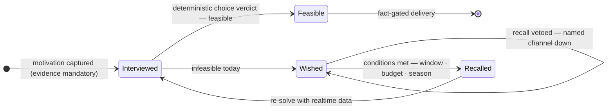
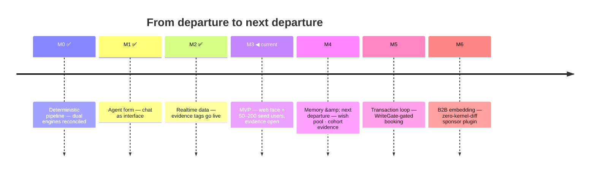

[English](README.md) | [简体中文](README.zh-CN.md)

# GoTry

> **Body and soul — more travel, less tourism.**
> *身体和灵魂,更多旅行,更少旅游。*

GoTry is an AI travel agent for **"departure to next departure."** You tell it where you want to go and why; it interviews you about your working hours and existing bookings, then hands you a deterministic itinerary verdict — ordinary candidate choices are enumerated and evaluated by the TypeScript kernel, while explicit flight-chain cases use the Z3 solver, not model guesses.

[](https://github.com/Danceiny/gotry/stargazers)
[](https://github.com/Danceiny/gotry/actions/workflows/ci.yml)
[](https://www.npmjs.com/package/@danceiny/gotry)
[](LICENSE)
[](https://www.npmjs.com/package/@danceiny/gotry)
[](docs/architecture.md)

**[What GoTry Does](#what-gotry-does)** · **[How It Works](#how-it-works)** · **[Tools](#tools)** · **[Demo](#demo)** · **[Benchmark](#how-mainstream-ai-answers-the-same-trip)** · **[Quick Start](#quick-start)** · **[Consent and Privacy](#consent-and-privacy)** · **[Trustworthy by Construction](#trustworthy-by-construction)** · **[Project Status](#project-status)** · **[Roadmap](#roadmap)** · **[For AI Agents](#for-ai-agents)** · **[Documentation](#documentation)** · **[License](#license)** · **[Star History](#star-history)**

> **Tip for newcomers:** one command is enough to feel the difference — `npx @danceiny/gotry web`, open `http://127.0.0.1:3080`, and say *"I want three relaxing days in Dali."* The agent interviews you first; then the solver, not the model, decides what is feasible. Full walkthrough: [`docs/user-guide.md`](docs/user-guide.md).

## What GoTry Does

GoTry turns "I want to go somewhere" into "can I — and how, at what true cost?" When the answer is "not this weekend," the destination is caught in a wish pool with its conditions instead of being dropped.

- **For travelers** — a conversational planner that asks the questions that actually matter (working window, booked resources, departure city, budget), then returns a verdict per destination: feasible or not, why, and the **smallest change that makes it feasible**.
- **For agent builders** — a working example of an agent where the LLM only listens, translates, and explains. Ordinary candidate decisions follow deterministic TypeScript enumeration, evaluation, and choice; the separate explicit flight-chain path uses Z3. Every deliverable number carries a provenance tag; write operations are gated by design.
- **Evidence built in** — an estimate never poses as realtime. Tags are attached by the render layer, never by the model, and switch honestly on degradation. Bookable claims that cannot trace to an exact-date tool result are blocked before delivery.

## How It Works

One planning pass is a pipeline. The model owns the two language-heavy ends; the ordinary choice path is deterministic TypeScript, while the explicit flight-chain path uses Z3:

```mermaid
flowchart LR
  U(["Traveler: 'I want three relaxing days in Dali'"]) --> A
  subgraph LANG["LLM owns — language"]
    A["Motivation interview<br/>working window · bookings · departure city"] --> B["Fact extraction<br/>working-hours &amp; leave semantics"]
  end
  subgraph NUM["Deterministic TypeScript kernel — ordinary choice path"]
    C["Candidate enumeration<br/>solveChoiceSegment"] --> D["Evaluate each choice<br/>evaluateChoice · true-cost checks"] --> V["Choice verdict<br/>feasible / infeasible · recommendation"]
  end
  subgraph Z3PATH["Separate script/control-plane entry"]
    Z["solveUnified<br/>script/control-plane flight-chain · Z3"]
  end
  subgraph GATE["Gates &amp; memory"]
    E["Evidence chain<br/>every number carries a source tag"] --> F{"Fact gate"}
    F -->|"all claims trace to exact-date tools"| G["Verified itinerary delivered"]
    F -->|"unverifiable"| H["Blocked — never posed as verified"]
    I[("Wish pool<br/>saved with recall conditions")]
  end
  B --> C
  V --> E
  B -.->|"separate script/control-plane entry"| Z
  Z --> E
  V -.->|"infeasible today"| I
  I -.->|"conditions met — enumerate again"| C
  classDef llm fill:#1f6feb22,stroke:#1f6feb,color:#1f6feb;
  classDef solver fill:#2ea04322,stroke:#2ea043,color:#2ea043;
  classDef gate fill:#d2992222,stroke:#d29922,color:#9e6a03;
  class A,B llm;
  class C,D solver;
  class E,F,G,H,I gate;
```



Vocabulary you will meet in a GoTry answer:

- **Evidence tag** — `[skeleton:openflights]` route existence verified against the public route database; `[realtime:...]` pulled live from an API seconds ago; `[static-pack:estimate]` a researched estimate — not realtime, verify before booking. On degradation the tag switches honestly.
- **Door-to-door true cost** — the ticket price plus what the trip actually takes from you: real duration across time zones, the early-wake penalty, transfers, and the energy you land with.
- **Wish pool** — "next departure" storage. An infeasible dream is saved with explicit conditions (e.g. "5+ days, off-season") and recalled when they can be met.
- **Fact gate** — pre-delivery check on itinerary artifacts: every bookable claim (flight no. / train code / time / airport / price / policy) must trace to an exact-date tool result; unverifiable means blocked — never presented as a verified plan. Flight and rail claims are classified separately; fact anchors are fingerprinted, and prices/policies fail closed on tampering or drift ([#273](https://github.com/Danceiny/gotry/issues/273) and linked issues). No live supplier availability or M5/M6 admission is claimed.

The wish pool lifecycle:



Architecture, five layers:

<a href="docs/assets/gotry-system-architecture.en.html">
  <picture>
    <source media="(prefers-color-scheme: dark)" srcset="docs/assets/gotry-system-architecture.en.dark.png" />
    <source media="(prefers-color-scheme: light)" srcset="docs/assets/gotry-system-architecture.en.light.png" />
    
  </picture>
</a>

> Generated from [`docs/assets/gotry-system-architecture.en.archify.json`](docs/assets/gotry-system-architecture.en.archify.json) with [archify](https://github.com/tt-a1i/archify) (showcase validation 0 errors/0 warnings + automated browser containment pass). Open [`docs/assets/gotry-system-architecture.en.html`](docs/assets/gotry-system-architecture.en.html) locally for the interactive version — guided views, pan/zoom, relationship tracing. English labels; the Chinese-labelled twin ([`gotry-system-architecture.html`](docs/assets/gotry-system-architecture.html)) matches the authoritative [`docs/architecture.md`](docs/architecture.md).

| Layer | Module | Role |
|---|---|---|
| L2 | `ts/src/index.ts` (dsh plugin) + `bin/gotry-inner.js` | Tool registry, time-anchor & memory-brief variables; execute isolation + consent gate + per-turn tool budget + process guards; launcher-owned dsh child process-group cleanup |
| L3 | `ts/src/unified.ts` | ordinary candidate enumeration/evaluation/choice; `solveUnified` is the separate flight-chain Z3 path. `py/gotry_feasibility/` is a historical comparison oracle only, with zero product/runtime/toolchain dependency |
| L4 | `ts/capabilities/effect.ts` · `hbcli.ts` · `skeleton-check.ts` | effect interpreter (backoff retry / circuit breaker / mock interpreter) + realtime inventory bridge + OpenFlights skeleton (three-valued semantics) |
| L5 | loopx governance | objective / gates / evidence / quota |

> Full ADRs / evolution / debt ledger: [`docs/architecture.md`](docs/architecture.md) (Chinese — English versions planned for v0.1.0).

## Tools

The plugin's 23 registered tools come in groups: **realtime retrieval** (Fliggy official channel + your own Chrome session, physically read-only) · **inventory & catalog** · the **deterministic decision engine** (`gotry_feasibility_check`; explicit flight chains via Z3) · **memory & reachability** · **artifacts** · async work-order status · the **fact gate** · **general external** search · **`gotry_doctor` self-check**.

Retrieval tools stay flat — no hidden dispatch: a channel registry returns an **ordered suggestion list** (official API > user session > web fallback, filtered by per-session channel health), and the model or user chooses the next tool. Per-tool contracts, the routing diagram, web onboarding behavior, and the operator script surface: [`docs/tools.md`](docs/tools.md) (Chinese-first).

## Demo

https://github.com/user-attachments/assets/6628c254-eba1-4017-a883-c70d22616939

*Illustrative animation-harness capture of a representative, condensed transcript — not a real `gotry web` product UI E2E (sources: [demo.en.svg](docs/assets/demo.en.svg) · [demo.en.webm](docs/assets/demo.en.webm); the animated SVG plays inline where video is unsupported). Static copy below is authoritative:*

```
> Two or three days staring at Erhai Lake, leaving from Shanghai, budget 3000, annual leave — no work.

GoTry: constraints captured —
  • window: 2 days   • departure: Shanghai   • budget: ¥3000 all-in
  • motivation: recovery [escape_rest: 0.7]   • no bookings yet

Engine verdict:
  **Erhai, Dali: not feasible now** — a 2-day window can't hold "at least 5 days of Erhai recovery".
    Relax: extend to 5 days, ~¥4950. ★ saved to your "next departure" wish pool.
  **Qiandao Lake: feasible** (G7315 06:35, ¥996, arrival energy 84%, effective rest 4.4h)
  **Taihu Lake: feasible** (G101 09:00, ¥716, effective rest 4.6h)
  Suggestion: Qiandao Lake (imagery match 80%).

[skeleton:openflights] ✓ SZX↔PVG verified [realtime:hbcli] Shanghai airports live
[static-pack:estimate] G7315/G7316 priced on Jul–Aug off-season rates
```

> Tag guide: `[skeleton:openflights]` — "this route can be flown" verified against the public route database; `[realtime:...]` — pulled live seconds ago; `[static-pack:estimate]` — off-season estimate, **verify before booking**. Tags are attached by the render layer, never by the model.

## How Mainstream AI Answers the Same Trip

GoTry's product persona is calibrated against evidence, not taste: the same real three-week multi-country workation prompt — with planted traps (no year given, a vague "some seaside town called Wan-xx", an ambiguity the user already resolved) — is fed verbatim to mainstream assistants, their answers archived word-for-word, and scored against a ground-truth rubric. Transcripts, rubric, and the contract feedback: [`docs/persona-bench/`](docs/evaluation/persona-bench/).

| Dimension | Generic chat assistant (Kimi, 13 real turns) | OTA agent (Fliggy open platform, single turn) | GoTry contract |
|---|---|---|---|
| Calendar grounding | ✗ 2025 calendar; three user corrections, three apology-refits | ✗ derived weekdays land on the 2025 calendar — contradicting its own answer on the same page | (2)(8)(9) + time-anchor card |
| Constraint interview | ✗ zero questions; both load-bearing constraints surfaced by the user at turn 6 | △ asks sales qualifiers (budget / star level / sea view); zero must-asks | (1)(10) |
| Feasibility & time accounting | ✗ density illusion, caught by the user | ✗ HK errands + same-day flight with no time budget; an "8h" flight contradicting its own arrival time | (4) + door-to-door true cost |
| Fact provenance | △ destination research holds up | ✗ sells a defunct airline (retired 2020); every price unsourced | (3)(7)(13)(20) |
| Structure completeness | △ decent comparison table only at turn 13 | ✓✓ full skeleton in one turn — completeness is table stakes | verified completeness (fact gate) |
| Persona in one line | erudite but stateless chatter — the user ends up doing four jobs | a flawless-brochure OTA clerk — every section ends in a price table | trusted travel engineer: interview first, the solver decides, infeasible says infeasible |

> **Evidence boundary:** this is a qualitative comparison, not a scorecard or performance claim. The Kimi and Fliggy columns summarize archived real-world transcripts with different protocols (13 turns versus one turn). The GoTry column summarizes repository behavior contracts and deterministic/fixture evidence; it is not a comparable real-world benchmark result. No ranking, uplift, or numerical positioning is asserted. Comparable benchmark evidence would require the same prompt, models, channel conditions, sample sizes, rubric, and published scoring.

**Single best finding: two unrelated products derived their weekdays from the 2025 calendar.** Calendar grounding has to be a product mechanism (anchor card, assert once, never recompute) — not model luck. Cautionary deep-dive: [`docs/research/kimi-postmortem.md`](docs/research/kimi-postmortem.md).

## Quick Start

### npm (recommended)

```bash
npx @danceiny/gotry web
# → open http://127.0.0.1:3080 and chat: "I want three relaxing days in Dali"
# LLM key & model: handled by the dsh host UI; nothing for gotry to ask on the CLI
```

| Entry | Command | When |
|---|---|---|
| Web chat (recommended) | `npx @danceiny/gotry web` | multi-turn planning with visualized reasoning → `:3080` |
| Headless one-shot | `npx @danceiny/gotry "Two recovery days from Shenzhen, budget 3000"` | scripts / CI / targeted debugging → stdout |
| Dependency doctor | `npx @danceiny/gotry doctor` (`--fix` to repair) | optional channels misbehaving: checks extension / Agent-Reach / hbcli / FlyAI key / sidebar / calendar / map tools, prints exact repair guidance, writes `gotry-state/doctor-report.md` |

Requires Node ≥ 22.15. LLM credentials are managed by your dsh host UI — gotry itself never asks for or echoes them; OpenAI-compatible endpoints (MiniMax / relays / self-hosted gateways) are handled by the dsh model configuration. First cold start takes 6–15 s; if port `:3080` is taken, free it first; unexpected exits leave evidence in `gotry-state/incidents.jsonl`.

> **Where you run it** — any npm-compatible registry works as long as the package is synced (pin an exact version if a mirror's `latest` lags). Inside the gotry repo itself, bare-name `npx @danceiny/gotry …` fails with `sh: gotry: command not found` — use the source entry `./gotry web`. An eligible interactive launch may offer a one-time optional-capability check (`y` runs the same installers as `doctor --fix`, `n` skips; CI / non-TTY never prompt, never install). Onboarding details and the repo-side operator scripts (cost table / metrics report / channel probe): [`docs/tools.md`](docs/tools.md).

### Developer source install

```bash
git clone https://github.com/Danceiny/gotry && cd gotry
npm ci && npm --prefix ts ci                      # pinned root/TS closure
node scripts/build-dist.mjs                       # build the JS runtime
./gotry web                                       # in-repo entry, same UX
```

The source entry and the npm package resolve the same 230-package DeepSeek Harness `0.1.5-alpha.1` closure (exact direct dependencies; publish preverify rejects omissions, mixed versions, and ranges). Source runs keep their state under `ts/dsh-runtime/gotry-state/`; benchmark opt-in and npm-package runs use the invocation directory for isolation.

## Consent and Privacy

The account-session channel reads realtime hotel/flight data from **your own logged-in Chrome**, under four hard rules:

1. **Login happens on the external website** — GoTry never offers, fills, or collects any password / SMS code / cookie value; it answers one boolean question — "does a login-ticket cookie exist" (cookie **names** only).
2. **Consent card, once per session** — approval holds for the session, refusal revokes it; master switch `sessionAccess: ask|allow|off` at any time.
3. **Physically read-only** — a ReadGuard aborts all write requests at the network layer; a captcha stops the agent and hands control back to you.
4. **Never hijacks your browser** — retrieval/login open their own dedicated tab; routine test runs never open browser windows.

One-time prerequisite: the [GoTry Session Bridge](https://chromewebstore.google.com/detail/gotry-session-bridge/oeajpiccmonococjcegddlooeeohlbgd) Chrome extension (one-click, auto-updates, no setup wizard) — until installed, tools return `needs-extension` with the store link and spend nothing.

## Trustworthy by Construction

1. **The model translates; deterministic code decides.** The LLM never produces feasibility verdicts or arithmetic. Ordinary candidate verdicts come from TypeScript enumeration/evaluation/choice; explicit flight-chain constraints use `solveUnified` and Z3 against the extracted facts.
2. **Every number carries a source tag** — attached by the render layer, never the model. Tags switch honestly on degradation; an estimate never poses as realtime.
3. **No write path exists.** Booking/payment-class tools must pass WriteGate before any implementation ships; the future booking seam is already pinned by the `booking_saga_fsm.v1` edge table.
4. **Login never touches credentials.** Login happens on the external website; GoTry reads cookie names only; consent is asked once per session and revocable.
5. **Retrieval is physically read-only.** A ReadGuard aborts write requests at the network layer; a captcha stops the agent and hands control back to you.
6. **Unverifiable means blocked.** The fact gate refuses to deliver any itinerary whose bookable claims cannot trace to exact-date tool results — it is never presented as a verified plan. Anchored fact/policy rows are fingerprinted against the registered facts, so edited or unknown anchors fail closed.
7. **Prices fail closed.** Unknown models get no guessed price; the price table changes only by PR; the drift monitor reports, never auto-applies.
8. **Your data is yours.** Product state lives under `gotry-state/`; validation paths use isolated state roots and never write the founder's real product data.

## Project Status

Current release: **v0.0.1-rc.22** (npm `latest`; the `rc` dist-tag points at rc.20. Registry pull-verified 2026-09-09 against a mirror: npx install, bin resolution, and `web` startup all pass). Evaluation is at Phase 0 foundation — deterministic contracts, validators, and a cadence policy; no external benchmark scores, no spend, no uplift claims. The M4→M6 program plan is a living task graph in [`docs/design/milestone-delivery-plan.md`](docs/design/milestone-delivery-plan.md) (it records the `hotelbyte-cli` first-supplier decision for M5 contract preparation, but opens no gates); public execution and debt ownership follow [the #270 ledger contract](docs/ops/external-pr-workflow.md) §0.

**Working today**:

- **Deterministic choice kernel + explicit flight-chain Z3 path** — ordinary candidate enumeration, `evaluateChoice`, true-cost checks, per-candidate verdicts and recommendation; multi-leg flight chains go through the separate `solveUnified` Z3 path
- **Realtime + account-session retrieval** — flights/trains/hotels (Fliggy official channel), catalogs, weather, live flight observation, route connectivity, plus Ctrip flights & hotels / 12306 trains / Dida supplier-portal rates on your own Chrome (consent-gated, physically read-only, typed invocation-bound facts; no live-availability claim beyond observed runs); realtime prices can overwrite solver prices (`GOTRY_REALTIME_PRICING=1`)
- **Dependency doctor & extension on demand** — `npx @danceiny/gotry doctor` / `gotry_doctor`: read-only by default, scoped repair on approval via the same idempotent installers; the Session Bridge extension is offered as a clickable link when first needed (no setup wizard)
- **Memory & reachability** — motivation profile / wish pool / companions / travel timeline on the tenant-scoped SQLite ledger; English solve output via `GOTRY_LOCALE=en`
- **Routed turn budgets** — a deterministic, zero-LLM router classifies every turn (quick / sync / deep-planning); deep-planning hands off to a persisted background ticket (`gotry_turn_handoff.v1`, ETA ≈1h) instead of dying mid-stream
- **M4 lifecycle evidence collector** — explicit opt-in CLI, isolated `stateRoot`, mandatory consent + HMAC key; exports feed the #223 scorer as candidate/synthetic only
- **Recent slices & fail-closed hardening** — bounded ground-transfer slice (#341), flight/hotel anchor field fingerprint (#363), malformed supplier responses (#279/#352), policy-anchor fingerprint (#359), booking-planner & duplicate-call repairs (#282/#327), safe-dispatch diagnostics (#329), IANA timezone contract (#343), home-city default (#338), subagent/jobs id guard (#194), ledger CLI & read-only repair plan (#254), Node ≥22.15 builds (#265). Deterministic, isolated evidence each — none open M4/M5/M6 gates. Full trail: [CHANGELOG.md](CHANGELOG.md)

**Open limitations** (honest list):

- **M3 Exit not closed** — the real 50–200 seed-user cohort evidence is not yet accumulated; automated tests prove contracts and formulas, not business pass
- **M4→M6 gates remain evidence-bound** — no real `observed_private` N≥5 repeat cohort has landed; M5 awaits #136 supplier authorization, M6 awaits #137 P6 approval + a signed pilot; local/fixture proof never opens these gates
- **Hotel session adapters** — Ctrip-hotel / Meituan logged-in surfaces await real login-state backfill; flights are done
- **#272 live evidence remains open** — only deterministic offline summary hardening (#335) has landed
- **Interface language** — English covers the deterministic solve-output layer; the dsh host UI and dialogue surface belong to the host
- **External benchmark generalization** — every frozen external run to date is diagnostic-only (no score, no uplift); round-by-round ledger: [`docs/evaluation/benchmark-environment-bridge.md`](docs/evaluation/benchmark-environment-bridge.md)
- **Booking** — nothing bookable ships today; M5 opens only through WriteGate and the booking-saga FSM

<details>
<summary>Deeper engineering state (ledger contracts / evidence contracts / milestone stance)</summary>

The authoritative state lives in the docs, not this README: transactional state ledger (ADR-15) + dual-form freeze (ADR-16: one ledger semantics for local+web; append/read/fold/rebuild are tenant-scoped, and legacy local rows are not re-attributed without external evidence); the M3 real-cohort evidence contract stands (fixtures don't count toward Exit; 50–200 real samples open the gate); the M4 paired-cohort value evidence contract is hardened (synthetic data is never Exit evidence; observed-private data also needs a manual source-review attestation contract bound to the current summary digest and cannot rely on `evidence_kind` self-reporting); the #228 collector is only an explicit-consent, isolated-stateRoot path to produce those scorer inputs; the async work-order terminal contract (`gotry_async_terminal.v1`: 4/4 → succeeded / ledger settled / exit 0). Details: [`docs/roadmap.md`](docs/roadmap.md) / [`docs/architecture.md`](docs/architecture.md) §1 and issues #19–#22, #223, #224, and #228.

</details>

## Roadmap



| # | Milestone | Scope | Status |
|---|---|---|---|
| M0 | Deterministic pipeline | dual engine implementations + real data packs + reconciliation | ✅ |
| M1 | Agent form established | LLM in the loop; chat as interface; gates as choice cards | ✅ |
| M2 | Realtime data | hotelbyte bridge + flight sources; evidence chain switches to realtime tags | ✅ |
| M3 | MVP | minimal web face + 50–200 seed users (Erhai / Phuket scenarios) | **← current — evidence open** |
| M4 | Memory & "next departure" | six-layer memory C-end domain; paired-cohort value evidence + explicit lifecycle collector | founder-authorized parallel; real N≥5 cohort open |
| M5 | Transaction loop | WriteGate in production; booking / payment / refunds; first supplier target: `hotelbyte-cli` | entry-gated: M4 Exit + supplier protocol |
| M6 | B2B embedding | traveler principal / sponsor plugin with measured zero-kernel-diff proof | entry-gated: M5 Exit + P6 founder review |

The single authoritative timeline — entry/exit conditions, deliverables, and gates per milestone — is [`docs/roadmap.md`](docs/roadmap.md).

## Verify

```bash
./scripts/run-all-tests.sh                     # full-stack suite (pure TS, no Python needed)
cd ts
npx tsx scripts/evaluation-contract-tests.ts   # evaluation Phase 0 contracts (offline)
npx tsx scripts/evaluation-cadence-tests.ts    # deterministic cadence policy/planner
```

The suite covers golden engines, dialogue replay, cross-process async work-orders, plugin smoke, realtime bridges, fatal incident observation and process guards, i18n, memory domain, the M4 lifecycle collector, the Z3 concurrency gate, the fact gate, and a packaged-consumer turn-deadline E2E, among others; the authoritative section list is whatever `scripts/run-all-tests.sh` enumerates. The packaged Web retry/cancel proof (#289) runs from `ts/` via `GOTRY_SESSION_LIVE=0 npx --no-install tsx scripts/issue-289-web-retry-e2e.ts` (needs Node 24 + local Chrome; reviewable artifacts land under `.omx/artifacts/issue-289-web-retry-e2e/`). The live session benchmark (`npx tsx scripts/sf-live-benchmark.ts --golden=static`) is opt-in, requires your connected Chrome session, and never runs in CI. For PRs, local final-SHA evidence is required; CI is additional signal, not a substitute.

## Contributing

Branch off latest `main` (`feat/ · fix/ · docs/ · chore/`), run local final-SHA typecheck + full regression, then open a Pull Request. Project process requires PR review for `main`; do not infer that GitHub branch protection has been configured. CI runs typecheck + all suites on Node 22/24 and the focused dist compatibility proof on Node 22/24/26; it is additional signal, not a replacement for local evidence. A maintainer chooses a repository-allowed merge method after checking the reviewed exact head and records the destination SHA. **Red tests never merge.** Full guide: [CONTRIBUTING.md](CONTRIBUTING.md). Bug reports / feature suggestions: use the issue templates (search existing issues first).

## For AI Agents

If you are an agent working in this repository, [`AGENTS.md`](AGENTS.md) is the binding contract — read it first. In brief:

- **Sweep async work orders on entry**: `ts/gotry-state/async/*.json` without a matching `.deliverable.md` → `cd ts && npx tsx scripts/async-collect.ts <id>`.
- **Layer discipline**: arithmetic only in the evaluate layer of `model.ts` / `unified.py`; solving only in `unified.ts` / `unified.py`; `engine.*` / `journey.*` are deprecated compatibility layers — new code must not call them. Any side change requires the full-stack regression.
- **Never write shared state**: `ts/dsh-runtime/gotry-state/` is the founder's real product data; validate write paths with an isolated `stateRoot` only.
- **State-sync discipline**: any commit changing the system's shape/state/debt must sync the six state faces of `architecture.md` §11 in the same commit; stage only named files — never `git add -A`.

Program-level context: [`docs/gotry-master-outline.md`](docs/gotry-master-outline.md). Technical authority: [`docs/architecture.md`](docs/architecture.md).

## Documentation

| Document | Purpose |
|---|---|
| [`docs/README.md`](docs/README.md) | Docs conventions & full index (taxonomy, naming, lifecycle) |
| [`docs/architecture.md`](docs/architecture.md) | System, ADRs, evolution, debt ledger (Chinese, authoritative) |
| [`docs/gotry-master-outline.md`](docs/gotry-master-outline.md) | Program master outline & reuse matrix |
| [`docs/gotry-product-design.md`](docs/gotry-product-design.md) | Product design: main loop, transparency, whole-cost model |
| [`docs/roadmap.md`](docs/roadmap.md) | M0–M6 timeline & current position |
| [`docs/user-guide.md`](docs/user-guide.md) | End-user guide |
| [`docs/tools.md`](docs/tools.md) | Tool reference: per-tool contracts, channel routing, onboarding, operator scripts (Chinese-first) |
| [`docs/data-sources.md`](docs/data-sources.md) | Data sources & evidence-chain policy |
| [`docs/ops/extension-privacy.md`](docs/ops/extension-privacy.md) | Session Bridge extension privacy |
| [`docs/research/kimi-postmortem.md`](docs/research/kimi-postmortem.md) | A real AI-travel-planning failure postmortem (cautionary tale) |
| [`docs/evaluation/persona-bench/`](docs/evaluation/persona-bench/) | Agent-persona benchmark — same real-trip prompt answered by mainstream AIs: transcripts, scoring rubric, and the persona it shapes |
| [`docs/release-notes.md`](docs/release-notes.md) | Release decisions per version (the "why") |
| [`CHANGELOG.md`](CHANGELOG.md) | Machine-derived changelog (Keep a Changelog + Conventional Commits) |

## License

**MIT** — same as upstream dsh. See [LICENSE](LICENSE).

## Star History

<a href="https://www.star-history.com/?repos=danceiny%2Fgotry&type=date&legend=top-left">
 <picture>
   <source media="(prefers-color-scheme: dark)" srcset="https://api.star-history.com/chart?repos=danceiny/gotry&type=date&theme=dark&legend=top-left" />
   <source media="(prefers-color-scheme: light)" srcset="https://api.star-history.com/chart?repos=danceiny/gotry&type=date&legend=top-left" />
   
 </picture>
</a>

---

**Built with**: DeepSeek Harness 0.1.5-alpha.1 (root-pinned) · Cordis · Z3 (WASM) · loopx (pipx) · hotelbyte-cli · Agent-Reach v1.5.0 · OpenFlights · TypeScript

**Version baseline: `v0.0.1-rc.22` (npm `latest`).** The authoritative verification gates for the current checkout are enumerated by `scripts/run-all-tests.sh`; release flow: `scripts/publish-npm.sh`.
