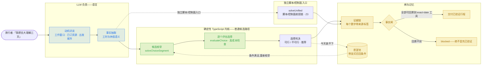
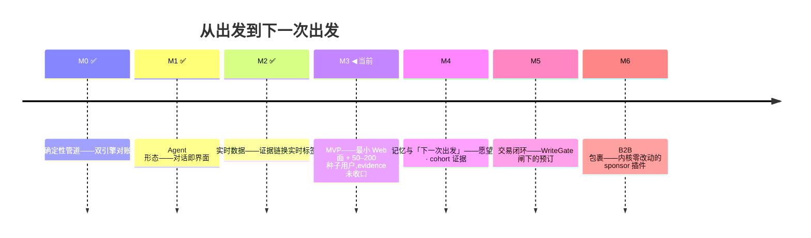

[English](README.md) | [简体中文](README.zh-CN.md)

# GoTry

> **身体和灵魂，更多旅行，更少旅游。**
> *Body and soul — more travel, less tourism.*

**GoTry 是「从出发到下一次出发」的 AI 旅行 Agent**：你只管说想去哪、为什么出发；它把该问的问清楚，然后让代码替你拍板——能不能去、怎么去、真实代价多少，每个数字都带出处，不靠模型脑补。

[](https://github.com/Danceiny/gotry/stargazers)
[](https://github.com/Danceiny/gotry/actions/workflows/ci.yml)
[](https://www.npmjs.com/package/@danceiny/gotry)
[](LICENSE)
[](https://www.npmjs.com/package/@danceiny/gotry)
[](docs/architecture.zh-CN.md)

**[它做什么](#它做什么)** · **[工作原理](#工作原理)** · **[一段对话](#一段对话)** · **[同题横评](#同题横评)** · **[快速开始](#快速开始)** · **[隐私与可信](#隐私与可信)** · **[状态与路线图](#状态与路线图)** · **[参与开发](#参与开发)** · **[文档](#文档)**

## 它做什么

把「想去哪」变成「能不能去、怎么去、真实代价是多少」。这周末去不了？它不会把你的念头一丢了之——目的地连同一个「满足就再试」的条件一起存进愿望池。

- **给旅行者** —— 先问对人问题（哪几天能走 / 从哪出发 / 预算多少），再给每个目的地一句痛快话：能去、不能去、为什么，以及让它能去的最小改动。
- **给 Agent 工程师** —— LLM 只负责听懂、翻译、解释；数字由代码算，判决由代码下。交付的每个数字带来源标签；写操作从设计上被闸住。

## 工作原理

模型只占语言密集的两端，数值全部归确定性代码：



架构——同步主链从对话经内核到事实闸，外加状态与异步控制面、只读数据层：

<a href="docs/assets/gotry-system-architecture.html">
  <picture>
    <source media="(prefers-color-scheme: dark)" srcset="docs/assets/gotry-system-architecture.dark.png" />
    <source media="(prefers-color-scheme: light)" srcset="docs/assets/gotry-system-architecture.light.png" />
    
  </picture>
</a>

> 交互版：[`docs/assets/gotry-system-architecture.html`](docs/assets/gotry-system-architecture.html)（archify 生成，showcase 校验通过）。分层：L2 dsh 插件 · L3 `ts/src/unified.ts` 内核 · L4 效应解译 + 实时桥 · L5 loopx 治理。ADR：[`docs/architecture.md`](docs/architecture.zh-CN.md)。

23 个注册工具分组：实时检索（飞猪官方通道 + 你本人登录态 Chrome，只读）· 目录 · 判定引擎 · 记忆 · 产物 · 事实闸 · 外部检索 · `gotry_doctor` 自检。无隐藏派发——通道注册表只返回有序建议列表，由模型或用户选择。逐工具契约：[`docs/tools.md`](docs/tools.zh-CN.md)。

## 一段对话

https://github.com/user-attachments/assets/6d537bb7-7992-4cc7-8e89-6f111ef6793b

*说明性 animation-harness 对精简对话的录制——不是 `gotry web` 产品 UI 的真实 E2E（源文件：[SVG](docs/assets/demo.zh-CN.svg) · [webm](docs/assets/demo.zh-CN.webm)）：*

```
> 我想去洱海边发呆两三天,上海出发,预算 3000,年假别让我办公。

GoTry: 收到。先把约束记下来——
  • 窗口: 2 天  • 出发: 上海  • 预算: ¥3000 全含
  • 动机: 休整 / [escape_rest: 0.7]  • 还没订任何东西

引擎判定:
  **大理·洱海: 现在不行** —— 2 天窗口装不下「至少 5 天的洱海休整」。
    放宽方案: 行程延长到 5 天,约 ¥4950。★已放入「下一次出发」清单。
  **千岛湖: 可行** (G7315 06:35 出发,¥996,到达精力 84%,有效休整 4.4h)
  **太湖: 可行** (G101 09:00 出发,¥716,有效休整 4.6h)
  建议: 千岛湖(意象匹配 80%)。

[骨架:openflights] ✓ SZX↔PVG 已校验 [实时API:hbcli] 上海机场在跑
[静态包:估算] G7315/G7316 价格按 7-8 月淡季估算
```

> 标签：`[骨架:openflights]` 航线经公开航线库校验 · `[实时API:*]` 刚从实时接口拉回 · `[静态包:估算]` 估算，**订前核实**。标签由渲染层附加，模型无权染指。

## 同题横评

同一段真实的跨国 workation prompt（埋了考点：不给年份、模糊指代「万xx」、用户已自行消解的歧义）逐字投喂各家主流 AI，回答逐字存档、对照地面真值打分（[`docs/evaluation/persona-bench/`](docs/evaluation/persona-bench/README.md)）。

| 维度 | 通用助手（Kimi，真实 13 轮） | OTA Agent（飞猪开放平台，单轮） | GoTry 契约 |
|---|---|---|---|
| 日历 grounding | ✗ 2025 年历；用户三次纠正、三次道歉式重排 | ✗ 派生星期落 2025 年历，与同页自答自相矛盾 | （2）（8）（9）+时间锚点卡 |
| 约束访谈 | ✗ 零提问；两个要害约束第 6 轮才由用户说出 | △ 只问销售资质（预算/星级/靠海），必答题零命中 | （1）（10） |
| 可行性与时间账 | ✗ 密度幻觉，被用户点破 | ✗ 香港办事+当天飞普吉无时间账；「约8小时」与自己的到达时刻矛盾 | （4）+门到门全成本 |
| 事实可证性 | △ 目的地研究经得起对 | ✗ 停业航司（2020 年歇业）仍在售；价格全部无出处 | （3）（7）（13）（20） |
| 结构完整性 | △ 第 13 轮才长出像样的对比表 | ✓✓ 单轮骨架最全——完整是基本盘 | 验证过的完整（事实闸） |
| 人格一句话 | 博学但无状态的聊天者——用户被迫干四份工 | 版式完美的 OTA 导购——每段止于价格表 | 可信赖的行程工程师：访谈先行、求解器判决、不可行明说 |

> **证据边界：**这是定性比较，不是分数表。Kimi/飞猪两列来自存档 transcript（13 轮 vs 单轮）；GoTry 一列是仓库行为契约。不主张排名或提升。

单条最有价值的发现：两家互不相关的产品，星期全落在 2025 年历上——日历锚定必须是产品机制，不是模型运气（[复盘全文](docs/research/kimi-postmortem.md)）。

## 快速开始

```bash
npx @danceiny/gotry web        # → 浏览器打开 http://127.0.0.1:3080
npx @danceiny/gotry doctor     # 可选渠道体检(--fix 补装)
npx @danceiny/gotry "我想从深圳休整两天,预算 3000"   # headless 一问一答
```

前置 Node ≥ 22.15。LLM key 由 dsh 宿主 UI 配（OpenAI 兼容端点同），gotry 不问也不回显。任何 npm 兼容 registry 皆可；镜像 `latest` 滞后时钉精确版本。仓内请走源码入口 `./gotry web`（裸名 npx 在仓内会失败）。符合条件的启动可能提供一次可选能力检查；CI / 非 TTY 不询问、不安装。onboarding 细节与运维脚本：[`docs/tools.md`](docs/tools.zh-CN.md)。源码安装：`npm ci && npm --prefix ts ci && node scripts/build-dist.mjs`——与 npm 包同一组钉死的 DSH `0.1.5-alpha.1` closure。全栈验证：`./scripts/run-all-tests.sh`。

## 隐私与可信

账号会话通道用**你本人已登录的 Chrome** 读实时数据，四条 hard 规则：

1. **登录在外部网站完成** —— 不碰密码、验证码、cookie 值；只读 cookie **名字**。
2. **授权卡，每会话一次** —— 拒绝即吊销；总闸 `sessionAccess: ask|allow|off`。
3. **物理只读** —— ReadGuard 在网络层中止写请求；遇验证码立即停。
4. **绝不劫持你的浏览器** —— 只开独立标签页；测试永不自动开窗。

前置（一次性）：[GoTry Session Bridge](https://chromewebstore.google.com/detail/gotry-session-bridge/oeajpiccmonococjcegddlooeeohlbgd) 扩展（一键装、自动更新）；未安装时工具返回 `needs-extension` 并附链接，不消耗配额。

可信不靠承诺，靠构造：

1. **模型只翻译，代码才判决** —— LLM 不产出可行性判决与算术。
2. **每个数字带来源标签** —— 渲染层附加，降级如实更换。
3. **不存在写路径** —— 预订/支付类工具必须先过 WriteGate。
4. **回溯不到就是 blocked** —— 无法回溯到 exact-date 工具结果的 claim 绝不交付为「已验证」；锚点带指纹。
5. **价格 fail-closed** —— 未知模型不猜价；价表只经 PR 变更。
6. **你的数据是你的** —— 状态在 `gotry-state/`；测试用隔离 state root。

## 状态与路线图

npm `latest`：**v0.0.1-rc.22**。未到 1.0：核心链路已端到端可用；评测仍停留在确定性合同与校验器阶段，无外部分数、无 uplift 声明。

**今天可用** —— 访谈 → 确定性可行性判决 → 带门到门真成本的行程 · 实时检索（飞猪 + 你本人登录态 Chrome，只读），事实 typed 且调用绑定 · 记忆（动机 / 愿望池 / 同行人 / 时间线）落租户作用域账本 · 自检 doctor，批准后范围修复。

**还没有** —— 今天没有可下单路径；预订只随 WriteGate 用户确认设计启封 · 实时可订证据仍部分覆盖 · 真实用户 cohort 未到退出口径 · 英文仅覆盖求解输出层。



里程碑进出闸：[`docs/roadmap.md`](docs/roadmap.zh-CN.md) · 工程状态：[`docs/architecture.md`](docs/architecture.zh-CN.md) · 逐版本决策：[`docs/release-notes.md`](docs/release-notes.zh-CN.md) + [CHANGELOG.md](CHANGELOG.md)。

## 参与开发

从最新 `main` 切 `feat/ · fix/ · docs/ · chore/` 分支，typecheck + 全栈回归全绿后开 PR。**测试红着不许合。** 指南：[CONTRIBUTING.md](CONTRIBUTING.zh-CN.md)。

AI agent：[`AGENTS.md`](AGENTS.zh-CN.md) 是绑定契约——入场先清扫异步工单 · 算术只在 evaluate 层、求解只在 `unified.*` · 绝不写共享状态（`ts/dsh-runtime/gotry-state/`）· 同提交同步 `architecture.md` §11 六状态面 · 只暂存具名文件，禁止 `git add -A`。

## 文档

每篇文档以双语对（英文 `x.md` + 中文 `x.zh-CN.md`）为准绳，成对不一致视为 bug（机器生成的 `CHANGELOG.md` 与工具自管的 `superpowers/` 豁免）。

| 文档 | 内容 |
|---|---|
| [`docs/architecture.md`](docs/architecture.zh-CN.md) | 系统 / ADR / 演进 / 债务（权威） |
| [`docs/roadmap.md`](docs/roadmap.zh-CN.md) | M0–M6 时间线与当前位置 |
| [`docs/user-guide.md`](docs/user-guide.zh-CN.md) | 终端用户使用指南 |
| [`docs/tools.md`](docs/tools.zh-CN.md) | 工具参考面：契约 · 路由 · onboarding |
| [`docs/data-sources.md`](docs/data-sources.zh-CN.md) | 数据源与证据链政策 |
| [`docs/release-notes.md`](docs/release-notes.zh-CN.md) | 逐版本发布决策（「为什么」） |
| [`CHANGELOG.md`](CHANGELOG.md) | 机器衍生变更日志 |
| [`docs/README.md`](docs/README.zh-CN.md) | 文档规范与总索引 |

## License

**MIT**——与上游 dsh 一致。文本见 [LICENSE](LICENSE)。

**Built with**: DeepSeek Harness 0.1.5-alpha.1 (root-pinned) · Cordis · Z3 (WASM) · loopx (pipx) · hotelbyte-cli · Agent-Reach v1.5.0 · OpenFlights · TypeScript

**版本基线：`v0.0.1-rc.22`（npm `latest`）。** 验证闸：`scripts/run-all-tests.sh`；发布流程：`scripts/publish-npm.sh`。

<a href="https://www.star-history.com/?repos=danceiny%2Fgotry&type=date&legend=top-left">
 <picture>
   <source media="(prefers-color-scheme: dark)" srcset="https://api.star-history.com/chart?repos=danceiny/gotry&type=date&theme=dark&legend=top-left" />
   <source media="(prefers-color-scheme: light)" srcset="https://api.star-history.com/chart?repos=danceiny/gotry&type=date&theme=light&legend=top-left" />
   
 </picture>
</a>
