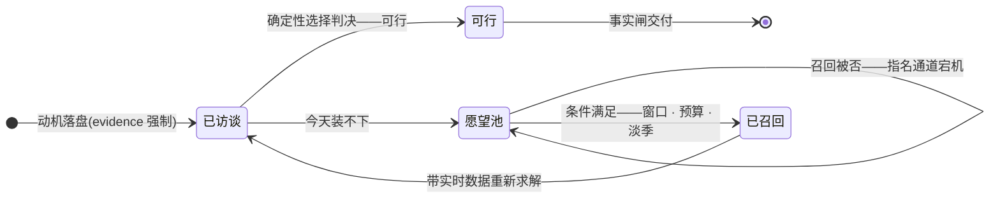
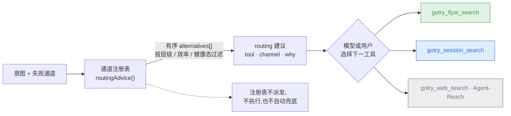
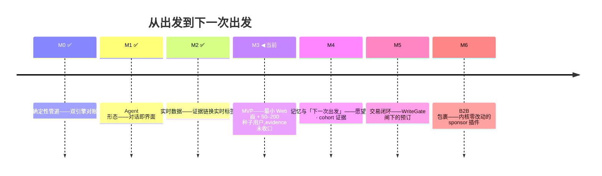

[English](README.md) | [简体中文](README.zh-CN.md)

# GoTry

> **身体和灵魂,更多旅行,更少旅游。**
> *Body and soul — more travel, less tourism.*

**GoTry 是「从出发到下一次出发」的 AI 旅行 Agent**:你用一句话说想去哪、为什么想出发;它先问清楚你的工作窗口和已订资源,再给你一份确定性的行程判决——普通候选由 TypeScript 内核枚举并评估,显式航班链路径才使用 Z3,不是模型猜的。

[](https://github.com/Danceiny/gotry/stargazers)
[](https://github.com/Danceiny/gotry/actions/workflows/ci.yml)
[](https://www.npmjs.com/package/@danceiny/gotry)
[](LICENSE)
[](https://www.npmjs.com/package/@danceiny/gotry)
[](docs/architecture.md)

**[它做什么](#它做什么)** · **[工作原理](#工作原理)** · **[工具](#工具)** · **[一段对话](#一段对话)** · **[同题横评](#与主流-ai-同题横评产品人格从哪来)** · **[快速开始](#快速开始)** · **[账号会话:授权与隐私](#账号会话授权与隐私)** · **[构造上可信](#构造上可信)** · **[状态与限制](#状态与限制)** · **[路线图](#路线图)** · **[给 AI Agent](#给-ai-agent)** · **[文档](#文档)** · **[License](#license)** · **[Star History](#star-history)**

> **新读者提示**:一条命令就能感受差别——`npx @danceiny/gotry web`,打开 `http://127.0.0.1:3080`,说一句「我想去大理躺三天」。Agent 会先访谈你;然后由求解器(而非模型)判定什么可行。完整走查见 [`docs/user-guide.md`](docs/user-guide.md)。

## 它做什么

GoTry 把「想去哪」变成「能不能——怎么去、真实代价是多少」。当答案是「这周末不行」时,目的地连同成行条件进愿望池接住,而不是被丢掉。

- **给旅行者** —— 一个先问对人问题(工作窗口/已订资源/出发城市/预算)的对话规划器,然后逐目的地给判决:可行/不可行、为什么、以及**让它可行的最小改动**。
- **给 Agent 工程师** —— 一个「LLM 只负责听懂、翻译、解释」的落地样本:普通候选沿确定性的 TypeScript 枚举、评估、选择路径;独立的显式航班链路径使用 Z3。交付物里每个数字都带来源标签,写操作从设计上就是被闸住的。
- **证据内建** —— 估算绝不冒充实时。标签由渲染层附加、模型无权染指;降级时标签如实更换。回溯不到 exact-date 工具结果的可下单 claim,交付前就被拦下。

## 工作原理

一次规划是一条流水线:模型只占语言密集的两端;普通候选路径由确定性的 TypeScript 内核处理,显式航班链路径使用 Z3:


在 GoTry 的回答里会遇到的词汇:

- **证据标签** —— `[骨架:openflights]` 航线存在性经公开航线库校验;`[实时API:...]` 刚从实时接口拉回数秒;`[静态包:估算]` 调研估算——非实时,下单前请核实。降级时标签如实更换。
- **门到门全成本** —— 票价之外,这段旅程真正从你身上拿走的东西:跨时区的真实时长、早起惩罚、接驳、落地时的精力余额。
- **愿望池** —— 「下一次出发」的存储。装不下的憧憬带显式条件(如「5 天+、淡季」)入池,条件满足时被召回。
- **事实闸** —— 行程产物交付前闸:每条可下单 claim(航班号/时刻/机场/价格/政策)必须回溯到 exact-date 工具结果;回溯不到即 blocked——绝不宣称「已验证方案」。航班与铁路 claim 分开归类;事实锚点带指纹,价格/政策在篡改或漂移时一律 fail closed([#273](https://github.com/Danceiny/gotry/issues/273) 及关联 issue)。不声称实时可售,也不构成 M5/M6 入场证据。

愿望池生命周期:



架构五层:

<a href="docs/assets/gotry-system-architecture.html">
  <picture>
    <source media="(prefers-color-scheme: dark)" srcset="docs/assets/gotry-system-architecture.dark.png" />
    <source media="(prefers-color-scheme: light)" srcset="docs/assets/gotry-system-architecture.light.png" />
    
  </picture>
</a>

> 由 [`docs/assets/gotry-system-architecture.archify.json`](docs/assets/gotry-system-architecture.archify.json) 经 [archify](https://github.com/tt-a1i/archify) 生成(showcase 校验:9/9 构件检查 + 浏览器实测)。本地打开 [`docs/assets/gotry-system-architecture.html`](docs/assets/gotry-system-architecture.html) 可得交互版——引导视图 · 缩放平移 · 关系追踪。同步主链明确区分普通 TypeScript 候选枚举/评估/选择,以及独立的显式航班链 `solveUnified` Z3 路径。

| 层 | 模块 | 角色 |
|---|---|---|
| L2 | `ts/src/index.ts`(dsh 插件) | 注册 21 工具,挂时间锚点/记忆 brief 变量;execute 异常隔离 + 授权闸 + 每轮工具预算 + 进程护栏 |
| L3 | `ts/src/unified.ts` | 普通候选枚举/评估/选择; `solveUnified` 是独立航班链 Z3 路径。`py/gotry_feasibility/` 仅是历史对照 oracle,与产品/运行时/工具链零依赖 |
| L4 | `ts/capabilities/effect.ts` · `hbcli.ts` · `skeleton-check.ts` | 效应解译层(退避重试/断路器/mock 解译器)+ 实时库存桥 + OpenFlights 骨架(三值语义) |
| L5 | loopx 治理面 | objective / gates / evidence / quota |

> 完整 ADR / 演进 / 债务清单:[`docs/architecture.md`](docs/architecture.md)(英文版计划 v0.1.0)。

## 工具

六组共 22 个:

| 组 | 工具 | 干什么 |
|---|---|---|
| **实时检索(OTA/官方只读)** | `gotry_flyai_search` | 机票/火车/酒店实时报价(飞猪官方通道;酒店价格为上游打码展示;匿名试用额度达限归类 `needs-setup` 并带配 key 指引,不盲重试) |
| | `gotry_session_search` | 在**用户本人登录态**里查携程机票/酒店 + 12306 火车 + Dida 供应商门户酒店实时价(kind=flight/hotel/train;授权后,物理只读;未知 kind fail closed) |
| | `gotry_session_login` | 登录引导:自动检测已登录与否,未登录才在用户 Chrome 弹登录入口(**零终端**) |
| | `gotry_weather_check` | Open-Meteo 预报≤16 天 + 历史气候基线 |
| | `gotry_flight_verify` | OpenSky ADS-B 航班实时观测(三值) |
| | `gotry_skeleton_check` | OpenFlights 168 对枢纽通航性(三值) |
| **库存与目录** | `gotry_hotel_search` | hotel-byte 实时桥(缺入住/退房日期先追问),供应商不可用时降级为明确标注的静态结果 |
| | `gotry_anything_search` | 城市/酒店/地标混合目录(hotel-be Anything) |
| **判定引擎** | `gotry_feasibility_check` | 注册工具路径:确定性的 TypeScript 候选枚举/评估与逐候选判决 |
| **记忆与触达** | `gotry_motivation_save` | 动机画像落盘(evidence 强制,反幻觉) |
| | `gotry_wish_pool_add` / `gotry_wish_pool_list` | 「下一次出发」愿望池 + 0..1 条件召回 |
| | `gotry_companion_save` · `gotry_trip_log` | 同行人档案 / 旅行时间线 |
| **产物** | `gotry_artifacts_list` / `gotry_artifacts_read` | 发现与查看已生成的产物(异步交付 + 工作目录 markdown),行号文件视图,只读 |
| **事实闸** | `gotry_fact_gate` | 行程产物交付前闸——见上文[工作原理](#工作原理)中的定义 |
| **通用外部** | `gotry_web_search` · `gotry_video_subtitle` · `gotry_github_search` · `gotry_agent_reach` | 网页/字幕/GitHub/全渠道外部信息(经 Agent-Reach) |
| **自检** | `gotry_doctor` | 默认只读体检。显式 `action: "repair"` 时展示范围计划、请求批准,复用 `doctor --fix` / web onboarding 的同一套幂等安装器,并以安装后复检判定结果;浏览器商店安装、凭证与 Node 升级仍由用户处理。报告落 `gotry-state/doctor-report.md` |

> **通道路由**:检索工具面保持平铺(无隐藏派发);persona 路由卡与检索失败结果内附的 `routing` 建议来自单一通道注册表(官方 API > 用户会话 > 网页兜底,按会话健康面过滤)——注册表只返回**有序建议列表**,由模型或用户选择下一工具;注册表自身不派发、不执行,也不自动兜底。



## 一段对话

https://github.com/user-attachments/assets/6d537bb7-7992-4cc7-8e89-6f111ef6793b

*说明性 animation-harness 对代表性精简对话的录制——不是 `gotry web` 产品 UI 的真实 E2E(源文件:[demo.zh-CN.svg](docs/assets/demo.zh-CN.svg) · [demo.zh-CN.webm](docs/assets/demo.zh-CN.webm);不支持视频的环境下动画 SVG 亦可内联播放)。下方静态文本为准:*

```
> 我想去洱海边发呆两三天,上海出发,预算 3000,年假别让我办公。

GoTry: 收到。先把约束记下来——
  • 窗口: 2 天  • 出发: 上海  • 预算: ¥3000 全含
  • 动机: 休整 / [escape_rest: 0.7]  • 还没订任何东西

引擎判定:
  **大理·洱海: 现在不行** —— 2 天窗口装不下「至少 5 天的洱海休整」。
    放宽方案: 行程延长到 5 天,约 ¥4950。★已放入「下一次出发」清单。
  **千岛湖: 可行** (G7315 06:35 出发,¥996,到达精力 84%,有效休整 4.4h)
  **太湖: 可行** (G101 09:00 出发,¥716,有效休整 4.6h)
  建议: 千岛湖(意象匹配 80%)。

[骨架:openflights] ✓ SZX↔PVG 已校验 [实时API:hbcli] 上海机场在跑
[静态包:估算] G7315/G7316 价格按 7-8 月淡季估算
```

> 标签导读:`[骨架:openflights]`——"这条航线能飞"已被公开航线数据校验;`[实时API:*]`——刚从实时接口拉回的当下数据;`[静态包:估算]`——淡季档估算,**订前核实**。标签由渲染层附加,模型无权染指。

## 与主流 AI 同题横评(产品人格从哪来)

GoTry 的产品人格不靠拍脑袋:同一段真实的跨国 workation 行程 prompt(埋了考点——不给年份、模糊指代「万xx」、用户已自行消解的歧义)逐字投喂各家主流 AI,回答逐字存档、对照地面真值打分,再反向校准行为契约。transcript、评分卡与契约反哺:[`docs/persona-bench/`](docs/evaluation/persona-bench/README.md)。

| 维度 | 通用助手(Kimi,真实 13 轮) | OTA Agent(飞猪开放平台,单轮) | GoTry 契约 |
|---|---|---|---|
| 日历 grounding | ✗ 2025 年历;用户三次纠正、三次道歉式重排 | ✗ 派生星期落 2025 年历,与同页自答自相矛盾 | (2)(8)(9)+时间锚点卡 |
| 约束访谈 | ✗ 零提问;两个要害约束第 6 轮才由用户说出 | △ 只问销售资质(预算/星级/靠海),必答题零命中 | (1)(10) |
| 可行性与时间账 | ✗ 密度幻觉,被用户点破 | ✗ 香港办事+当天飞普吉无时间账;「约8小时」与自己的到达时刻矛盾 | (4)+门到门全成本 |
| 事实可证性 | △ 目的地研究经得起对 | ✗ 停业航司(2020 年歇业)仍在售;价格全部无出处 | (3)(7)(13)(20) |
| 结构完整性 | △ 第 13 轮才长出像样的对比表 | ✓✓ 单轮骨架最全——完整是基本盘 | 验证过的完整(事实闸) |
| 人格一句话 | 博学但无状态的聊天者——用户被迫干四份工 | 版式完美的 OTA 导购——每段止于价格表 | 可信赖的行程工程师:访谈先行、求解器判决、不可行明说 |

> **证据边界:**这是定性比较,不是分数表或性能声明。Kimi 与飞猪两列来自存档的真实世界 transcript,协议并不对称(Kimi 13 轮、飞猪单轮)。GoTry 一列总结仓库行为契约与确定性/fixture 证据,不是可比的真实世界 benchmark 结果。这里不主张排名、提升或数值定位。可比 benchmark 需要相同 prompt、模型、通道条件、样本量、评分规约与公开评分。

**单条最有价值的发现:两家互不相关的产品,要自己算的星期全落在 2025 年历上**——日历锚定必须是产品机制(锚点卡、一次断言、永不重算),不是模型运气。反面教材全文:[`docs/research/kimi-postmortem.md`](docs/research/kimi-postmortem.md)。

## 快速开始

### npm(推荐)

```bash
npx @danceiny/gotry web
# → 浏览器打开 http://127.0.0.1:3080,说「我想去大理躺三天」
# LLM key & 模型:由 dsh 宿主 UI 配;gotry 在 CLI 层完全不出声,不要求也不回显任何凭证
```

| 入口 | 命令 | 什么时候用 |
|---|---|---|
| Web 对话(推荐) | `npx @danceiny/gotry web` | 持续多轮规划,看推理可视化 → `:3080` |
| headless 一问一答 | `npx @danceiny/gotry "我想从深圳休整两天,预算 3000"` | 脚本 / CI / 定向调试 → stdout |
| 依赖体检 | `npx @danceiny/gotry doctor`(`--fix` 补装) | 可选渠道不好使时:体检扩展 / Agent-Reach / hbcli / FlyAI key / sidebar / calendar / 地图工具,逐项给精确修复指引,报告落 `gotry-state/doctor-report.md` |

前置:Node ≥ 22.15。LLM 凭证由 dsh 宿主 UI 配,OpenAI 兼容端点(MiniMax/中转/自建网关)走 dsh 的模型设置。首启 6–15 秒属正常冷启动;`:3080` 被占先腾端口;异常退出会留证据到 `gotry-state/incidents.jsonl`(不静默)。

> **registry 兼容与运行位置** —— 命令与 registry 无关:npmjs / npmmirror / 公司内部镜像等任何 npm 兼容源都行,只要该源已同步本包;镜像 `latest` 滞后时钉精确版本,如 `npx @danceiny/gotry@0.0.1-rc.22 web`。一个例外:**在 gotry 仓库根**(或任何 package.json 同名为 `@danceiny/gotry` 的项目里)跑裸名 npx 会报 `sh: gotry: command not found`——仓内请走源码入口 `./gotry web`。

> **每次启动的 onboarding(`gotry web`,#258/#267)** —— 符合条件的交互式启动最多询问一次可选能力检查:`y` 复用 `doctor --fix` 的同一套幂等安装器,并逐项报告 `installed` / `needs-user-action` / `unavailable`(附具体原因);`n` 直接进 web。CI、benchmark、非 TTY、`GOTRY_SETUP_SKIP=1`、`GOTRY_ONBOARDING_SKIP=1` 下不询问也不安装;`postinstall` 与 detached 后台任务里永远零安装。这是确定性隔离测试支撑的 M4 UX 证明——**不计入 #20 真实复购 cohort 证据**。

> **运维脚本(仓内,只读)** —— nightly 成本核算的唯一事实源是 `ts/data/llm-price-table.json`(只经 PR 变更;未知模型 fail-closed 不猜价;`price-drift-watch.ts` 只报告漂移、永不自动 apply);`build-metrics-report.ts` 把事实闸/通道/事故 sidecar 聚合成一份 markdown 报告;`channel-probe.ts` 以 cron 驱动只读通道探测,产出的 `down`/恢复事件直接供路由建议、doctor 与愿望池召回消费。

### 开发者源码安装

```bash
git clone https://github.com/Danceiny/gotry && cd gotry
npm ci && npm --prefix ts ci                      # 锁定的 root/TS 依赖闭包
node scripts/build-dist.mjs                       # 构建 JS runtime
./gotry web                                       # 仓内入口,与 npm 形态同 UX
```

源码入口与 npm 包解析同一组 230 个精确直接依赖的 DSH `0.1.5-alpha.1` closure(publish preverify 拒绝漏钉、混版和 range)。源码运行状态落在 `ts/dsh-runtime/gotry-state/`;benchmark opt-in 与 npm 包运行用调用目录隔离。

## 账号会话:授权与隐私

账号会话通道用**你本人已登录的 Chrome**读酒店/机票实时数据,为此立了四条 hard 规则:

1. **登录在外部网站完成** —— gotry 从不提供、不代填、不收集任何密码/验证码/cookie 值。它只回答一个布尔问题:"登录票据 cookie 存在吗"(只读**名字**,0 值过手)。已登录会被自动识别,零弹窗。
2. **授权卡,每会话一次** —— 首次动用账号会话弹运行时审批卡;批准后会话内记住,拒绝即本会话吊销,不再打扰。总闸 `sessionAccess: ask|allow|off` 随时可关。
3. **物理只读** —— ReadGuard 在网络层中止一切写请求(下单/支付在传输层不可达);agent 永不接触凭证与验证码,遇验证码立即停、交还给你。
4. **绝不劫持你的浏览器** —— 检索/登录只开自己的独立标签页,登录页置前台、留在你那;例行动测试永不自动开浏览器窗。

前置(一次性):[GoTry Session Bridge](https://chromewebstore.google.com/detail/gotry-session-bridge/oeajpiccmonococjcegddlooeeohlbgd) Chrome 应用商店一键装(自动更新,无 setup wizard,不需手动加载已解压扩展)。账号会话工具首次需要扩展时,**由 dsh 宿主 UI 把商店 URL 作为可点链接渲染**;未安装时工具返回 `needs-extension` 并附上链接,不消耗执行配额。扩展只被动转发站点自己发出的检索响应——构造上只读,cookie 值永不离开浏览器。

## 构造上可信

1. **模型只翻译,确定性代码才判决** —— LLM 永远不产出可行性判决与算术;普通候选由 TypeScript 枚举/评估/选择路径处理,显式航班链约束由 `solveUnified` 和 Z3 基于抽取事实计算。
2. **每个数字带来源标签** —— 由渲染层附加,模型无权染指;降级时如实更换,估算绝不冒充实时。
3. **不存在写路径** —— 预订/支付类工具必须先过 WriteGate 才允许实现;未来的预订缝已被 `booking_saga_fsm.v1` 边表钉住。
4. **登录永不碰凭证** —— 登录发生在外部网站;gotry 只读 cookie 名;授权每会话问一次、可吊销。
5. **检索物理只读** —— ReadGuard 在网络层中止写请求;验证码让 agent 停下、把控制权交还给你。
6. **回溯不到就是 blocked** —— 事实闸拒绝交付任何可下单 claim 无法回溯到 exact-date 工具结果的行程——绝不宣称「已验证方案」。锚定的事实/政策行与注册事实做指纹比对,篡改或未知锚点一律 fail closed。
7. **价格 fail-closed** —— 未知模型不猜价;价表只经 PR 变更;漂移监测只报告、永不自动 apply。
8. **你的数据是你的** —— 产品状态在 `gotry-state/`;自动化测试与 smoke 用隔离 state root,永不写创始人的真实产品数据。

## 状态与限制

当前版本:**v0.0.1-rc.22**(npm `latest`;`rc` dist-tag 指 rc.20;2026-09-09 镜像 registry 回拉实测:npx 安装 / bin 解析 / web 启动全通)。评测处于 Phase 0 基座——确定性合同、校验器与节奏策略;无外部 benchmark 分数、无花费、无 uplift 声明。M4→M6 程序计划是 [`docs/design/milestone-delivery-plan.md`](docs/design/milestone-delivery-plan.md) 里的活任务图(记录了 M5 合同准备的 `hotelbyte-cli` 首选供应商决策,但不打开任何 gate);公开执行与债务归属按 [#270 台账合同](docs/ops/external-pr-workflow.md) §0。

**今天可用**(全栈回归全绿;每项都有确定性测试):

- **确定性选择内核** —— 普通候选枚举、`evaluateChoice`、真成本检查、逐候选判决与推荐
- **显式航班链 Z3 路径** —— `solveUnified` 处理独立的多段约束路径;求解调用由单一共享 Context、串行会话与 #227 本地 native 清理屏障把守
- **有界地面接驳切片(#341)** —— 显式起讫坐标 + `mode=driving` 走注册的 `map_driving_route` 公共工具;只有精确静态 `taxi` 接驳可拿路径估算分钟数(静态价仍标 `[静态包:估算]`);实时路况、公交轨交与车费不在这条切片内
- **实时检索** —— 机票/火车/酒店(飞猪官方通道)、目的地/酒店目录、天气、航班观测、通航性校验;实时票价可覆写求解价(`GOTRY_REALTIME_PRICING=1`);飞猪匿名试用额度达限归类 `needs-setup` 并带配 key 指引(不盲重试)
- **账号会话检索** —— 你本人登录态查携程机票/酒店 + 12306 火车 + Dida 供应商门户酒店实时价(酒店:被动嗅探登录态真实价;火车:公开余票查询面);事实全部 typed 且绑定单次调用——可识别空是唯一负事实,malformed 行零记录,列表接口不提供价格;不作超出此口径的实时可售声明
- **依赖体检** —— `npx @danceiny/gotry doctor`(CLI)/ `gotry_doctor`(对话内工具):默认只读;显式修复展示范围计划、请求一次批准、调用既有幂等安装器,并按安装后复检逐项报告。需人工配置的项目保持人工,LLM key 仍归 dsh 宿主管
- **扩展按需装** —— [GoTry Session Bridge](https://chromewebstore.google.com/detail/gotry-session-bridge/oeajpiccmonococjcegddlooeeohlbgd) 由 dsh 宿主 UI 在账号会话工具首次需要时以可点链接给出(Chrome 商店一键装 + 自动更新);gotry 不跑 setup wizard
- **记忆与触达** —— 动机画像 / 愿望池 / 同行人 / 旅行时间线,由租户作用域 SQLite 账本持久化;英文求解输出一键切换(`GOTRY_LOCALE=en`)
- **M4 lifecycle 证据采集器** —— 显式 opt-in CLI 记录 planning flow:隔离 `stateRoot`、consent 与 HMAC key 必需;导出只作为 #223 scorer 的 candidate/synthetic 输入,绝不生成人工签核
- **按任务路由的回合预算** —— 每轮由确定性路由器(零 LLM)分类 quick / sync / deep-planning;时间是唯一预算:quick/sync 收敛作答,deep-planning 转后台落 `gotry_turn_handoff.v1` 工单(ETA 约 1 小时)而不是让会话流死掉;工单由 `scripts/turn-handoff-collect.ts` 后台收集结算,经只读工具 `gotry_turn_handoff_list` 可查;经打包消费者安装的 E2E 在 CI 里实测
- **账本管理 CLI 与租户修复计划** —— `ts/scripts/state-cli.ts` 解析 fail-closed(未知/重复/非法选项不碰 state root);`repair-plan` 只在临时 DB 副本上盘点与 dry-run——apply/迁移/回滚仍是 #254 的编号后续
- **航班/酒店锚点字段指纹([#363](https://github.com/Danceiny/gotry/issues/363),父 [#273](https://github.com/Danceiny/gotry/issues/273))** —— 带锚点的航班行从渲染文本重新抽取 `flight_no` token,必须严格等于 `fact.flight_no`;酒店行必须逐字包含 `fact.destination` + `fact.check_in` + `fact.check_out`;任一漂移即 `fact_anchor_unknown` fail-closed。字段指纹补位而不替代整行严格比对与既有价格分类;`gotry_fact_gate` 注册执行面无新增路径。确定性隔离证据;不关闭 #273,也不打开 M5/M6
- **近期 fail-closed 加固** —— 供应商 malformed 响应(#279 携程会话、#352 FlyAI)、政策锚点全文指纹(#359)、booking planner 修复(#282)、严格重复工具调用修复(#327)、安全派发诊断(#329)、IANA 时区合同(#343)、常住地软默认(#338)、子代理/jobs id 安全闸(#194)、Node ≥22.15 构建兼容(#265)。每项均为确定性隔离证据——均不打开 M4/M5/M6 gate。完整轨迹见 [CHANGELOG.md](CHANGELOG.md)

**已知限制**(诚实清单):

- **M3 Exit 未关闭** —— 工程与分发面就绪,但真实种子用户证据(50–200 人 cohort)尚未积累;自动化测试证明的是合同与公式,不是 business pass
- **M4→M6 真实证据门仍开放** —— scorer 加严(#238)、opt-in lifecycle collector(#248)、租户 CLI 与 Z3/地图稳定性基座已在 main,但 #20 所需真实 `observed_private` N≥5 repeat cohort 仍未落地;M5 仍等待 #136 的供应协议/内部授权,M6 仍等待 #137 的 P6 批准与真实签约试点。本地或 fixture 证明——包括 #258/#267 web onboarding UX 证明与 Node 26 dist 闸——永不打开这些真实 gate
- **酒店会话适配** —— 携程酒店/美团登录态面等实测回填;机票已通
- **#272 实时证据仍开放** —— #335 只加固了确定性离线摘要选择;授权的真实浏览器/会话校准与打包形态 connected/degraded 证据仍未完成
- **界面语言** —— 英文仅覆盖求解确定性输出层;dsh 宿主界面与对话面属宿主/校准件
- **外部 benchmark 泛化** —— 迄今所有冻结外部运行均仅 diagnostic(无分数、无 uplift 声明);逐轮工程台账见 [`docs/evaluation/benchmark-environment-bridge.md`](docs/evaluation/benchmark-environment-bridge.md)
- **预订** —— 今天没有任何可下单路径;M5 只经 WriteGate 与 booking-saga 状态机启封

<details>
<summary>更深的工程状态(账本合同 / 证据合同 / 里程碑口径)</summary>

状态权威面在文档,不在 README:事务化状态账本(ADR-15)+ 双形态冻结(ADR-16:本地+Web 一套账本语义);M3 真实 cohort 证据合同已立(fixture 不充当 Exit,真实 50–200 人样本即开 Exit);M4 paired-cohort 价值证据合同已按 #223 加严,#228 collector 只是显式 consent + 隔离 stateRoot 的 scorer 输入生产路径(合成/candidate 不充当 Exit 证据);异步工单终态合同(`gotry_async_terminal.v1`:4/4 → succeeded / ledger settled / exit 0)。细则见 [`docs/roadmap.md`](docs/roadmap.md) / [`docs/architecture.md`](docs/architecture.md) §1 与 #19–#22/#223/#228。

</details>

## 路线图



| # | 里程碑 | 范围 | 状态 |
|---|---|---|---|
| M0 | 确定性管道 | 引擎双实现 + 真实数据包 + 对账框架 | ✅ |
| M1 | Agent 形态成立 | LLM 进环;对话即界面;gates 选择题 | ✅ |
| M2 | 实时数据 | hotelbyte 桥 + 航班源;证据链换实时标签 | ✅ |
| M3 | 最小可用产品 | 最小 Web 面 + 50–200 种子用户(洱海/普吉场景) | **← 当前 —— evidence 未收口** |
| M4 | 记忆与「下一次出发」 | 六层记忆 C 端域;paired-cohort 价值证据 + 显式 lifecycle collector | founder 授权并行;真实 N≥5 cohort 未收口 |
| M5 | 交易闭环 | WriteGate 上生产;预订 / 支付 / 退改;首选供应商目标 `hotelbyte-cli` | entry gate 启封:M4 Exit + 供应协议 |
| M6 | B2B 包裹 | principal/sponsor 插件,内核零改动 | entry gate 启封:M5 Exit + P6 创始人评审 |

唯一权威时间线(逐里程碑的进入/退出条件、交付物与 gate):[`docs/roadmap.md`](docs/roadmap.md)。

## 跑测试

```bash
./scripts/run-all-tests.sh                     # 全栈套件(纯 TS,无 Python 依赖)
cd ts
npx tsx scripts/evaluation-contract-tests.ts   # 评测 Phase 0 合同(离线)
npx tsx scripts/evaluation-cadence-tests.ts    # 确定性节奏策略/planner
```

套件覆盖金标准引擎、对话重放、跨进程异步工单、插件 smoke、实时桥、事故观测与进程护栏、i18n、记忆域、M4 lifecycle collector、Z3 并发闸、事实闸、打包消费者回合截止 E2E 等;权威分节以 `scripts/run-all-tests.sh` 实际枚举为准。打包 Web 重试/取消证明(#289)在 `ts/` 下经 `GOTRY_SESSION_LIVE=0 npx --no-install tsx scripts/issue-289-web-retry-e2e.ts` 运行(需 Node 24 + 本机 Chrome;可审产物落 `.omx/artifacts/issue-289-web-retry-e2e/`)。真实会话 benchmark(`npx tsx scripts/sf-live-benchmark.ts --golden=static`)为 opt-in,需你的 Chrome 会话扩展在线,永不进 CI。PR 要求本地 final-SHA 证据;CI 是附加信号,不是替代。

## 参与开发

从最新 `main` 切出 `feat/ · fix/ · docs/ · chore/` 分支,本地全栈绿后开 Pull Request——`main` 不直接推。CI 在 Node 22/24 跑 typecheck + 全部套件，在 Node 22/24/26 跑 focused dist 兼容闸；维护者核对被审 exact head 后选择仓库允许的合入方式,并记录 destination SHA。**测试红着不许合。** 完整指南:[CONTRIBUTING.md](CONTRIBUTING.md)。Bug/功能建议:用 issue 模板(先搜既有 issue)。

## 给 AI Agent

如果你是在本仓工作的 agent,[`AGENTS.md`](AGENTS.md) 是绑定契约,先读它。要点:

- **入场先清扫异步工单**:`ts/gotry-state/async/*.json` 无同名 `.deliverable.md` → `cd ts && npx tsx scripts/async-collect.ts <id>`。
- **分层纪律**:算术只在 `model.ts` / `unified.py` 的 evaluate 层;求解只在 `unified.ts` / `unified.py`;`engine.*` / `journey.*` 是 deprecated 兼容层,新代码不得调用。改任何一侧必须跑全栈回归。
- **绝不写共享状态**:`ts/dsh-runtime/gotry-state/` 是创始人真实产品数据;验证写路径只用隔离 `stateRoot`。
- **状态同步纪律**:任何改变系统形态/状态/债务的提交,必须在同一提交内同步 `architecture.md` §11 六状态面;只暂存具名文件——禁止 `git add -A`。

程序层语境:[`docs/gotry-master-outline.md`](docs/gotry-master-outline.md)。技术权威面:[`docs/architecture.md`](docs/architecture.md)。

## 文档

| 文档 | 内容 |
|---|---|
| [`docs/README.md`](docs/README.md) | 文档规范与总索引(目录税则 · 命名 · 生命周期) |
| [`docs/architecture.md`](docs/architecture.md) | 系统 / ADR / 演进 / 债务清单(中文,权威) |
| [`docs/gotry-master-outline.md`](docs/gotry-master-outline.md) | 总纲:工作分解 · 复用矩阵 |
| [`docs/gotry-product-design.md`](docs/gotry-product-design.md) | 产品设计:主循环 · 透明机制 · 全成本模型 |
| [`docs/roadmap.md`](docs/roadmap.md) | M0–M6 时间线与当前位置 |
| [`docs/user-guide.md`](docs/user-guide.md) | 终端用户使用指南 |
| [`docs/data-sources.md`](docs/data-sources.md) | 数据源与证据链政策 |
| [`docs/ops/extension-privacy.md`](docs/ops/extension-privacy.md) | Session Bridge 扩展隐私 |
| [`docs/research/kimi-postmortem.md`](docs/research/kimi-postmortem.md) | 一次真实 AI 旅行规划失败复盘(反面教材) |
| [`docs/evaluation/persona-bench/`](docs/evaluation/persona-bench/) | Agent 产品人格横评——同一真实行程 prompt 的各家回答存档、评分卡与人格提炼 |
| [`docs/release-notes.md`](docs/release-notes.md) | 逐版本发布决策(「为什么」) |
| [`CHANGELOG.md`](CHANGELOG.md) | 机器衍生的变更日志(Keep a Changelog + Conventional Commits) |

## License

**MIT**——与上游 dsh 一致。文本见 [LICENSE](LICENSE)。

## Star History

<a href="https://www.star-history.com/?repos=danceiny%2Fgotry&type=date&legend=top-left">
 <picture>
   <source media="(prefers-color-scheme: dark)" srcset="https://api.star-history.com/chart?repos=danceiny/gotry&type=date&theme=dark&legend=top-left" />
   <source media="(prefers-color-scheme: light)" srcset="https://api.star-history.com/chart?repos=danceiny/gotry&type=date&legend=top-left" />
   
 </picture>
</a>

---

**Built with**: DeepSeek Harness 0.1.5-alpha.1 (root-pinned) · Cordis · Z3 (WASM) · loopx (pipx) · hotelbyte-cli · Agent-Reach v1.5.0 · OpenFlights · TypeScript

**版本基线:`v0.0.1-rc.22`(npm `latest`)。** 当前 checkout 的权威验证闸以 `scripts/run-all-tests.sh` 实际枚举为准;发布流程见 `scripts/publish-npm.sh`。

---

## 中英版说明

- 本文件与 [README.md](README.md) 各自完整自含、结构互为镜像(常见开源双语布局)。
- `docs/` 深度工程文档当前中文先行,英文版计划 v0.1.0 同步。
