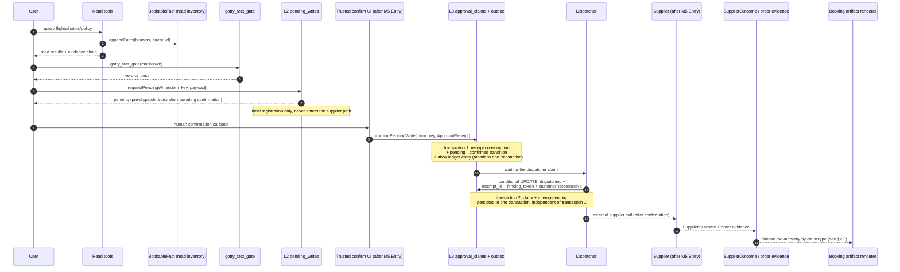

[English](fact-writegate-seam.md) | [简体中文](fact-writegate-seam.zh-CN.md)

# fact-anchor × M5 WriteGate Seam Design (issue #303, sub-slice of #273)

> Position: this sub-slice defines only the **seam** — between `gotry_fact_gate` and the M5 WriteGate, who owns what, what may enter artifacts, and what must fail closed. **No write path is implemented or enabled.**
> Status: **proposal (2026-09-10, docs-only; does not unseal the runtime)**
> Upstream: [`../architecture.md`](../architecture.md) §1.4 / §8 ADR-15/17/18/19 / §10.1 D-26, [`./write-gate-production-design.md`](./write-gate-production-design.md), [`./booking-saga-fsm.md`](./booking-saga-fsm.md), [`./milestone-delivery-plan.md`](./milestone-delivery-plan.md) §4 M5-0..M5-4, issues #136/#225/#231/#232/#233.
> Downstream: the WriteGate core/outbox wiring PRs after M5 Entry (M5-2/M5-3); the `gotry_fact_gate` core and the `BookableFact` schema stay untouched.
> Boundary: the #273 red lines hold — this sub-slice **does not** land transaction runtime and **does not** send supplier writes; read-only / fixture / failing-test preparation is allowed; depends on #136 M5 admission and #231 persistent WriteGate/outbox.

## 0. One-Sentence Claim

The read path `gotry_fact_gate` and the write path WriteGate are **two independent gates**, separated by "read-side inventory facts (covering only read tool results) + the write-side `SupplierOutcome` projection (covering only booking business outcomes)": a write receipt must not pollute `BookableFact`, and booking artifacts must not pass `<!-- fact: -->` anchors off as order evidence; receipts that are non-success, missing tenant, missing idem, missing freshness, missing currency, or whose `customerReferenceNo` was not persisted before the supplier external call fail closed without exception.

## 1. Current: the two gates each close their own loop, and the seam is undefined

| Gate | Responsibility | Anchor / ledger entry | Failure face | Evidence |
|---|---|---|---|---|
| **Read**: `gotry_fact_gate` (registered at `ts/src/index.ts:1924`, `gateArtifact` at `ts/src/artifact-gate.ts:492`) | every bookable claim in artifact markdown is traced item by item to the `BookableFact` registry; `renderFlightFact` (`ts/src/bookable-facts.ts:532`) / `renderHotelFact` (`ts/src/bookable-facts.ts:660`) / `renderPolicyFact` (`ts/src/bookable-facts.ts:582`) generate `<!-- fact:<fact_id> -->` anchors one-way | `BookableFact = FlightFact \| PolicyFact \| HotelFact` (`ts/src/bookable-facts.ts:40-119`); **no** `tenant_id` / `idem_key`; `FlightFact`'s `price` / `currency` / `review_by` are all optional; `HotelFact` has no price fields (only `options_masked` is recorded, `ts/src/bookable-facts.ts:94-119`); sidecar `<stateRoot>/gotry-state/bookable-facts.jsonl` (`appendFacts` at `ts/src/index.ts:1088-1091`) | `verdict=blocked` ⇒ `presentation: verified_label_forbidden` (`ts/src/artifact-gate.ts:678`); violation list at `ts/src/artifact-gate.ts:242-260` | `ts/scripts/fact-gate-tests.ts` (run-all §39) |
| **Write**: the WriteGate base (`requestPendingWrite` / `confirmPendingWrite` / `compensatePendingWrite` at `ts/src/state-ledger.ts:609/627/643`) | L2 registration → L3 confirmation (carrying the receipt string) → L4 compensation; the `pending_writes` schema CHECK `('pending','confirmed','compensated')` (`ts/src/state-ledger.ts:132-142`) | events `write.pending` / `write.confirmed` / `write.compensated`; the vocabulary layer `booking_saga_fsm.v1` (`ts/src/booking-saga.ts:16-46`) | `sagaTraceViolations` flags an empty receipt on `write.confirmed` as a violation (`ts/src/booking-saga.ts:123-125`) | `ts/scripts/booking-saga-tests.ts` (run-all §36) |

**Concrete symptoms of the missing seam**: `requestPendingWrite` / `confirmPendingWrite` are only a ledger state machine, with **no** `ApprovalReceipt` / `PreparedChallenge` / `delivery_nonce_digest` / `customerReferenceNo` persistence / `attempt_id` fencing (the `./write-gate-production-design.md` §3 vocabulary is not landed); if future booking artifacts (locked/booked) use `renderFlightFact`-style `<!-- fact: -->` anchors, they will be confused with read-side inventory facts — `BookableFact.bookable_exact_date` is read-side exact-date tool-result semantics, **not** supplier booking-success evidence.

## 2. Proposed: Read fact → explicit user confirmation → WriteGate/outbox → supplier receipt → booking artifact

### 2.1 Read-side contract (the current shape is the final shape)

| Step | Responsibility | Landing point | Gate verdict |
|---|---|---|---|
| ① Read → inventory fact | `gotry_flyai_search` / `gotry_session_search` / `gotry_hotel_search` / policy producers | `bookable-facts.jsonl` | hit/miss/error; errors do not land negative facts |
| ② Fact → artifact claim | `renderFlightFact` / `renderHotelFact` / `renderPolicyFact` (`ts/src/bookable-facts.ts:532/582/660`) | end-of-line `<!-- fact:<fact_id> -->` in the artifact | deterministic anchor back-tracing by `gotry_fact_gate` (`ts/src/artifact-gate.ts:506-535`); three states: **anchor missing** → the existing heuristics apply (hotel back-trace / policy lines, `ts/src/artifact-gate.ts:537+`); **anchor present and fact_id registered** → judged by the fact's `bookability` / `as_of` fingerprint; **anchor present but fact_id unregistered** = `fact_anchor_unknown` blocked (hand-edited/forged, line 509) |

### 2.2 Write-side contract (contract only, implemented after M5 Entry; strict ordering, independent transaction boundaries)

The write-side order cannot be compressed; **dispatch must never precede human confirmation**. `requestPendingWrite` is a **pre-dispatch registration** (it only writes `pending_writes.status='pending'`) and never enters the supplier path; **any dispatch / claim / external call must happen after human confirmation**.

There are exactly two transaction boundaries, and they must not be merged into a fake "single transaction": **transaction 1** = receipt consumption + pending→confirmed state transition + outbox ledger entry (atomic in one transaction); **transaction 2** = dispatcher claim + attempt/fencing persistence (atomic in one transaction, independent of transaction 1). Each step links to the corresponding section of [`write-gate-production-design.md`](./write-gate-production-design.md).

| # | Step | Responsibility | Atomic boundary | Gate verdict |
|---|---|---|---|---|
| 1 | **Human confirmation** (precondition) | `PreparedChallenge.status='confirmed'` + trusted host callback ([`write-gate-production-design.md` §5.2](./write-gate-production-design.md)) | (precondition, not a transaction) | **dispatch must never precede this**; **unconfirmed = no supplier path**; `requestPendingWrite` does not constitute confirmation |
| 2 | **Transaction 1: receipt consumption + pending→confirmed transition + outbox ledger entry** | within one transaction: (a) `confirmPendingWrite(idem_key, ApprovalReceipt)` → `UPDATE approval_claims SET consumed_at=? WHERE receipt_id=? AND consumed_at IS NULL` affects exactly 1 row; (b) `pending_writes.status` moves from `pending` to `confirmed` (same `idem_key`); (c) `INSERT WriteEffectIntent(dispatch_status='queued', attempt_budget, idem_key, receipt_id, supplier_attempt_key, request_fingerprint_sha256, ...)` ([`write-gate-production-design.md` §3 / §5.2](./write-gate-production-design.md)) | **transaction 1** (a + b + c atomic in one transaction) | empty receipt = `sagaTraceViolations` violation (`ts/src/booking-saga.ts:123-125`); `ApprovalReceipt` = an authorization credential ≠ a business outcome; `idem_key` / `request_fingerprint_sha256` required |
| 3 | **Transaction 2: dispatcher claim + pre-dispatch binding** | an independent conditional UPDATE: `UPDATE write_effect_intents SET dispatch_status='dispatching', attempt_id=?, fencing_token=?, claimed_by=?, lease_until=? WHERE tenant_id=? AND idem_key=? AND dispatch_status='queued'` affects exactly 1 row; **within the same transaction** the immutable `attempt_id` / `fencing_token` / `customerReferenceNo` are persisted ([`write-gate-production-design.md` §5.4](./write-gate-production-design.md)) | **transaction 2** (independent of transaction 1; the claim and attempt/fencing live **inside transaction 2's single transaction**; **the claim is not inside transaction 1**, and transactions 1 and 2 must not be merged) | a single winner among concurrent workers; fencing tokens increase monotonically; **once persisted, `attempt_id` is immutable**; **it must not be derived backwards from a receipt**; non-winners must not initiate the supplier call |
| 4 | **Re-validation before the external call** | at the same dispatch point, re-check authorization, `valid_until` / `presentation_key` drift, revocation, tenant ownership ([`write-gate-production-design.md` §5.5](./write-gate-production-design.md)) | (synchronous verdict at the dispatch point) | any failure = supplier write=0, the old effect set to `rejected` (outbox layer) |
| 5 | **External supplier call → SupplierOutcome** | the M5-3 supplier adapter ([`write-gate-production-design.md` §3 / §6](./write-gate-production-design.md)) | (network IO) | the return lands in the `SupplierOutcome` projection; **independent of `BookableFact`** |

### 2.3 booking artifact = choose the authority by claim type (each claim is judged independently by its own authority)

Booking-type artifacts are **not a single shape**; a uniform definition is **not** imposed on all booking artifacts. Each claim is judged independently along its own authority chain, and **none substitutes for another** — different claim types in the same artifact may come from different authorities.

| Claim type | Required authority | Notes |
|---|---|---|
| **Availability / quote / policy reads** | the `BookableFact` registry + `gotry_fact_gate` verdict=pass | **does not** need `SupplierOutcome`; **not** an order-success claim |
| **Booked / order success** | an authoritative `SupplierOutcome.success` or `SupplierOutcome.reconciled_success` with the same intent + the same `attempt_id` | does not require the current inventory to still be available; stale inventory does not erase existing order evidence |
| **Cancellation requested** | `SupplierOutcome.cancel_submitted` | wording is **only** "cancellation requested/submitted", **never** "cancelled"; `refund_pending` / `refunded` each take the corresponding `SupplierOutcome` status |
| **Local recommendation withdrawal** | **explicit evidence that dispatch never happened and later dispatch has been blocked** — it can hold for a **pending intent with no outbox entry** (only `pending_writes`, no corresponding `WriteEffectIntent`), or for an intent **already in the outbox whose `dispatch_status` is still `queued` with no later claim / lease-forfeiture record** | `compensated` alone is **not** enough; a missing `SupplierOutcome.cancel_*` is by itself **not** enough; **if already dispatched**, it must stay unknown / reconcile, or adopt real `SupplierOutcome.cancel_submitted` / `refund_pending` / `refunded` statuses; **must not** write "refunded" |

**Key principles**:

- Existing authoritative order evidence is shown under its **own** authority, regardless of whether the current inventory hits / is stale / is unavailable — a read inventory claim ≠ an order-success claim; **the ledger `confirmed` alone does not prove an order**.
- A new read inventory proposal is a **read-side** claim, **not** an order-success claim, and **does not** require `SupplierOutcome`.
- Cancellation requested ≠ cancelled; refund semantics are each carried by the corresponding `SupplierOutcome` status and must not be smuggled across generations via `compensated`.
- When displaying booking-type artifacts, a missing anchor falls to the existing heuristics; only "anchor present but fact_id unregistered" is `fact_anchor_unknown` (`ts/src/artifact-gate.ts:509`); the `HotelFact` interface has no price fields (`ts/src/bookable-facts.ts:94-119`), and `unverified_price_claim` covers only the flight read-side hard-price comparison (lines 464-480), not a booking receipt amount validator.

### 2.4 Fail-Closed Matrix

| Shape | Source | Seam verdict |
|---|---|---|
| `pending` still hanging / `confirmed` registered | the `requestPendingWrite` / `confirmPendingWrite` at `ts/src/state-ledger.ts:609/627` are **only a ledger state machine**, advancing the `pending_writes` vocabulary by receipt string; `sagaTraceViolations` flags an empty receipt as a violation (`ts/src/booking-saga.ts:123-125`). The `confirmPendingWrite` success path returns `{ok:true, status:'confirmed'}` (`ts/src/state-ledger.ts:627-641`) — **`ok:true` only means the local ledger transition succeeded; it proves no supplier/business success**; failure/unknown will be expressed by the future `SupplierOutcome.failed` / `unknown` (see [`write-gate-production-design.md` §3](./write-gate-production-design.md)); **`confirmed` is only an authorization/ledger state and must not by itself prove an order exists or allow booking display** | not into `BookableFact`; the artifact may only say "locally registered, awaiting SupplierOutcome" |
| Supplier `unknown` | see [`write-gate-production-design.md` §5.3 / §7](./write-gate-production-design.md) (outbox crash recovery / CLI timeout / non-JSON / process exit / 30s abort) | enters `SupplierOutcome.unknown`; **blind retries forbidden**; keep querying or do manual reconcile |
| `compensated` (local cancellation) | `ts/src/state-ledger.ts:643-655` | **`compensated` does not prove zero external side effects** — local withdrawal holds only when there is **explicit evidence that dispatch never happened and later dispatch has been blocked** (it can hold for a pending intent with no outbox entry, or an intent still `dispatch_status='queued'` with no claim/lease-forfeiture record); all other compensated cases (already claimed / already dispatched / already unknown / lease expired) **must** stay unknown / reconcile, or adopt real `SupplierOutcome.cancel_submitted` / `refund_pending` / `refunded` before any "cancelled/refunded" wording; **`compensated` alone must never be taken one-sidedly as the business being cancelled**; **a single `dispatch_status='queued'` snapshot** is by itself **not** authoritative evidence of withdrawal |
| **Duplicate receipt on the same intent** | the `requestPendingWrite` `idem_key` UNIQUE hits an existing `confirmed` | **idempotent**: the existing `pending_writes` state and (if landed) the `SupplierOutcome` projection can be read as existing order evidence; **the artifact may display the existing booking, provided it cites the real authoritative state** (awaiting `confirmed` ⇒ explicitly labeled "awaiting SupplierOutcome"; `SupplierOutcome.success` received ⇒ explicitly labeled "booked"); **no** side effects are triggered |
| **Cross-intent replay of the same receipt/challenge/nonce** | see [`write-gate-production-design.md` §5.2](./write-gate-production-design.md) (atomic receipt consumption) | `approval-claimed`; no new outbox entry, no new effect |
| Expiry before the external call (`valid_until` / `presentation_key` drift / revocation) | see [`write-gate-production-design.md` §5.5](./write-gate-production-design.md) (dispatch-point re-validation before the external call) | supplier write=0, the old effect set to `rejected` (outbox layer, not the saga); build a new quote/intent/receipt instead |
| Missing `tenant_id` / `idem_key` / `customerReferenceNo` persistence | `ts/src/state-ledger.ts:83-92` + [`write-gate-production-design.md` §5.4](./write-gate-production-design.md) force the ledger entry before dispatch | any one missing = fail-closed before the external call, no supplier effect |
| Missing/mismatched `currency` (`FlightFact`); hotel `priceRaw` straying into the hard-price comparison | `FlightFact` fields are as defined in `ts/src/bookable-facts.ts:40-89`, `currency` optional; the `HotelFact` interface has no price fields (`ts/src/bookable-facts.ts:94-119`), `priceRaw` is only a string field inside `HotelOption` (line 157), and the comment at `ts/src/artifact-gate.ts:291` states explicitly that it **does not join the hard-price comparison** | `unverified_price_claim` targets only the **flight read-side hard-price comparison** (lines 464-480) and is **not** an implemented hotel booking receipt amount validator; the latter is left to the future typed receipt envelope proposal ([`write-gate-production-design.md` §3 / §4](./write-gate-production-design.md)) |

## 3. Not in This Sub-Slice

- **No changes to the `BookableFact` schema**: the current interface fields are as the source defines them (`ts/src/bookable-facts.ts:40-119`); the seam does **not** introduce `tenant_id` / `idem_key` / required `currency` / required `review_by` / `HotelFact` price fields — those belong to the future typed receipt envelope proposal ([`write-gate-production-design.md` §3 / §4](./write-gate-production-design.md)).
- **No implementation of the trusted UI security chain**: `ApprovalReceipt` / `PreparedChallenge` / `delivery_nonce_digest` remain vocabulary definitions in [`write-gate-production-design.md` §3](./write-gate-production-design.md); `confirmPendingWrite` is currently only a ledger state machine (`ts/src/state-ledger.ts:627`), with **no** challenge/nonce/receipt envelope, **no** recognition of business outcomes, and **no** trusted UI security chain validation.
- **No pre-writing of new gate violation classes / `renderBookingFact` / `approval-claimed`, etc.**: those are the implementation responsibility of the M5-2/M5-3 PRs; before Entry, **failing-test / fixture / read-only** preparation and contract documents may be written, but **no** transaction runtime is landed and **no** real supplier is connected.
- **No change to the ADR-17 three states**: `pending|confirmed|compensated` is not extended; `rejected` exists only at the outbox/dispatch layer ([`write-gate-production-design.md` §5.5](./write-gate-production-design.md)).

## 4. Dependencies and Not-Yet-Triggered

- **#136 M5 admission**: supply-chain contract signing / internal authorization evidence pending verification; `./milestone-delivery-plan.md` §4 M5-0 TODO.
- **#231 persistent WriteGate/outbox**: `approval_claims` + `write_effect_intents` + atomic claim / attempt fencing; M5-2 TODO.
- **#232 HotelByte trade adapter**: M5-3; the `SupplierOutcome` projection lands here.
- **#233 cancel/refund/wallet + commission disclosure**: M5-4.
- **#273 parent red lines**: this proposal **does not** land transaction runtime and **does not** send supplier writes; read-only / fixture / failing-test preparation is allowed; **any future** runtime changes (the write-side `approval_claims` / `WriteEffectIntent` schema, the `SupplierOutcome` projection, new gate violation classes, the trusted UI security chain, etc.) must still sync the six status surfaces per [`../architecture.md`](../architecture.md) §11.

**M5 Entry** = M4 Exit + #136 satisfied at the same time (M4 Exit is still awaited under D-19); this proposal itself **does not** land transaction runtime and **does not** send real supplier writes; before Entry, read-only / fixture / failing-test preparation under #273 remains allowed.

## 5. §11 Status Surface Sync

This sub-slice has **no** current runtime shape changes (the read-side `gotry_fact_gate` and `BookableFact` are untouched; the write-side `pending_writes` and `booking_saga_fsm.v1` are untouched), so this PR does not trigger §11 six-status-surface sync. **If future** M5-2/M5-3 landings introduce shape changes such as the `approval_claims` / `write_effect_intents` schema, the `SupplierOutcome` projection, new gate violation classes, or the trusted UI security chain, the corresponding PR must sync the six status surfaces per the [`../architecture.md`](../architecture.md) §11 rules; this document does not waive that responsibility.
