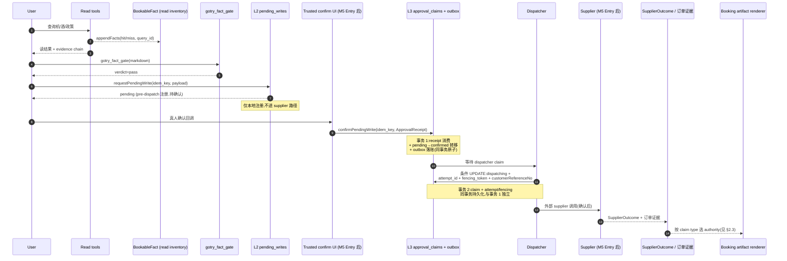

[English](fact-writegate-seam.md) | [简体中文](fact-writegate-seam.zh-CN.md)

# fact-anchor × M5 WriteGate 接缝设计（issue #303，#273 子切片）

> 定位：本切片只定义**接缝**——`gotry_fact_gate` 与 M5 WriteGate 之间谁负责什么、什么可进产物、什么必须 fail-closed。**不实现、不启用任何写路径**。
> 状态：**proposal（2026-09-10，docs-only；不启封 runtime）**
> 上游：[`../architecture.md`](../architecture.zh-CN.md) §1.4 / §8 ADR-15/17/18/19 / §10.1 D-26、[`./write-gate-production-design.md`](./write-gate-production-design.zh-CN.md)、[`./booking-saga-fsm.md`](./booking-saga-fsm.zh-CN.md)、[`./milestone-delivery-plan.md`](./milestone-delivery-plan.zh-CN.md) §4 M5-0..M5-4、issue #136/#225/#231/#232/#233。
> 下游：M5 Entry 后的 WriteGate core/outbox 接线 PR（M5-2/M5-3）；`gotry_fact_gate` 本体与 `BookableFact` schema 不动。
> 边界：#273 红线保留——本切片**不**落交易 runtime、**不**发 supplier write；允许 read-only / fixture / failing-test 准备；依赖 #136 M5 admission 与 #231 persistent WriteGate/outbox。

## 0. 一句话主张

读路径 `gotry_fact_gate` 与写路径 WriteGate 是**两套独立的闸**，中间用「读侧 inventory fact（只覆盖读工具结果）+ 写侧 `SupplierOutcome` 投影（只覆盖 booking 业务结果）」分词：写 receipt 不得污染 `BookableFact`，booking 产物不得用 `<!-- fact: -->` 锚点冒充订单证据；non-success / 缺 tenant / 缺 idem / 缺 freshness / 缺 currency / `customerReferenceNo` 未在 supplier 外呼前持久化的 receipt 一律 fail-closed。

## 1. Current：两闸各自闭环、接缝未定义

| 闸 | 责任 | 锚点 / 落账 | 失败面 | 证据 |
|---|---|---|---|---|
| **读**：`gotry_fact_gate`（`ts/src/index.ts:1924` 注册，`ts/src/artifact-gate.ts:492` `gateArtifact`） | 产物 markdown 的可下单 claim 逐条回溯 `BookableFact` 注册表；`renderFlightFact`（`ts/src/bookable-facts.ts:532`）/`renderHotelFact`（`ts/src/bookable-facts.ts:660`）/`renderPolicyFact`（`ts/src/bookable-facts.ts:582`）单向生成 `<!-- fact:<fact_id> -->` 锚点 | `BookableFact = FlightFact \| PolicyFact \| HotelFact`（`ts/src/bookable-facts.ts:40-119`）；**无** `tenant_id` / `idem_key`，`FlightFact` 的 `price` / `currency` / `review_by` 皆可选，`HotelFact` 无价格字段（只记 `options_masked`，`ts/src/bookable-facts.ts:94-119`）；侧车 `<stateRoot>/gotry-state/bookable-facts.jsonl`（`ts/src/index.ts:1088-1091` `appendFacts`） | `verdict=blocked` ⇒ `presentation: verified_label_forbidden`（`ts/src/artifact-gate.ts:678`）；违例清单见 `ts/src/artifact-gate.ts:242-260` | `ts/scripts/fact-gate-tests.ts`（run-all §39） |
| **写**：WriteGate 基座（`ts/src/state-ledger.ts:609/627/643` `requestPendingWrite` / `confirmPendingWrite` / `compensatePendingWrite`） | L2 登记 → L3 确认（携带 receipt 字符串）→ L4 补偿；`pending_writes` schema CHECK `('pending','confirmed','compensated')`（`ts/src/state-ledger.ts:132-142`） | events `write.pending` / `write.confirmed` / `write.compensated`；词汇层 `booking_saga_fsm.v1`（`ts/src/booking-saga.ts:16-46`） | `sagaTraceViolations` 对 `write.confirmed` 空 receipt 即违例（`ts/src/booking-saga.ts:123-125`） | `ts/scripts/booking-saga-tests.ts`（run-all §36） |

**接缝缺失的具体表现**：`requestPendingWrite` / `confirmPendingWrite` 只是账本状态机，**无** `ApprovalReceipt` / `PreparedChallenge` / `delivery_nonce_digest` / `customerReferenceNo` 持久化 / `attempt_id` fencing（`./write-gate-production-design.md` §3 词汇未落地）；未来 booking 产物（已锁定/已预订）若走 `renderFlightFact` 同款 `<!-- fact: -->` 锚点，会与读侧 inventory fact 混淆——`BookableFact.bookable_exact_date` 是读侧 exact-date 工具结果语义，**不是** supplier 预订成功证据。

## 2. Proposed：Read fact → 用户明确确认 → WriteGate/outbox → supplier receipt → booking 产物

### 2.1 读侧契约（当前形态即最终形态）

| 步骤 | 责任 | 落点 | 闸判定 |
|---|---|---|---|
| ① Read → inventory fact | `gotry_flyai_search` / `gotry_session_search` / `gotry_hotel_search` / 政策生产端 | `bookable-facts.jsonl` | hit/miss/error；error 不落负事实 |
| ② Fact → artifact claim | `renderFlightFact` / `renderHotelFact` / `renderPolicyFact`（`ts/src/bookable-facts.ts:532/582/660`） | artifact 行尾 `<!-- fact:<fact_id> -->` | `gotry_fact_gate` 锚点确定性回溯（`ts/src/artifact-gate.ts:506-535`）；三态：**锚点缺失** → 走既有启发式（酒店回溯/政策行，`ts/src/artifact-gate.ts:537+`）；**锚点存在且 fact_id 已注册** → 按事实 `bookability` / `as_of` 指纹判定；**锚点存在但 fact_id 未注册** = `fact_anchor_unknown` blocked（手改/伪造，行 509） |

### 2.2 写侧契约（仅契约，M5 Entry 后实现；顺序严格，事务边界独立）

写侧顺序不可压缩；**dispatch 不可早于人类确认**。`requestPendingWrite` 是 **pre-dispatch 注册**（只写 `pending_writes.status='pending'`），不进入 supplier 路径；**任何 dispatch / claim / 外呼必须发生在人类确认之后**。

事务边界只有两个，不得合并成伪造「单事务」：**事务 1** = receipt 消费 + pending→confirmed 状态转移 + outbox 落账（同事务原子）；**事务 2** = dispatcher claim + attempt/fencing 持久化（同事务原子，与事务 1 独立）。每步链接到 [`write-gate-production-design.md`](./write-gate-production-design.zh-CN.md) 对应章节。

| # | 步骤 | 责任 | 原子边界 | 闸判定 |
|---|---|---|---|---|
| 1 | **人类确认**（前置） | `PreparedChallenge.status='confirmed'` + 可信宿主回调（[`write-gate-production-design.md` §5.2](./write-gate-production-design.zh-CN.md)） | （前置条件，非事务） | **dispatch 不可早于此**；**未确认 = 无 supplier 路径**；`requestPendingWrite` 不构成确认 |
| 2 | **事务 1：receipt 消费 + pending→confirmed 转移 + outbox 落账** | 同事务内：（a）`confirmPendingWrite(idem_key, ApprovalReceipt)` → `UPDATE approval_claims SET consumed_at=? WHERE receipt_id=? AND consumed_at IS NULL` 影响行数=1；（b）`pending_writes.status` 从 `pending` 转 `confirmed`（同 `idem_key`）；（c）`INSERT WriteEffectIntent(dispatch_status='queued', attempt_budget, idem_key, receipt_id, supplier_attempt_key, request_fingerprint_sha256, ...)`（[`write-gate-production-design.md` §3 / §5.2](./write-gate-production-design.zh-CN.md)） | **事务 1**（a + b + c 同事务原子） | 空 receipt = `sagaTraceViolations` 违例（`ts/src/booking-saga.ts:123-125`）；`ApprovalReceipt` = 授权凭证 ≠ 业务结果；`idem_key` / `request_fingerprint_sha256` 必填 |
| 3 | **事务 2：dispatcher claim + 派发前绑定** | 独立条件 UPDATE：`UPDATE write_effect_intents SET dispatch_status='dispatching', attempt_id=?, fencing_token=?, claimed_by=?, lease_until=? WHERE tenant_id=? AND idem_key=? AND dispatch_status='queued'` 影响行数=1；**同事务内**持久化不可变 `attempt_id` / `fencing_token` / `customerReferenceNo`（[`write-gate-production-design.md` §5.4](./write-gate-production-design.zh-CN.md)） | **事务 2**（与事务 1 独立；claim 与 attempt/fencing 在**事务 2 同事务内**；**claim 不在事务 1 内**，事务 1 与事务 2 不可合并） | 并发 worker 唯一赢家；fencing token 单调递增；**`attempt_id` 一旦持久化即不可变**；**不可由回执反向派生**；非赢家不得发起 supplier 调用 |
| 4 | **外呼前重验** | 同一派发点重检授权、`valid_until` / `presentation_key` 漂移、撤回、tenant 归属（[`write-gate-production-design.md` §5.5](./write-gate-production-design.zh-CN.md)） | （派发点同步判定） | 任一失效 = supplier write=0，旧 effect 置 `rejected`（outbox 层） |
| 5 | **外部 supplier 调用 → SupplierOutcome** | M5-3 supplier adapter（[`write-gate-production-design.md` §3 / §6](./write-gate-production-design.zh-CN.md)） | （网络 IO） | 返回落 `SupplierOutcome` 投影；**独立于 `BookableFact`** |

### 2.3 booking 产物 = 按 claim type 选 authority（各 claim 按自身权威独立判定）

booking 类产物**不是单一形态**；**不**对所有 booking 产物施加统一定义。各 claim 按自身权威链独立判定，**互不替代**——同一 artifact 中不同 claim 类型可来自不同权威。

| Claim 类型 | 所需 authority | 备注 |
|---|---|---|
| **可用性 / 报价 / 政策读** | `BookableFact` 注册表 + `gotry_fact_gate` verdict=pass | **不**需 `SupplierOutcome`；**不**是订单成功 claim |
| **已预订 / 订单成功** | 同 intent + 同 `attempt_id` 的权威 `SupplierOutcome.success` 或 `SupplierOutcome.reconciled_success` | 不要求当前 inventory 仍可用；陈旧 inventory 不抹除既有订单证据 |
| **已申请取消** | `SupplierOutcome.cancel_submitted` | 措辞**仅**「cancellation requested/submitted」，**绝不**写「cancelled」；`refund_pending` / `refunded` 各取对应 `SupplierOutcome` 状态 |
| **本地建议撤回** | **明确证据表明 dispatch 从未发生且后续 dispatch 已被阻止**——可对**无 outbox 的 pending intent**（仅 `pending_writes` 而无对应 `WriteEffectIntent`）成立；或对**已落 outbox 但 `dispatch_status` 仍为 `queued` 且无后续 claim / lease 失权记录**成立 | `compensated` 单独**不**足；`SupplierOutcome.cancel_*` 缺失本身**不**足；**如已 dispatch**，必须保持 unknown / reconcile，或采用真实 `SupplierOutcome.cancel_submitted` / `refund_pending` / `refunded` 状态；**不得**写「已退款」 |

**关键原则**：

- 既有权威订单证据按其**自身** authority 显示，与当前 inventory 是否命中/陈旧/不可用无关——读 inventory claim ≠ 订单成功 claim；**ledger `confirmed` 单独不证明订单**。
- 新读 inventory proposal 是**读侧** claim，**不**是订单成功 claim，**不**要求 `SupplierOutcome`。
- 已申请取消 ≠ 已取消；退款语义各由对应 `SupplierOutcome` 状态承载，不得借 `compensated` 跨代。
- 显示 booking 类产物时，锚点缺失走既有启发式，只有「锚点存在但 fact_id 未注册」才是 `fact_anchor_unknown`（`ts/src/artifact-gate.ts:509`）；`HotelFact` 接口无价字段（`ts/src/bookable-facts.ts:94-119`），`unverified_price_claim` 仅机票读侧硬币比（行 464-480），不是 booking receipt 金额验证器。

### 2.4 Fail-closed 矩阵

| 形态 | 来源 | 接缝判定 |
|---|---|---|
| `pending` 仍挂起 / `confirmed` 已登记 | `ts/src/state-ledger.ts:609/627` 的 `requestPendingWrite` / `confirmPendingWrite` **只是账本状态机**，按 receipt 字符串推进 `pending_writes` 词汇；`sagaTraceViolations` 对空 receipt 违例（`ts/src/booking-saga.ts:123-125`）。`confirmPendingWrite` 成功路径返回 `{ok:true, status:'confirmed'}`（`ts/src/state-ledger.ts:627-641`）——**`ok:true` 仅表示本地 ledger 转移成功，不证明 supplier/业务成功**；失败/unknown 由未来 `SupplierOutcome.failed` / `unknown` 表达（见 [`write-gate-production-design.md` §3](./write-gate-production-design.zh-CN.md)）；**`confirmed` 仅是授权/账本状态，不得独立证明订单存在或允许 booking 显示** | 不入 `BookableFact`；产物只能写「本地已登记，待 SupplierOutcome」 |
| Supplier `unknown` | 见 [`write-gate-production-design.md` §5.3 / §7](./write-gate-production-design.zh-CN.md)（outbox 崩溃恢复 / CLI timeout / 非 JSON / 进程退出 / 30s abort） | 进 `SupplierOutcome.unknown`；**禁盲重试**；继续 query 或 manual reconcile |
| `compensated`（本地取消） | `ts/src/state-ledger.ts:643-655` | **`compensated` 不证明零外部副作用**——本地撤回仅在**明确证据表明 dispatch 未发生且后续 dispatch 已被阻止**时成立（可对无 outbox 的 pending intent 或仍为 `dispatch_status='queued'` 且无 claim/lease 失权记录的 intent）；其余 compensated（已 claim / 已 dispatch / 已 unknown / lease 已过期）**必须**保持 unknown / reconcile，或采用真实 `SupplierOutcome.cancel_submitted` / `refund_pending` / `refunded` 才可写「取消/退款」表述；**不得**因 `compensated` 单边认定业务已取消；**单一 `dispatch_status='queued'` 快照**本身**不**是撤回的权威证据 |
| **同 intent 重复 receipt** | `requestPendingWrite` `idem_key` UNIQUE 命中既有 `confirmed` | **幂等**：可读既有 `pending_writes` 状态与（若已落） `SupplierOutcome` 投影作为既有订单证据；**产物可显示既有预订，但前提是引用真实权威状态**（待 `confirmed` ⇒ 显式标「待 SupplierOutcome」；待 `SupplierOutcome.success` ⇒ 显式标「已预订」）；**不**触发副作用 |
| **跨 intent replay 同一 receipt/challenge/nonce** | 见 [`write-gate-production-design.md` §5.2](./write-gate-production-design.zh-CN.md)（receipt 原子消费） | `approval-claimed`；无新 outbox、无新 effect |
| 外呼前过期（`valid_until` / `presentation_key` 漂移 / 撤回） | 见 [`write-gate-production-design.md` §5.5](./write-gate-production-design.zh-CN.md)（外呼前派发点重验） | supplier write=0，旧 effect 置 `rejected`（outbox 层，非 saga）；另建新 quote/intent/receipt |
| 缺 `tenant_id` / `idem_key` / `customerReferenceNo` 持久化 | `ts/src/state-ledger.ts:83-92` + [`write-gate-production-design.md` §5.4](./write-gate-production-design.zh-CN.md) 强制派发前落账 | 任一缺 = 外呼前 fail-closed，无 supplier effect |
| `currency` 缺失/不匹配（`FlightFact`）；酒店 `priceRaw` 误入硬币比 | `FlightFact` 字段以 `ts/src/bookable-facts.ts:40-89` 为准，`currency` 可选；`HotelFact` 接口无价字段（`ts/src/bookable-facts.ts:94-119`），`priceRaw` 仅在 `HotelOption` 内字符串字段（行 157），`ts/src/artifact-gate.ts:291` 注释明确**不参与硬币比** | `unverified_price_claim` 仅针对**机票读侧硬币比**（行 464-480），**不是**已实现的酒店 booking receipt 金额验证器；后者留未来 typed receipt envelope proposal（[`write-gate-production-design.md` §3 / §4](./write-gate-production-design.zh-CN.md)） |

## 3. 不在本切片

- **不改 `BookableFact` schema**：当前接口字段以源码为准（`ts/src/bookable-facts.ts:40-119`），**不**为接缝引入 `tenant_id` / `idem_key` / 必填 `currency` / 必填 `review_by` / `HotelFact` 价字段——它们是未来 typed receipt envelope proposal（[`write-gate-production-design.md` §3 / §4](./write-gate-production-design.zh-CN.md)）。
- **不实现 trusted UI security chain**：`ApprovalReceipt` / `PreparedChallenge` / `delivery_nonce_digest` 仍是 [`write-gate-production-design.md` §3](./write-gate-production-design.zh-CN.md) 词汇定义；`confirmPendingWrite` 当前只是账本状态机（`ts/src/state-ledger.ts:627`），**无** challenge/nonce/receipt envelope、**不**识别业务结果、**不**提供 trusted UI 安全链验证。
- **不预写新闸违例类 / `renderBookingFact` / `approval-claimed` 等**：这些是 M5-2/M5-3 PR 的实现责任；Entry 前可写 **failing-test / fixture / read-only** 准备与契约文档，但**不**落交易 runtime、**不**接真实 supplier。
- **不改 ADR-17 三态**：`pending|confirmed|compensated` 不扩；`rejected` 仅在 outbox/dispatch 层（[`write-gate-production-design.md` §5.5](./write-gate-production-design.zh-CN.md)）。

## 4. 依赖与未触发

- **#136 M5 admission**：供应链协议签署/内部授权证据待核验；`./milestone-delivery-plan.md` §4 M5-0 TODO。
- **#231 持久 WriteGate/outbox**：`approval_claims` + `write_effect_intents` + 原子 claim / attempt fencing；M5-2 TODO。
- **#232 HotelByte trade adapter**：M5-3；`SupplierOutcome` 投影在此落地。
- **#233 cancel/refund/wallet + commission 披露**：M5-4。
- **#273 父红线**：本 proposal **不**落交易 runtime、**不**发 supplier write；允许 read-only / fixture / failing-test 准备；**未来**任何 runtime 变更（写侧 `approval_claims` / `WriteEffectIntent` schema、`SupplierOutcome` 投影、新闸违例类、trusted UI security chain 等）仍须按 [`../architecture.md`](../architecture.zh-CN.md) §11 同步六状态面。

**M5 Entry** = M4 Exit + #136 同时满足（M4 Exit 仍 D-19 未到）；本提案自身**不**落交易 runtime、**不**发真实 supplier write；Entry 前仍可按 #273 做 read-only / fixture / failing-test 准备。

## 5. §11 状态面同步

本切片**无**当前 runtime 形态变化（读侧 `gotry_fact_gate` 与 `BookableFact` 不动；写侧 `pending_writes` 与 `booking_saga_fsm.v1` 不动），故本 PR 不触发 §11 六状态面同步。**未来** M5-2/M5-3 落地若引入 `approval_claims` / `write_effect_intents` schema、`SupplierOutcome` 投影、新闸违例类、trusted UI security chain 等形态变化，由对应 PR 按 [`../architecture.md`](../architecture.zh-CN.md) §11 规则同步六状态面，本文档不豁免该责任。
