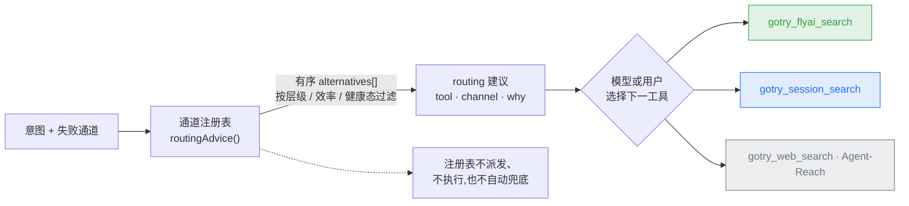

[English](tools.md) | [简体中文](tools.zh-CN.md)

# GoTry Tool Reference Surface

> Position: the single reference surface for the grouping, per-tool contracts, and degradation behavior of the tools registered by the gotry-tools plugin; the bilingual root README keeps only group-level summaries and pointers.
> Status: living
> Upstream: [`architecture.md`](architecture.md) (system authority), [`design/tool-orchestration-design.md`](design/tool-orchestration-design.md) (channel registry design), AGENTS.md (repo contract)
> Downstream: root `README.md` / `README.zh-CN.md` (summary + pointers), [`user-guide.md`](user-guide.md) (end-user narrative)

## At a Glance

- The tool surface is **flat**: no hidden dispatch; channel selection is produced by the registry as an **ordered suggestion list**; the model or the user picks the next tool; the registry itself does not dispatch, does not execute, and does not fall back.
- All retrieval is **read-only**: the account-session channel is physically read-only (the ReadGuard network-layer gate); write operations are not on this surface.
- Degradation **honestly relabels**: estimates never pose as real-time; when a supplier is unavailable, degradation is explicit.
- The tool count is authoritative in the code registry (`ts/src/index.ts`); this table evolves in sync with the code.

## Tool Groups

| Group | Tool | Contract |
|---|---|---|
| **Real-time retrieval (OTA/official, read-only)** | `gotry_flyai_search` | Real-time quotes for flights/trains/hotels via the official Fliggy(飞猪) channel; hotel prices are shown masked by upstream (the real price is whatever the jumpUrl page shows; the masked price keeps its original value in `priceRaw` while the numeric price is always 0, preventing "¥7xx truncated to 7 posing as the real price"); when the anonymous trial quota hits its limit the result is classified `needs-setup` with key-setup guidance attached — no blind retries |
| | `gotry_session_search` | Queries Ctrip(携程) flights/hotels + 12306 trains + Dida supplier-portal real-time hotel prices inside the **user's own logged-in Chrome**. `kind` = flight/hotel/train; defaults to flight when omitted; query-wrapped parameters follow query-first selection; unknown/malformed kind fails closed; all forms are physically read-only after the authorization gate. Hotel = `kind:"hotel"` + optional `cityId`, passively sniffing real logged-in prices; train = `kind:"train"`, the 12306 public remaining-ticket query surface (train number/schedule/seat availability; the list API has no prices). Train facts are typed and bound to a single call: the query date is the call authority captured by the host and must be bound to the exact response URL; recognizable emptiness is the only negative fact; malformed/transport/unknown-seat rows produce zero records; `canWebBuy=Y` does not substitute for a recognizable available seat |
| | `gotry_session_login` | Login guidance: auto-detects an existing login first; only when not logged in does it pop a login entry in the user's Chrome (**zero terminal**) |
| | `gotry_weather_check` | Open-Meteo forecast ≤16 days + historical climate baseline |
| | `gotry_flight_verify` | OpenSky ADS-B real-time flight observation (three-valued) |
| | `gotry_skeleton_check` | OpenFlights reachability check for 168 hub pairs (three-valued) |
| **Inventory & catalog** | `gotry_hotel_search` | hotel-byte real-time bridge; valid check-in/check-out dates required — asks first when missing; degrades to explicitly labeled static results when the supplier is unavailable |
| | `gotry_anything_search` | Mixed city/hotel/landmark catalog (hotel-be Anything) |
| **Verdict engine** | `gotry_feasibility_check` | Registered tool path: deterministic TypeScript candidate enumeration/evaluation with per-candidate verdicts; explicit multi-leg flight chains go through the separate `solveUnified` Z3 path |
| **Memory & reach** | `gotry_motivation_save` | Persists the motivation profile (evidence mandatory, anti-hallucination); supports typed `homeCity` as a soft default for the usual residence (#338); an explicit current-trip origin takes precedence; the origin is never inferred from IP/language/timezone/history/model guesses |
| | `gotry_wish_pool_add` / `gotry_wish_pool_list` | The "next departure" wish pool + 0..1 conditional recall; recall can be falsified by a named channel being down |
| | `gotry_companion_save` · `gotry_trip_log` | Companion profiles / travel timeline |
| **Artifacts** | `gotry_artifacts_list` / `gotry_artifacts_read` | Discover and view generated artifacts (async delivery + working-directory markdown/HTML): a read-only, line-numbered file view; the public `./client` adapter renders custom list/read cards per runtime `block`, with clickable paths, and the read card shows the source identity and content version. Scope = `stateRoot` + session working directory (excluding `node_modules`/`.git`), text extensions only (`md/txt/json/jsonl/csv/log/yaml/yml/html/htm`); `.html`/`.htm` are discovered case-insensitively and `gotry_artifacts_read` returns them as **source text only** — that read path does not parse markup, runs no script or inline event handler, and fetches nothing; the read card labels them as HTML source. Opening a listed HTML entry is a separate, explicitly labelled action (`Open HTML preview`, with a note that the page's scripts may run) that hands the file to the host's native HTML preview — that rendering belongs to the host, not to this tool, and interactive Lavish editing feedback remains #438/#443; >2 MB / out of bounds / symlink escape / unsupported extension → `ok: false` + `hint`. **List paging + literal metadata search (#458)**: `gotry_artifacts_list` adds `offset` (nonnegative safe integer ≤ `Number.MAX_SAFE_INTEGER`; undefined defaults to 0) and `search` (optional literal case-insensitive substring over `id`/`title`/filename; trimmed, empty/whitespace-only = no filter; must be a string — non-string input is rejected). `limit` is a finite integer (integer zero/negative clamps to 1, large values cap at 50; strings / non-finite / non-integer are rejected). The model is collect → canonical-path dedupe (ledger authority preserved) → search filter → deterministic global sort (`updated` DESC + `(source, id, canonical path)` codepoint tie-break) → page slice; `total` reflects the post-filter set; `nextOffset` only when more pages exist; an `offset` past the end returns an empty page with the known total + `truncated: false` + no `nextOffset`. |
| | `gotry_itinerary_render` | Generates one **new** self-contained itinerary HTML document in the session working directory: input = `title`, an explicit itinerary object (`trip_start`/`trip_end`/`stays`/`od_segments`, no nights/budget fields) and `fact_ids`. Facts load **only** from the current `stateRoot` fact registry — caller-supplied fact objects are never accepted, and unknown/duplicate/over-limit ids plus malformed registered rows are rejected. An empty `fact_ids` list is a legitimate explicitly-unverified plan (no overall "verified" badge ever). Basename is limited to `gotry-itinerary-<ASCII token>.html` (crypto-random otherwise); the file is created with `O_CREAT\|O_EXCL`, so an existing file or a symlink pointing elsewhere fails instead of being followed, and `.git`/`node_modules` are refused. The session working directory must be an explicitly provided absolute path: a missing/empty/whitespace-only/relative cwd fails closed before any write (deliberately no process-cwd fallback), and the provided path is used verbatim — never trimmed into a same-named sibling directory. Invalid input writes zero bytes. Local document generation only — no booking/payment/supplier write; the result returns the final real path, revisitable through the artifact list/read journey |
| **Async work orders** | `gotry_turn_handoff_list` | Read-only query of the status and deliverables of deep-planning background work orders (`gotry_turn_handoff.v1`, ETA ~1 hour) |
| **Fact gate** | `gotry_fact_gate` | Pre-delivery gate for itinerary artifacts: every bookable claim (flight number/train number/schedule/airport/price/policy) must trace back to an exact-date tool result, otherwise blocked. Flight/rail claims are classified separately; fact anchors carry fingerprints; policy lines are compared in full text (#359); flight/hotel anchor lines carry field-level fingerprints (#363); tampered or unknown anchors always fail closed |
| **General external** | `gotry_web_search` · `gotry_video_subtitle` · `gotry_github_search` · `gotry_agent_reach` | Web / subtitles / GitHub / all-channel external information (via Agent-Reach) |
| **Self-check** | `gotry_doctor` | Read-only doctor by default (extensions / Agent-Reach / hbcli / FlyAI key / sidebar / dsh-calendar / dsh-map-tools / dsh-tool-ask-user). Explicit `action: "repair"`: first shows the auto-repairable items and their scope, requests approval, reuses the same idempotent installers as `doctor --fix` / web onboarding, and judges by the post-install re-check; browser-store installs, credentials/API keys, profiles, package reinstalls, and Node upgrades remain user-handled; on refusal, cancellation, or no approval channel, zero execution. The report lands in `gotry-state/doctor-report.md` (previewable in the sidebar workbench) |
| **Local review (default-off)** | `gotry_lavish_open` / `gotry_lavish_poll` / `gotry_lavish_reply` / `gotry_lavish_end` / `gotry_lavish_stop` | Present only with trusted absolute `lavishAxiPackageRoot` configuration for `lavish-axi@0.1.67`. Open existing workspace HTML, receive bounded untrusted feedback, reply, end and reap the exact host session’s owned server. Active commands serialize and terminal states cannot reopen; stop preserves cleanup failures. See [configuration and lifecycle](design/lavish-local.md#9-registration-into-the-product-tool-surface). |

The package also ships an MIT map-tools payload (`map_geocode` / `map_poi_search` / `map_*_route`, etc., from the dsh-map-tools family) that introduces no external npm peers conflicting with the pinned family; the ground-transfer slice (#341) is delegated via the registered public `map_driving_route` — the arrival (A→B) and return (B→A) directions are requested and bound separately with per-direction cache/fallback (#364), only exact static `taxi` transfers can get route-estimated minutes (`minutesOut`/`minutesRet` overrides), and static prices are still labeled `[静态包:估算]`.

## Channel Routing

The retrieval tool surface stays flat (no hidden dispatch); the persona routing cards and the `routing` suggestions attached to failed retrieval results are **generated solely by the channel registry** (official API > user session > web fallback, filtered by the session health surface). The registry returns an ordered suggestion list, and the model or the user picks the next tool; the registry itself does not auto-dispatch, does not execute, and does not auto-fallback.

## Web Startup Onboarding (#258/#267)

Each eligible `gotry web` startup may run an optional capability check before entering the web: evaluated once per launch, asked at most once, with no cross-launch persisted "already asked" marker; it reuses the same idempotent installers as `doctor --fix` — no second installer set is built.

- **Interactive TTY + auto-installable gaps exist** (hbcli binary / Agent-Reach `.venv` / dsh-better-sidebar) → asks exactly once "Set up now? (y/N)". `y` installs and reports three result classes item by item: `installed` (auto-installed on this machine) / `needs-user-action` (Chrome Store extensions, hbcli login, FlyAI key, calendar profile — never disguised as automated) / `unavailable` (e.g., a bundled plugin missing → reinstall gotry). `n` goes straight into the web. Partial failures do not block the web; the retry command `npx @danceiny/gotry doctor --fix` is shown; later runs do not reinstall already-healthy items.
- **Interactive TTY, no auto-installable gaps but other gaps exist** (e.g., Windows has no auto-install surface, or only credential/key/reinstall classes) → no asking, no installing; renders the classified `needs-user-action` / `unavailable` lines with concrete reasons, then enters the web.
- **Fully healthy** → silent.
- **Conditions for zero asking, zero installing, web starts as usual**: CI, benchmark, non-TTY, `GOTRY_SETUP_SKIP=1`, `GOTRY_ONBOARDING_SKIP=1` (or `--no-onboarding`). Always zero installs in `postinstall` and detached background tasks.

This is an M4 UX proof backed by deterministic isolation tests; **it does not count toward the #20 real-repurchase cohort evidence**.

## Ops Script Surface (In-Repo, Read-Only)

- **Cost accounting**: `ts/data/llm-price-table.json` (schema `gotry_llm_price_table_v2`) is the single source of truth for nightly cost accounting; adding a model or switching the relay = a PR against this file (peak conservative upper bound); unknown models are **fail-closed, never price-guessed**. Drift monitoring `npx tsx ts/scripts/price-drift-watch.ts` (offline baseline comparison by default, `--fetch` pulls official pages) only reports and **never auto-applies**.
- **Metrics report**: `npx tsx ts/scripts/build-metrics-report.ts [--state-root <root>] [--out report.md] [--days 7]` aggregates sidecar data — fact gate verdict distribution and blocked rate, channel down/cooldown, the incident surface, bridge latency (against the 500 ms review budget) — into a read-only markdown; zero new dependencies, zero LLM; the state root is read-only; only `--out` writes one file (outside the state root).
- **Channel probe**: `npx tsx ts/scripts/channel-probe.ts --state-root <root>` runs one round of read-only probing driven by cron/loopx (channels that can be probed headlessly: hbcli whoami / open-meteo / opensky; the session surface is skipped; FlyAI is skipped by default to preserve the shared anonymous quota), appending `down` / `'ok'` recovery events into `channel-health.jsonl` — routing advice and doctor consume it with zero changes; wish pool recall uses the same fact surface to falsify named down channels. No resident process.
