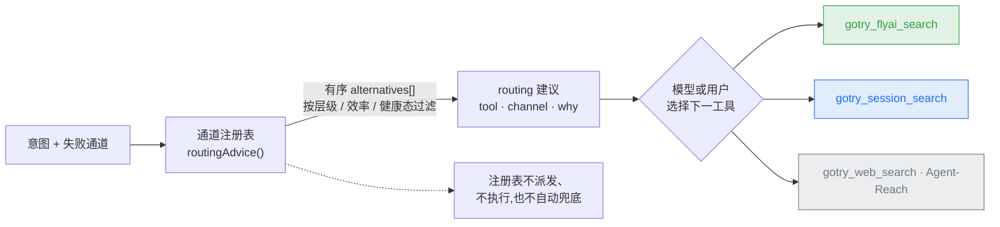

[English](tools.md) | [简体中文](tools.zh-CN.md)

# GoTry 工具参考面

> 定位：gotry-tools 插件注册工具的分组、逐工具契约与降级行为的唯一参考面；根 README 双语只留组级摘要与指针。
> 状态：living
> 上游：[`architecture.md`](architecture.zh-CN.md)（系统权威面）、[`design/tool-orchestration-design.md`](design/tool-orchestration-design.md)（通道注册表设计）、AGENTS.md（仓库契约）
> 下游：根 `README.md` / `README.zh-CN.md`（摘要 + 指针）、[`user-guide.md`](user-guide.zh-CN.md)（终端用户叙事）

## 速览

- 工具面**平铺**：无隐藏派发；通道选择由注册表产出**有序建议列表**，模型或用户挑下一工具，注册表自身不派发、不执行、不兜底。
- 检索全部**只读**：账号会话通道物理只读（ReadGuard 网络层闸），写操作不在这条面内。
- 降级**如实换标签**：估算绝不冒充实时；供应商不可用即显式降级。
- 工具数量以代码注册表（`ts/src/index.ts`）为准；本表与代码同步演进。

## 工具分组

| 组 | 工具 | 契约 |
|---|---|---|
| **实时检索（OTA/官方，只读）** | `gotry_flyai_search` | 机票/火车/酒店实时报价，飞猪官方通道；酒店价格为上游打码展示（真实价以 jumpUrl 页面为准，打码价保 `priceRaw` 原值、数字价恒 0，防「¥7xx 截成 7 伪装真价」）；匿名试用额度达限归类 `needs-setup` 并带配 key 指引，不盲重试 |
| | `gotry_session_search` | 在**用户本人登录态 Chrome** 里查携程机票/酒店 + 12306 火车 + Dida 供应商门户酒店实时价。`kind` = flight/hotel/train，省略默认 flight，query 包裹参数走 query-first 选择，未知/畸形 kind fail closed；全部形态授权闸后物理只读。酒店 = `kind:"hotel"` + 可选 `cityId`，被动嗅探登录态真实价；火车 = `kind:"train"`，12306 公开余票查询面（车次/时刻/座位可用性，列表接口无价格）。火车事实 typed 且绑定单次调用：查询日期为宿主捕获的调用权威、须与精确响应 URL 绑定；可识别空是唯一负事实，malformed/transport/未知座位行零记录，`canWebBuy=Y` 不替代可识别可用座位 |
| | `gotry_session_login` | 登录引导：先自动检测既有登录；未登录才在用户 Chrome 弹登录入口（**零终端**） |
| | `gotry_weather_check` | Open-Meteo 预报 ≤16 天 + 历史气候基线 |
| | `gotry_flight_verify` | OpenSky ADS-B 航班实时观测（三值） |
| | `gotry_skeleton_check` | OpenFlights 168 对枢纽通航性校验（三值） |
| **库存与目录** | `gotry_hotel_search` | hotel-byte 实时桥；需提供有效入住/退房日期，缺失时先追问；供应商不可用时降级为明确标注的静态结果 |
| | `gotry_anything_search` | 城市/酒店/地标混合目录（hotel-be Anything） |
| **判定引擎** | `gotry_feasibility_check` | 注册工具路径：确定性的 TypeScript 候选枚举/评估与逐候选判决；显式多段航班链走独立的 `solveUnified` Z3 路径 |
| **记忆与触达** | `gotry_motivation_save` | 动机画像落盘（evidence 强制，反幻觉）；支持 typed `homeCity` 常住地软默认（#338），显式当前行程出发地优先，原点永不从 IP/语言/时区/历史/模型猜测推断 |
| | `gotry_wish_pool_add` / `gotry_wish_pool_list` | 「下一次出发」愿望池 + 0..1 条件召回；召回可被指名通道宕机否证 |
| | `gotry_companion_save` · `gotry_trip_log` | 同行人档案 / 旅行时间线 |
| **产物** | `gotry_artifacts_list` / `gotry_artifacts_read` | 发现与查看已生成产物（异步交付 + 工作目录 markdown/HTML）：只读、带行号的文件视图；公开 `./client` adapter 按 runtime `block` 渲染自定义 list/read 卡，路径可点，读卡显示 source 身份与内容版本。范围 = `stateRoot` + 会话工作目录（排除 `node_modules`/`.git`），仅文本扩展名（`md/txt/json/jsonl/csv/log/yaml/yml/html/htm`）；`.html`／`.htm` 大小写不敏感地发现，`gotry_artifacts_read` 只作**源码文本**返回——该读取路径不解析标记、不运行脚本或内联事件处理器、不发起任何抓取；读卡把 HTML 标注为源码。主动打开列表中的 HTML 条目是另一个显式标注的动作（`Open HTML preview`，并说明页面脚本可能运行），把文件交给宿主原生 HTML 预览——该渲染属宿主行为、不属本工具，交互式 Lavish 本地编辑反馈仍归 #438／#443；>2 MB / 越界 / 符号链接逃逸 / 不支持扩展名 → `ok: false` + `hint`。**List 分页 + 字面元数据搜索（#458）**：`gotry_artifacts_list` 新增 `offset`（非负安全整数，≤ `Number.MAX_SAFE_INTEGER`；undefined 默认 0）与 `search`（可选字面大小写不敏感子串，匹配 `id`／`title`／filename；trim 后空串 = 不过滤；必须是字符串——非字符串输入 predictably 拒绝）。`limit` 为有限整数（整数零／负夹到 1、大值封顶 50；字符串／非有限／非整 predictably 拒绝）。模型走收集 → canonical-path 去重（账本权威优先） → 搜索过滤 → 确定性全局排序（`updated` DESC + `(source, id, canonical path)` 词典序 tie-break）→ 分页切片；`total` 反映过滤后集合的真实长度；`nextOffset` 仅当存在下一页时出现；越界 `offset` 返回空页 + 已知 `total` + `truncated: false` + 无 `nextOffset`。 |
| | `gotry_itinerary_render` | 在会话工作目录**新建**一份自包含行程 HTML 文档：入参 = `title`、显式行程对象（`trip_start`/`trip_end`/`stays`/`od_segments`，不接受夜数/预算字段）与 `fact_ids`。事实**只**从当前 `stateRoot` 事实注册表取——绝不接收调用方自带事实对象，未知/重复/超量 id 与畸形登记行一律拒绝。空 `fact_ids` 是合法的明确未核验计划（永不出现整体「已验证」徽章）。basename 限定 `gotry-itinerary-<ASCII token>.html`（否则用 crypto 随机名）；文件以 `O_CREAT\|O_EXCL` 创建，既有文件或指向别处的符号链接都会失败而不会被跟随，`.git`/`node_modules` 拒绝。会话工作目录必须是显式给出的绝对路径：缺失/空白/纯空白/相对的 cwd 在任何写入之前 fail closed（刻意不回落进程 cwd）；给出的路径按原值使用，绝不 trim 成同名兄弟目录。非法输入零字节写入。只做本地文档生成——不预订、不支付、不写供应商；结果返回最终真实路径，可经产物列表/阅读旅程再次查看 |
| **异步工单** | `gotry_turn_handoff_list` | 只读查询 deep-planning 后台工单（`gotry_turn_handoff.v1`，ETA 约 1 小时）的状态与交付物 |
| **事实闸** | `gotry_fact_gate` | 行程产物交付前闸：每条可下单 claim（航班号/车次/时刻/机场/价格/政策）必须回溯到 exact-date 工具结果，否则 blocked。航班/铁路 claim 分开归类；事实锚点带指纹，政策行全文比对（#359），航班/酒店锚点行字段级指纹（#363），篡改或未知锚点一律 fail closed |
| **通用外部** | `gotry_web_search` · `gotry_video_subtitle` · `gotry_github_search` · `gotry_agent_reach` | 网页 / 字幕 / GitHub / 全渠道外部信息（经 Agent-Reach） |
| **自检** | `gotry_doctor` | 默认只读体检（扩展 / Agent-Reach / hbcli / FlyAI key / sidebar / dsh-calendar / dsh-map-tools / dsh-tool-ask-user）。显式 `action: "repair"`：先展示可自动修复项与范围，请求批准，复用 `doctor --fix` / web onboarding 同一套幂等安装器，以安装后复检判定结果；浏览器商店安装、凭证/API key、profile、包重装与 Node 升级仍由用户处理；拒绝、取消或无审批通道时零执行。报告落 `gotry-state/doctor-report.md`（侧栏工作台可预览） |
| **本地评审（默认关闭）** | `gotry_lavish_open` / `gotry_lavish_poll` / `gotry_lavish_reply` / `gotry_lavish_end` / `gotry_lavish_stop` | 仅在可信绝对路径 `lavishAxiPackageRoot` 指向 `lavish-axi@0.1.67` 时注册。打开工作区现有 HTML，接收有界未受信任反馈、回复、结束并回收精确宿主会话拥有的 server。活动命令串行执行，终态不能重开；stop 保留清理失败。见 [配置与生命周期](design/lavish-local.zh-CN.md#9-注册到产品工具面)。 |

另有随包交付的 MIT 地图工具 payload（`map_geocode` / `map_poi_search` / `map_*_route` 等，dsh-map-tools 系），不引入与锁定家族冲突的外部 npm peer；地面接驳切片（#341）经注册的公共 `map_driving_route` 委托，抵达方向（A→B）与返程方向（B→A）分别请求与绑定，缓存/回退按方向隔离（#364），仅精确静态 `taxi` 接驳可拿路径估算分钟数（`minutesOut` / `minutesRet` 覆盖），静态价仍标 `[静态包:估算]`。

## 通道路由

检索工具面保持平铺（无隐藏派发）；persona 路由卡与检索失败结果内附的 `routing` 建议**由通道注册表单一生成**（官方 API > 用户会话 > 网页兜底，按会话健康面过滤）。注册表返回有序建议列表，由模型或用户选择下一工具；注册表自身不自动派发、不执行，也不自动兜底。

## web 启动 onboarding（#258/#267）

每次符合条件的 `gotry web` 启动在进 web 前可做一次可选能力检查：逐 launch 评估一次、最多问一次，无跨 launch 持久化「已问过」标记；复用 `doctor --fix` 的同一套幂等安装器，不建第二套安装器。

- **交互式 TTY + 存在可自动安装缺口**（hbcli 二进制 / Agent-Reach `.venv` / dsh-better-sidebar）→ 恰好问一次「现在配置？（y/N）」。`y` 安装并逐项报告三类结果：`installed`（本机自动装好）/ `needs-user-action`（Chrome 商店扩展、hbcli 登录、FlyAI key、calendar profile——绝不伪装成已自动化）/ `unavailable`（如随包插件缺失 → 重装 gotry）。`n` 直接进 web。部分失败不阻塞 web，显示重试命令 `npx @danceiny/gotry doctor --fix`；后续运行不会重装已健康项。
- **交互式 TTY，无可自动安装缺口但有其他缺口**（如 Windows 无自动安装面，或仅凭证/key/重装类）→ 不询问、不安装，渲染分类后的 `needs-user-action` / `unavailable` 行与具体原因，然后进 web。
- **完全健康** → 静默。
- **零询问、零安装、web 照常启动**的条件：CI、benchmark、非 TTY、`GOTRY_SETUP_SKIP=1`、`GOTRY_ONBOARDING_SKIP=1`（或 `--no-onboarding`）。`postinstall` 与 detached 后台任务里永远零安装。

这是确定性隔离测试支撑的 M4 UX 证明；**不计入 #20 真实复购 cohort 证据**。

## 运维脚本面（仓内，只读）

- **成本核算**：`ts/data/llm-price-table.json`（schema `gotry_llm_price_table_v2`）是 nightly 成本核算的唯一事实源；新增模型或换中转 = 对该文件提 PR（peak 保守上界）；未知模型 **fail-closed 不猜价**。漂移监测 `npx tsx ts/scripts/price-drift-watch.ts`（默认离线对照 baseline，`--fetch` 拉官方页）只报告、**永不自动 apply**。
- **指标报告**：`npx tsx ts/scripts/build-metrics-report.ts [--state-root <root>] [--out report.md] [--days 7]` 把事实闸 verdict 分布与 blocked 率、通道 down/cooldown、事故面、桥延迟（对 500 ms 复审预算）等 sidecar 聚合成一份只读 markdown；零新依赖、零 LLM，state root 只读，只有 `--out` 落一个文件（在 state root 之外）。
- **通道探针**：`npx tsx ts/scripts/channel-probe.ts --state-root <root>` 以 cron/loopx 驱动一轮只读探测（可无头探测的通道：hbcli whoami / open-meteo / opensky；session 面跳过，FlyAI 默认跳过以保共享匿名额度），把 `down` / `'ok'` 恢复事件追加进 `channel-health.jsonl`——路由建议与 doctor 零改动消费；愿望池召回用同一事实面否证指名已宕通道。无驻留进程。
